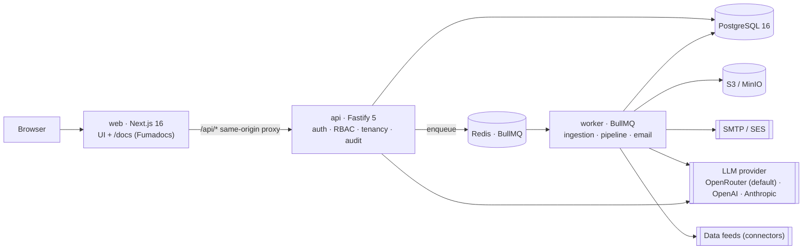

# SelloEasy — Marketing Intelligence Platform

SelloEasy turns **market signals into scored, ready-to-contact leads**. Each organization (tenant) builds a knowledge profile from its website, documents, products and policies. The platform derives **ICPs** and **buying signals** from that profile, and an AI pipeline scans market events against those signals. When an event matches, for example _"Automaker announces a new SUV from its Pune plant"_ for a tyre maker, SelloEasy creates a **lead** with the evidence attached. The lead is scored on **BANT+**, and the team works it in a built-in CRM using email, WhatsApp, call scripts and Calendly.

> All organizations, companies, people and news in the demo dataset are **fictional** (`.example` domains).

## Contents

- [Quick start](#quick-start)
- [Required environment variables](#required-environment-variables)
- [OpenRouter model](#openrouter-model)
- [Using OpenAI or Anthropic instead](#using-openai-or-anthropic-instead)
- [Demo accounts](#demo-accounts)
- [Platform data source](#platform-data-source)
- [Architecture](#architecture)
- [Major design decisions](#major-design-decisions)
- [Assumptions & limitations](#assumptions--limitations)
- [Development](#development)
- [Documentation](#documentation)

## Quick start

Requirements: **Docker** with Compose v2. Node and pnpm are only needed for development without Docker.

```bash
cp .env.example .env          # then set OPENROUTER_API_KEY in .env
docker compose up --build
```

On first start, the one-shot `migrate` service applies the database migrations and seeds the demo data: 5 organizations, about 300 market events and about 190 pre-scored leads. After that the services start. The first build takes a few minutes.

| What                                | URL                                             |
| ----------------------------------- | ----------------------------------------------- |
| Web app                             | http://localhost:3000                           |
| Documentation (`/docs`)             | http://localhost:3000/docs                      |
| Docs site (standalone)              | http://localhost:3001                           |
| API (OpenAPI / Swagger UI)          | http://localhost:4000/api/docs                  |
| Mailpit (invites & outreach emails) | http://localhost:8025                           |
| MinIO console (uploads)             | http://localhost:9001 (minioadmin / minioadmin) |

If a host port is already taken, override it in `.env`. The overrides are `WEB_HOST_PORT`, `API_HOST_PORT`, `POSTGRES_HOST_PORT`, `REDIS_HOST_PORT`, `MINIO_HOST_PORT`, `MINIO_CONSOLE_HOST_PORT`, `SMTP_HOST_PORT` and `MAILPIT_UI_HOST_PORT`.

To reset the demo data, run `docker compose down -v && docker compose up --build`.

## Required environment variables

<!-- docs:start:required-env -->
| Variable | Required | Notes |
|---|---|---|
| `LLM_PROVIDER` | No | `openrouter` (default, currently `openrouter`), `openai` or `anthropic`; each needs its own `*_API_KEY` + `*_MODEL`. |
| `OPENROUTER_API_KEY` | For live AI | Empty ⇒ the app runs in deterministic **mock** mode (seed data still works). |
| `OPENROUTER_MODEL` | Yes (live) | Currently `google/gemini-2.5-flash`. |
| Everything else | No | Sensible local defaults in `.env.example`; full reference at `/docs/getting-started/environment-variables`. |
<!-- docs:end:required-env -->

Every key, for local and AWS, is listed in [`.env.example`](.env.example), grouped into 12 sections. All keys are validated at boot by one schema in [`packages/shared/src/env.ts`](packages/shared/src/env.ts). Run `pnpm env:check` to validate an env file before you start.

## OpenRouter model

<!-- docs:start:model -->
The submission uses **`google/gemini-2.5-flash`** via OpenRouter — the value of `OPENROUTER_MODEL` in [.env.example](.env.example) (`LLM_PROVIDER=openrouter`). The model is read only from env (no model names in code, ADR-0009/ADR-0017); set `LLM_PROVIDER` to `openai` or `anthropic` plus that provider's key and model to switch.
<!-- docs:end:model -->

All LLM calls go through `packages/llm`, a thin `fetch` client with provider adapters. OpenRouter (its OpenAI-compatible `/chat/completions` endpoint) is the default provider. Every call is:

- a versioned prompt with a zod output schema
- sent with `json_schema` structured output, falling back to prompt-only JSON when the model doesn't support it
- repaired with one retry if the output is invalid
- cached in Redis
- recorded in `llm_calls` with its provider, model, tokens, cost and latency

If the selected provider's API key (by default `OPENROUTER_API_KEY`) is empty, the app starts in **mock mode**. Mock mode uses deterministic fixtures, so the whole demo works offline.

### Using OpenAI or Anthropic instead

The provider is chosen by `LLM_PROVIDER` (`openrouter` | `openai` | `anthropic`). `.env.example` keeps OpenRouter as the default. To call OpenAI directly, set these in **your own `.env`** (it is git-ignored; never commit a key):

```dotenv
LLM_PROVIDER=openai
OPENAI_API_KEY=<your OpenAI key>
OPENAI_MODEL=<the OpenAI model id you want>
```

Restart the API and worker. The model is exactly the value of `OPENAI_MODEL` (no model names in code). Reasoning models automatically get no custom temperature, `max_completion_tokens` and `OPENAI_REASONING_EFFORT` (default `low`). Anthropic works the same way with `LLM_PROVIDER=anthropic`, `ANTHROPIC_API_KEY` and `ANTHROPIC_MODEL`. Optional extras: `LLM_FALLBACK_PROVIDER` for failover, and `LLM_PRICE_INPUT_PER_MTOK` / `LLM_PRICE_OUTPUT_PER_MTOK` so cost is recorded for providers that don't report it. `curl -s localhost:4000/api/ready` shows the active provider and model. Details: `/docs/pipeline/llm-providers` and ADR-0017.

## Demo accounts

| Role                                            | Email                                         | Password       |
| ----------------------------------------------- | --------------------------------------------- | -------------- |
| Super Admin                                     | `superadmin@selloeasy.local`                  | `Admin@123`    |
| Org Admin · Roadgrip Tyres (Automotive)         | `admin@roadgrip.local`                        | `Password@123` |
| Sales Manager · Roadgrip                        | `manager@roadgrip.local`                      | `Password@123` |
| SDR · Roadgrip                                  | `sdr1@roadgrip.local` / `sdr2@roadgrip.local` | `Password@123` |
| Viewer · Roadgrip                               | `viewer@roadgrip.local`                       | `Password@123` |
| Org Admin · MediSphere Diagnostics (Healthcare) | `admin@medisphere.local`                      | `Password@123` |
| Org Admin · Nanoforge Semiconductor             | `admin@nanoforge.local`                       | `Password@123` |
| Org Admin · Suncrest Energy (Renewable Energy)  | `admin@suncrest.local`                        | `Password@123` |
| Org Admin · Cargolane Logistics                 | `admin@cargolane.local`                       | `Password@123` |

**Try the onboarding flow.** The org _Voltedge Mobility_ is seeded in the `INVITED` state. Open http://localhost:3000/accept-invite?token=demo-invite-voltedge-mobility-2026-local-only to accept its admin invite. That token only exists when `APP_ENV=local`. You can also log in as the Super Admin, create a new org, and open the invite email in Mailpit.

**Suggested tour:**

1. As the Super Admin, open the platform overview, which shows aggregates only.
2. Log in as `admin@roadgrip.local` and open **Leads**: 6 per page, filtered by signal and score band. Open a lead to see **"Why this score?"** and the evidence.
3. Draft an email with AI and send it. It arrives in Mailpit.
4. Log a WhatsApp message, a call and a meeting. Move the lead to _Won_.
5. Check the **Dashboard** and the **Audit log**.
6. Go to **Pipeline runs** and click _Run pipeline now_ to watch live progress. With an API key, this re-scores leads with the real model.

## Platform data source

The Super Admin owns the platform-wide raw data that every org's pipeline reads: market events, the company directory and contacts. All of it follows one canonical format, **template v1** (one business event + its subject company + optionally one contact; `/docs/platform-data/data-template`). Every record keeps its provenance (seed, CSV import, JSONL import or connector, plus its batch).

- **Import CSV / JSONL / JSON** (≤ 10 MB, ≤ 5 000 rows). Imports are two-phase: the worker validates the file into a staging area with strict anti-garbage rules (schema, content heuristics, duplicates), you review the report and `errors.csv`, then commit or discard. Valid and warning rows are committed; the commit is refused if more than 20 % of rows are invalid.
- **Run ingestion** from connectors: the seeded "Demo news feed" releases 10 fresh synthetic events per run, and `HTTP_FEED` connectors pull template-v1 data from any https feed (SSRF-guarded, secrets only from `CONNECTOR_*` env vars). Progress streams over SSE.
- **Fan-out:** new data queues `DATA_REFRESH` pipeline runs for orgs whose target industries match, so leads appear without waiting for the schedule.
- **Rollback** retracts a batch's events (future runs skip them); leads orgs already created are kept.

**Try it with `sampleData.csv`** (10 valid rows across all five industries, in the repo root). Log in as the Super Admin with a cookie jar, then:

```bash
curl -c jar.txt -H 'content-type: application/json' \
  -d '{"email":"superadmin@selloeasy.local","password":"Admin@123"}' http://localhost:4000/api/v1/auth/login
curl -b jar.txt -F 'file=@sampleData.csv' http://localhost:4000/api/v1/platform/data/imports     # 202, batch UPLOADED
curl -b jar.txt http://localhost:4000/api/v1/platform/data/batches/<batchId>                      # VALIDATED, 10 valid
curl -b jar.txt -H 'content-type: application/json' -d '{}' \
  http://localhost:4000/api/v1/platform/data/batches/<batchId>/commit                              # 10 events, 10 companies, 7 contacts
```

Importing it a second time yields 10 `DUPLICATE` rows. `sampleData.invalid.csv` shows the validator rejecting garbage (12 of its 13 rows are invalid, so the commit is refused). Everything is also browsable in Swagger UI under the `platform-data` tag. Full guide: `/docs/platform-data`.

## Architecture



The repo is a **pnpm + Turborepo monorepo**:

| Path                                 | What                                                                                                                                                                                     |
| ------------------------------------ | ---------------------------------------------------------------------------------------------------------------------------------------------------------------------------------------- |
| `apps/web`                           | Next.js 16 app: product UI (TanStack Query, Tailwind v4, Radix), `/docs` (Fumadocs), and a same-origin `/api/*` proxy                                                                    |
| `apps/docs-site`                     | Standalone Fumadocs site (port 3001) rendering the same `docs/` folder, with search and Mermaid                                                                                          |
| `apps/api`                           | Fastify 5 REST API (`/api/v1`) with zod-validated routes, cookie JWT sessions, RBAC guards, tenant scoping, audit hooks and OpenAPI                                                      |
| `apps/worker`                        | BullMQ workers: source processing (crawl/PDF/DOCX), AI profile generation, pipeline runs, email delivery, platform-data imports and connector ingestion, scheduled runs, audit retention |
| `packages/shared`                    | zod DTOs, enums, RBAC matrix, scoring weights, **env schema**                                                                                                                            |
| `packages/core`                      | Server runtime: config (+ AWS Secrets Manager), logger, Redis/queues, **storage (MinIO/S3) and mail (SMTP/SES) drivers**                                                                 |
| `packages/db`                        | Drizzle schema (34 tables), SQL migrations (including the append-only audit trigger and the platform data source)                                                                        |
| `packages/llm`                       | Provider-agnostic LLM client with OpenRouter / OpenAI / Anthropic adapters, versioned prompts, mocks, cache and telemetry hooks                                                          |
| `packages/pipeline`                  | Pure pipeline stages (prefilter, batching, dedupe) and BANT+ scoring math, plus the eval harness                                                                                         |
| `packages/engine`                    | I/O orchestration: pipeline runs, lead scoring, knowledge ingestion, platform-data imports / connectors / fan-out, audit writer                                                          |
| `packages/dataset` / `packages/seed` | Synthetic dataset (5 industries) and an idempotent seed                                                                                                                                  |
| `infra/`                             | AWS CDK stacks and deploy scripts (deploy-ready)                                                                                                                                         |
| `docs/`                              | Documentation source, rendered at `/docs`, including ADRs                                                                                                                                |

**Pipeline** (the `/docs/pipeline` pages have the details):

1. Load market events from the recency window.
2. Run a keyword + industry **prefilter**, with no LLM calls. It drops most events.
3. **Batched LLM signal matching** plus buyer extraction, 8 events per call.
4. Resolve the account through the company directory (the enrichment stand-in).
5. **Dedupe per account** and upsert the lead.
6. Score with **BANT+**:
   - Deterministic parts: Authority, ICP fit and signal strength with a 30-day half-life decay.
   - LLM-judged parts: Budget, Need and Timeline.
7. Stream progress to the UI over **SSE**.

Runs are idempotent. They are capped by `PIPELINE_MAX_LLM_CALLS_PER_RUN` (default 60); when the cap is hit, the run is marked _Partial_ and the remaining events are picked up by the next run.

## Major design decisions

Every decision is recorded as an ADR in [`docs/decisions`](docs/decisions), rendered at `/docs/decisions`.

| #    | Decision                                          | Why                                                                                         |
| ---- | ------------------------------------------------- | ------------------------------------------------------------------------------------------- |
| 0001 | Next.js (not Vite)                                | Fumadocs is Next-native, and `/docs` lives inside the frontend                              |
| 0002 | Drizzle ORM                                       | SQL-first, reviewable migrations, strong typing for analytics queries                       |
| 0003 | BullMQ + Redis                                    | Retries, backoff, schedulers and progress events for long AI jobs                           |
| 0004 | Postgres full-text search instead of vectors (v1) | Keeps every model call on OpenRouter and needs no extra infra; pgvector is the upgrade path |
| 0005 | Offset pagination (6 per page)                    | Users need "page 3 of 7"; ordering is stable by score                                       |
| 0006 | Deep links for WhatsApp, voice and Calendly       | Real providers need paid or verified accounts; everything sits behind provider interfaces   |
| 0007 | App-level tenancy before RLS                      | `org_id` scoping everywhere, 404 on cross-tenant access; RLS is planned hardening           |
| 0008 | Synthetic dataset + mock-LLM seed                 | Reproducible, free, safe; no fabricated news about real firms                               |
| 0009 | Model only from `OPENROUTER_MODEL`                | No model names in code                                                                      |
| 0010 | Super Admin sees public data + aggregates only    | Allow-list DTOs; 403 on every tenant route                                                  |
| 0011 | Lead visibility is a setting                      | SDRs see all org leads today; assigned-only is one config change                            |
| 0012 | Env-driven drivers                                | The same images run locally and on AWS (MinIO/S3, SMTP/SES, env/Secrets Manager)            |
| 0013 | API and worker run TypeScript via `tsx`           | Bundling breaks BullMQ Lua scripts and pino transports                                      |
| 0014 | `fetch` instead of the OpenAI SDK                 | Thin client, fewer version risks, OpenRouter `usage.cost`                                   |
| 0015 | One data template + two-phase import              | Garbage never reaches orgs; partial commit, refused above 20 % invalid rows                 |
| 0016 | Rollback retracts instead of deleting             | Tenant leads stay valid evidence; the data source is append/retract only                    |
| 0017 | Provider adapters, OpenRouter default             | Switch to OpenAI or Anthropic by env alone; model per provider from env                     |
| 0018 | Hybrid offset/keyset pagination                   | Fast first and deep pages on large tables; estimated totals above 50 000 rows               |
| 0019 | Standalone docs site next to `/docs`              | Docs readable and shareable without the product stack; same `docs/` folder and URLs         |

**Security highlights:**

- argon2id password hashing
- rotating refresh tokens with reuse detection
- account lockout and login rate limits
- default-deny RBAC on every route
- zod validation everywhere
- an SSRF-safe crawler
- magic-byte checks on uploads
- prompt-injection-aware prompts
- CSV-injection-safe exports
- an **append-only audit log**, enforced by a database trigger

## Assumptions & limitations

- **Data.** Market events come from a **synthetic dataset**, not live news. The Super Admin can add more through validated imports and connectors in template v1; there is no RSS or news-API format mapping yet. Stored records are append/retract only, and retracted records still count as duplicates on re-import. Contacts are synthetic, and nothing is scraped.
- **LLM providers.** OpenRouter is the default; OpenAI and Anthropic are selected by env. OpenAI and Anthropic don't report cost, so set the `LLM_PRICE_*_PER_MTOK` keys to record it. The Anthropic adapter is unit-tested but not yet evaluated live.
- **Seed and mock mode.** The seed uses the **mock LLM**, so the demo works without a key. Pipeline runs use the configured model. In mock mode, signal matching is keyword-based. Run `pnpm eval:pipeline` for precision and recall on the 60-item gold set, in live or mock mode.
- **Outreach.** **Email is really sent**, via SMTP to Mailpit locally or via SES. WhatsApp, voice and Calendly use deep links and manual logging. There is no reply ingestion and no open tracking.
- **Retrieval.** It uses Postgres **full-text search**, not embeddings.
- **Tenancy.** It is enforced in the application layer and covered by tests. Postgres **RLS is not enabled yet**.
- **Website crawling.** The crawl is capped at 25 pages and depth 2, and respects robots.txt. The demo orgs' `.example` sites are unreachable, so the seed stores website snapshots instead.
- **Not implemented yet.** Upload antivirus scanning and the OpenTelemetry exporter (its env flags are reserved).
- **One org per user.** The schema supports multi-org membership, but the UI assumes one org.
- **AWS.** Deployment is **ready but not deployed**. `infra/` holds the CDK stacks, `pnpm env:check --target aws` validates the config, and `pnpm deploy:aws` deploys. See `/docs/operations/aws-deployment`.

## Development

```bash
pnpm install
docker compose up -d postgres redis minio mailpit   # infrastructure only
pnpm db:migrate && pnpm db:seed
pnpm dev                                            # web + api + worker in watch mode
```

| Command                                     | Purpose                                                                                                                                                                                                                                 |
| ------------------------------------------- | --------------------------------------------------------------------------------------------------------------------------------------------------------------------------------------------------------------------------------------- |
| `pnpm test`                                 | Unit tests (pipeline, data validation, LLM client and provider adapters, RBAC, config, demo feed) and API integration tests (auth, RBAC, tenancy, super-admin boundary, CRM, outreach, audit, platform data imports/rollback/ingestion) |
| `pnpm test:report [--e2e] [--no-serve]`     | Run the tests and serve an **Allure report** on http://localhost:5252 (`ALLURE_PORT`); `--e2e` adds Playwright; CI uploads the report as an artifact                                                                                    |
| `pnpm typecheck`                            | TypeScript across the workspace                                                                                                                                                                                                         |
| `pnpm e2e`                                  | Playwright E2E against a running stack (`BASE_URL`)                                                                                                                                                                                     |
| `pnpm eval:pipeline [--mode live\|mock]`    | Signal-matching precision, recall and F1 on the gold set                                                                                                                                                                                |
| `pnpm --filter @selloeasy/dataset validate` | Validate the synthetic dataset                                                                                                                                                                                                          |
| `pnpm docs:check`                           | Checks that every env var is documented, links resolve, and docs changed alongside code                                                                                                                                                 |
| `pnpm env:check [--file f] [--target aws]`  | Validate an env file                                                                                                                                                                                                                    |
| `pnpm db:reset`                             | Drop, migrate and reseed the local database                                                                                                                                                                                             |

Claude Code is configured in `.claude/` with 10 skills (code-writer, code-reviewer, tester, doc-keeper and more), 3 subagents and hooks. Project rules are in [`CLAUDE.md`](CLAUDE.md).

## Documentation

The full documentation lives in [`docs/`](docs) and is served at **http://localhost:3000/docs** inside the app and by the standalone docs site at **http://localhost:3001** (`apps/docs-site`; `pnpm dev:docs` or `docker compose up docs`). It covers getting started, concepts, architecture, the pipeline and prompts, modules, the API, operations, all ADRs, and the project section: the [8-week sprint plan](docs/%28project%29/project/sprint-plan.mdx) and [roles & responsibilities](docs/%28project%29/project/roles-and-responsibilities.mdx). Code and docs change together; `pnpm docs:check` enforces this in CI.
