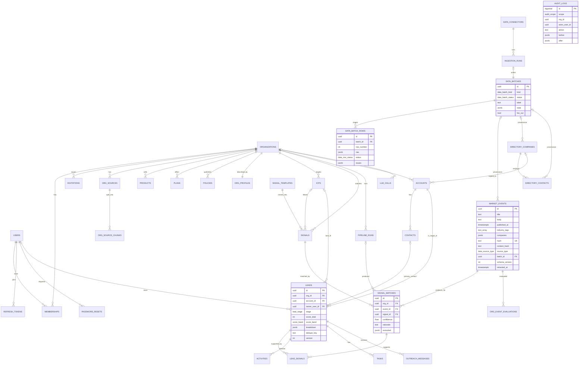

The schema is defined with Drizzle in `packages/db/src/schema/` and materialized by the SQL migrations in
`packages/db/drizzle/`. Conventions: UUIDv7 primary keys (`id`), `created_at` / `updated_at` as `timestamptz`,
snake_case columns, and `org_id` on every tenant table with `ON DELETE CASCADE` from `organizations`.

## Entity-relationship diagram



<Callout type="info">
  `audit_logs` has **no foreign keys** on purpose: audit rows must outlive the records they describe. It is
  not connected in the diagram for that reason.
</Callout>

## Identity & tenancy (`schema/identity.ts`)

| Table             | Purpose                 | Key columns                                                                                                                                                                                                                                                                                 |
| ----------------- | ----------------------- | ------------------------------------------------------------------------------------------------------------------------------------------------------------------------------------------------------------------------------------------------------------------------------------------- |
| `organizations`   | Tenants                 | `name`, `slug` (unique), `industry`, `status` (`INVITED`/`ONBOARDING`/`ACTIVE`/`SUSPENDED`), `website_url`, `logo_key`, `hq`, `regions text[]`, `company_size`, `description`, `settings jsonb` (`calendlyUrl`, `senderName`, `timezone`, `leadVisibility`), `activated_at`, `suspended_at` |
| `users`           | Global user accounts    | `email` (unique, stored lower-case), `name`, `password_hash` (argon2id), `is_super_admin`, `status` (`ACTIVE`/`DISABLED`), `calendly_url`, `phone`, `failed_login_count`, `locked_until`, `last_login_at`                                                                                   |
| `memberships`     | User ↔ org with role    | `user_id`, `org_id`, `role` (`ORG_ADMIN`/`SALES_MANAGER`/`SDR`/`VIEWER`), `status`. Unique (`user_id`, `org_id`)                                                                                                                                                                            |
| `invitations`     | Single-use invite links | `org_id`, `email`, `role`, `token_hash` (SHA-256, unique), `expires_at`, `accepted_at`, `revoked_at`, `invited_by`                                                                                                                                                                          |
| `refresh_tokens`  | Rotating refresh tokens | `user_id`, `token_hash` (unique), `family_id`, `expires_at`, `revoked_at`, `replaced_by`, `user_agent`, `ip`                                                                                                                                                                                |
| `password_resets` | Reset links (1 hour)    | `user_id`, `token_hash` (unique), `expires_at`, `used_at`                                                                                                                                                                                                                                   |

## Knowledge (`schema/knowledge.ts`)

| Table               | Purpose                                      | Key columns                                                                                                                                                                                           |
| ------------------- | -------------------------------------------- | ----------------------------------------------------------------------------------------------------------------------------------------------------------------------------------------------------- |
| `org_sources`       | Website, uploaded documents, pasted text     | `type` (`WEBSITE`/`PDF`/`DOC`/`TEXT`), `title`, `url`, `s3_key`, `content_type`, `visibility` (default `INTERNAL`), `status` (`PENDING`/`PROCESSING`/`READY`/`FAILED`), `error`, `bytes`, `checksum`  |
| `org_source_chunks` | ~800-token chunks for retrieval              | `source_id`, `ordinal`, `content`, `token_count`, `tsv` (generated `to_tsvector('english', content)`, GIN index)                                                                                      |
| `products`          | Catalogue                                    | `name`, `category`, `description`, `target_segments text[]`, `price_notes`, `visibility` (default `PUBLIC`)                                                                                           |
| `plans`             | Pricing plans                                | `name`, `pricing`, `features text[]`, `visibility` (default `INTERNAL`)                                                                                                                               |
| `policies`          | Warranty, SLA, compliance…                   | `title`, `type`, `body`, `visibility` (default `INTERNAL`)                                                                                                                                            |
| `org_profiles`      | AI-generated, editable profile (one per org) | `summary`, `summary_visibility` (default `PUBLIC`), `value_props jsonb`, `differentiators jsonb`, `target_industries text[]`, `geographies text[]`, `personas jsonb`, `generated_by_model`, `version` |

## Intelligence (`schema/intelligence.ts`)

| Table                   | Scope             | Purpose                                              | Key columns                                                                                                                                                                                                                                                                                                                                                                                                                                                                                                                                   |
| ----------------------- | ----------------- | ---------------------------------------------------- | --------------------------------------------------------------------------------------------------------------------------------------------------------------------------------------------------------------------------------------------------------------------------------------------------------------------------------------------------------------------------------------------------------------------------------------------------------------------------------------------------------------------------------------------- |
| `icps`                  | tenant            | Ideal Customer Profiles                              | `name`, `description`, `source` (`AI_SUGGESTED`/`CUSTOM`), `criteria jsonb`, `is_active`                                                                                                                                                                                                                                                                                                                                                                                                                                                      |
| `signal_templates`      | **platform**      | Industry templates managed by the Super Admin        | `industry`, `key` (unique per industry), `name`, `description`, `match_instructions`, `default_keywords`, `default_weight`                                                                                                                                                                                                                                                                                                                                                                                                                    |
| `signals`               | tenant            | The org's signals                                    | `template_id`, `icp_id`, `name`, `description`, `match_instructions`, `keywords`, `negative_keywords`, `weight` (0.5–2), `source` (`PREDEFINED`/`CUSTOM`), `is_active`                                                                                                                                                                                                                                                                                                                                                                        |
| `market_events`         | **platform**      | The events corpus, ingested once and matched per org | `external_id`, `source`, `url`, `title`, `body`, `published_at`, `industry_tags text[]`, `companies jsonb` (name, domain, role subject/mentioned), `region`, `amount`, `currency`, `synthetic`, `hash` (unique), `tsv` (generated, GIN). **Provenance (migration `0002`):** `content_hash` (near-duplicate fingerprint), `country`, `source_type` (`SEED`/`CSV_IMPORT`/`JSONL_IMPORT`/`CONNECTOR`, default `SEED`), `batch_id` → `data_batches`, `schema_version` (default 1), `retracted_at` (hidden from matching), `ingested_by` → `users` |
| `directory_companies`   | **platform**      | Simulated enrichment provider: target companies      | `key` (unique), `name`, `domain` (unique when not null), `industry`, `hq_country`, `size_band`, `employees`, `description`, `synthetic`, `source_type`, `batch_id`, `updated_by_batch_id` (last batch that filled attributes), `retracted_at`                                                                                                                                                                                                                                                                                                 |
| `directory_contacts`    | **platform**      | People at directory companies                        | `company_id`, `name`, `title`, `persona`, `seniority`, `email`, `phone`, `whatsapp`, `linkedin_url`, `synthetic`, `source_type`, `batch_id`, `retracted_at`                                                                                                                                                                                                                                                                                                                                                                                   |
| `pipeline_runs`         | tenant            | One row per run                                      | `trigger` (`MANUAL`/`SCHEDULED`/`ONBOARDING`/`DATA_REFRESH`), `status` (`QUEUED`/`RUNNING`/`COMPLETED`/`PARTIAL`/`FAILED`), `triggered_by`, `started_at`, `finished_at`, `stats jsonb`, `error`                                                                                                                                                                                                                                                                                                                                               |
| `signal_matches`        | tenant            | Accepted event ↔ signal matches                      | `run_id`, `event_id`, `signal_id`, `confidence`, `rationale`, `extracted jsonb` (account, personas, deal hints). **Unique (`org_id`, `event_id`, `signal_id`)**                                                                                                                                                                                                                                                                                                                                                                               |
| `org_event_evaluations` | tenant            | Which events were evaluated under which signal set   | `org_id`, `event_id`, `signals_hash`, `run_id`, `matched`, `evaluated_at`. Unique (`org_id`, `event_id`, `signals_hash`)                                                                                                                                                                                                                                                                                                                                                                                                                      |
| `llm_calls`             | tenant (nullable) | Telemetry for every LLM call                         | `org_id`, `purpose` (prompt id), `provider` (`openrouter`/`openai`/`anthropic`/`mock`, default `openrouter` for older rows), `model`, `prompt_version`, `prompt_hash`, `input_tokens`, `output_tokens`, `cost_usd`, `latency_ms`, `status`, `error`, `cached`                                                                                                                                                                                                                                                                                 |

`pipeline_runs.stats` holds `eventsScanned`, `prefiltered`, `matched`, `leadsCreated`, `leadsUpdated`,
`llmCalls`, `cacheHits`, `costUsd` and `budgetExhausted`.

## Platform data source (`schema/data.ts`)

Global (not tenant) tables for provenance, imports and ingestion, added by migration `0002_data_source.sql`. Super
Admin only. See [Platform data](/docs/platform-data).

| Table             | Purpose                                                        | Key columns                                                                                                                                                                                                                                                                                                                                            |
| ----------------- | -------------------------------------------------------------- | ------------------------------------------------------------------------------------------------------------------------------------------------------------------------------------------------------------------------------------------------------------------------------------------------------------------------------------------------------ |
| `data_batches`    | One row per import file, ingestion run or the seed             | `kind` (`IMPORT`/`INGESTION`/`SEED`), `status` (`UPLOADED`/`VALIDATING`/`VALIDATED`/`COMMITTING`/`COMMITTED`/`DISCARDED`/`FAILED`/`ROLLED_BACK`), `label`, `file_name`, `file_s3_key`, `format`, `file_issues jsonb`, `stats jsonb`, `fan_out` (default true), `created_by`, `committed_by`, `validated_at`, `committed_at`, `rolled_back_at`, `error` |
| `data_batch_rows` | Staged rows of a batch (purged after `STAGING_RETENTION_DAYS`) | `batch_id` (cascade), `row_number`, `raw jsonb`, `normalized jsonb`, `status` (`VALID`/`WARNING`/`INVALID`/`DUPLICATE`), `issues jsonb` (`field`, `code`, `message`, `severity`), `duplicate_of_event_id`, `inserted_event_id`                                                                                                                         |
| `data_connectors` | Configured sources                                             | `name` (unique), `type` (`HTTP_FEED`/`DEMO_FEED`), `config jsonb` (url, format, sinceParam, authHeader, **authEnvVar name, never the secret**, maxRowsPerRun, batchSize), `schedule` (cron, nullable), `enabled`, `fan_out`, `cursor jsonb`, `last_run_at`, `last_status`, `created_by`                                                                |
| `ingestion_runs`  | One row per connector run                                      | `connector_id` (cascade), `batch_id`, `trigger` (`MANUAL`/`SCHEDULED`), `status` (pipeline statuses), `stats jsonb` (`fetched`, `valid`, `warnings`, `invalid`, `duplicates`, `inserted`, `orgsNotified`), `error`, `triggered_by`, `started_at`, `finished_at`                                                                                        |

`data_batches.stats` holds `rows`, `valid`, `warnings`, `invalid`, `duplicates`, `inserted`, `companiesCreated`,
`companiesUpdated`, `contactsCreated` and, for ingestion, `fetched`. Provenance foreign keys from `market_events`,
`directory_companies` and `directory_contacts` to `data_batches` are `ON DELETE SET NULL`. The seed puts all seeded
rows into one `SEED` batch ("Initial synthetic dataset"), backfills `content_hash`, and registers the "Demo news feed"
`DEMO_FEED` connector.

## CRM (`schema/crm.ts`)

| Table               | Purpose                           | Key columns                                                                                                                                                                                                                                                                                                                                             |
| ------------------- | --------------------------------- | ------------------------------------------------------------------------------------------------------------------------------------------------------------------------------------------------------------------------------------------------------------------------------------------------------------------------------------------------------- |
| `accounts`          | Target companies, per org         | `directory_company_id`, `name`, `domain`, `industry`, `hq_country`, `size_band`, `employees`, `description`                                                                                                                                                                                                                                             |
| `contacts`          | People at an account              | `account_id`, `name`, `title`, `persona`, `seniority`, `email`, `phone`, `whatsapp`, `linkedin_url`, `source` (`SYNTHETIC`/`MANUAL`/`ENRICHED`)                                                                                                                                                                                                         |
| `leads`             | One per target account per org    | `account_id`, `primary_contact_id`, `icp_id`, `owner_user_id`, `stage`, `score_total`, `score_band`, `breakdown jsonb`, `fit_score`, `signal_strength`, `recency_score`, `suggested_personas jsonb`, `first_signal_at`, `last_signal_at`, `first_touch_at`, `last_activity_at`, `stage_changed_at`, `lost_reason`, `won_value`, `dedupe_key`, `version` |
| `lead_signals`      | Evidence link lead ↔ signal match | PK (`lead_id`, `signal_match_id`)                                                                                                                                                                                                                                                                                                                       |
| `activities`        | Timeline                          | `lead_id`, `actor_user_id`, `type` (`EMAIL`, `WHATSAPP`, `CALL`, `MEETING`, `NOTE`, `STAGE_CHANGE`, `ASSIGNMENT`, `TASK`, `SCORE_CHANGED`, `SIGNAL`), `direction` (`OUTBOUND`/`INBOUND`/`INTERNAL`), `subject`, `body`, `metadata jsonb`, `occurred_at`                                                                                                 |
| `tasks`             | Follow-ups                        | `lead_id`, `assignee_user_id`, `created_by`, `title`, `due_at`, `completed_at`                                                                                                                                                                                                                                                                          |
| `outreach_messages` | Emails queued or sent             | `lead_id`, `contact_id`, `channel`, `to`, `subject`, `body`, `status` (`DRAFT`/`SENT`/`FAILED`), `provider_message_id`, `error`, `sent_by`, `sent_at`                                                                                                                                                                                                   |

## Audit (`schema/audit.ts`)

| Table        | Purpose                 | Key columns                                                                                                                                                                                                               |
| ------------ | ----------------------- | ------------------------------------------------------------------------------------------------------------------------------------------------------------------------------------------------------------------------- |
| `audit_logs` | Append-only audit trail | `id bigserial`, `occurred_at`, `scope` (`PLATFORM`/`ORG`), `org_id`, `actor_user_id` (null = system), `actor_role`, `action`, `entity_type`, `entity_id`, `before jsonb`, `after jsonb`, `ip`, `user_agent`, `request_id` |

### The append-only trigger (migration `0001`)

```sql
CREATE OR REPLACE FUNCTION audit_logs_guard() RETURNS trigger AS $$
BEGIN
  IF TG_OP = 'DELETE' AND current_setting('selloeasy.audit_retention', true) = 'on' THEN
    RETURN OLD;
  END IF;
  RAISE EXCEPTION 'audit_logs is append-only (% blocked)', TG_OP;
END;
$$ LANGUAGE plpgsql;

CREATE TRIGGER audit_logs_no_update BEFORE UPDATE OR DELETE ON audit_logs
  FOR EACH ROW EXECUTE FUNCTION audit_logs_guard();
```

Every `UPDATE` raises. `DELETE` raises unless the transaction has set `selloeasy.audit_retention = 'on'`,
which only the retention job does (`SET LOCAL`, so the flag dies with its transaction). See
[Audit trail](/docs/modules/audit-trail).

## Indexes

| Index                                                                                                               | Purpose                                                                          |
| ------------------------------------------------------------------------------------------------------------------- | -------------------------------------------------------------------------------- |
| `leads (org_id, score_total desc, id desc)`                                                                         | Default leads sort and stable offset pagination                                  |
| `leads (org_id, stage)`, `leads (org_id, owner_user_id)`, `leads (org_id, last_signal_at desc)`                     | Filters and the "recent" sort                                                    |
| `leads (org_id, dedupe_key)` unique                                                                                 | One lead per account per org                                                     |
| `signal_matches (org_id, event_id, signal_id)` unique                                                               | Pipeline idempotency                                                             |
| `org_event_evaluations (org_id, event_id, signals_hash)` unique                                                     | Skip already-evaluated events                                                    |
| `market_events (hash)` unique, `(published_at desc)`, GIN `industry_tags`, GIN `tsv`                                | Ingest dedupe, window scan, tag filter, full-text                                |
| `org_source_chunks` GIN `tsv`                                                                                       | Knowledge retrieval ([ADR-0004](/docs/decisions/0004-fts-over-vector-retrieval)) |
| `accounts (org_id, name)`, GIN trigram on `accounts.name`                                                           | Account search                                                                   |
| `activities (org_id, lead_id, occurred_at desc)`, `(org_id, type, occurred_at)`                                     | Timeline, dashboard channel stats                                                |
| `tasks (org_id, assignee_user_id, completed_at)`                                                                    | "My tasks"                                                                       |
| `audit_logs (org_id, occurred_at desc)`, `(scope, occurred_at desc)`, `(entity_type, entity_id)`, `(actor_user_id)` | Audit views and filters                                                          |
| `llm_calls (org_id, created_at desc)`                                                                               | 30-day cost per org                                                              |
| `pipeline_runs (org_id, created_at desc)`                                                                           | Run history                                                                      |
| `market_events (lower(source), lower(external_id))` unique where `external_id` is not null                          | Import dedupe by source + id                                                     |
| `market_events (lower(rtrim(url, '/')))` unique where `url` is not null                                             | Import dedupe by URL                                                             |
| `market_events (content_hash)`, `(source_type, published_at desc)`, `(batch_id)`                                    | Near-duplicate lookup, explorer filters, batch views                             |
| `directory_companies (domain)` unique where not null, `directory_contacts (company_id, email)`                      | Directory upsert keys                                                            |
| `data_batch_rows (batch_id, status, row_number)`, `data_batches (created_at desc)`                                  | Validation report paging, batch history                                          |
| `data_connectors (name)` unique, `ingestion_runs (connector_id, created_at desc)`                                   | Connector lookup, run history                                                    |

## Enums

Postgres enums mirror the TypeScript tuples in `packages/shared/src/enums.ts`: `industry`, `org_status`,
`org_role`, `user_status`, `visibility`, `source_type`, `source_status`, `icp_source`, `signal_source`,
`pipeline_trigger` (now including `DATA_REFRESH`), `pipeline_status`, `lead_stage`, `score_band`, `activity_type`,
`activity_direction`, `outreach_status`, `contact_source`, `audit_scope`, and (migration `0002`) `data_source_type`,
`data_batch_kind`, `data_batch_status`, `data_row_status`, `connector_type`.

## Deletion behavior

- Deleting an organization cascades to every tenant table. Audit rows remain (no FK).
- Deleting a lead cascades to `lead_signals`, `activities`, `tasks` and `outreach_messages`.
- Deleting a signal cascades to its `signal_matches` (and therefore its `lead_signals`).
- Deleting an ICP, contact or user sets the referencing columns to null (`SET NULL`).
- Soft delete (`deleted_at`) from plan §7 is **not** implemented. Deletes are hard deletes, captured in the audit
  log with a `before` snapshot.
