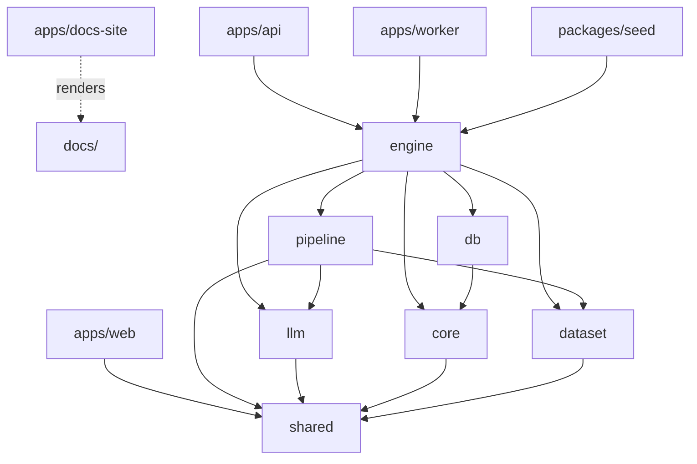

SelloEasy is a single TypeScript repository managed with **pnpm workspaces** and **Turborepo**. Workspaces are
`apps/*`, `packages/*` and `infra` (`pnpm-workspace.yaml`). All packages are ES modules (`"type": "module"`) and
export their TypeScript sources directly (`"exports": { ".": "./src/index.ts" }`). There is no per-package build
step for the backend ([ADR-0013](/docs/decisions/0013-tsx-runtime-no-bundling)).

## Layout

```text
selloeasy/
├── apps/
│   ├── web/          Next.js 16: product UI, /docs (Fumadocs), /api/* proxy
│   ├── api/          Fastify 5 HTTP API (/api/v1), OpenAPI at /api/docs
│   ├── worker/       BullMQ processors and schedulers
│   └── docs-site/    standalone Fumadocs site for docs/ (port 3001, ADR-0019)
├── packages/
│   ├── shared/       Zod DTOs, enums, RBAC matrix, pagination, scoring constants, env schema
│   ├── core/         config, logger, redis/queues, storage + mail drivers, crypto
│   ├── db/           Drizzle schema, client, SQL migrations (drizzle/), reset
│   ├── llm/          LLM client + provider adapters, versioned prompts + Zod schemas + mocks
│   ├── pipeline/     pure pipeline stages + scoring math (no I/O)
│   ├── engine/       domain services with I/O: pipeline orchestration, scoring,
│   │                 knowledge ingestion (crawler, parsers), audit writer, LLM factory
│   ├── dataset/      synthetic dataset (data/*) + schema, loader, validator, PDF builder
│   └── seed/         idempotent demo seed
├── docs/             this documentation (MDX), rendered at /docs and by apps/docs-site
├── infra/            AWS CDK app (deploy-ready work; see Operations → AWS deployment)
├── docker-compose.yml
├── .env.example      every configuration key
├── plan.md, plan2.md the approved implementation plans
└── turbo.json, pnpm-workspace.yaml, tsconfig.base.json
```

## Packages in detail

| Package                | Depends on                                                                                            | Key modules                                                                                              |
| ---------------------- | ----------------------------------------------------------------------------------------------------- | -------------------------------------------------------------------------------------------------------- |
| `@selloeasy/shared`    | `zod`                                                                                                 | `env.ts` (runtime + deploy schemas), `rbac.ts`, `enums.ts`, `dto.ts`, `scoring.ts`, `pagination.ts`      |
| `@selloeasy/core`      | shared, AWS SDK v3 (S3, SES v2, Secrets Manager), `bullmq`, `ioredis`, `nodemailer`, `pino`, `argon2` | `config.ts`, `logger.ts`, `queues.ts`, `redis.ts`, `storage.ts`, `mail.ts`, `crypto.ts`, `password.ts`   |
| `@selloeasy/db`        | core, shared, `drizzle-orm`, `pg`, `uuidv7`                                                           | `schema/{identity,knowledge,intelligence,crm,audit}.ts`, `client.ts`, `migrate.ts`, `reset.ts`           |
| `@selloeasy/llm`       | shared, `zod`                                                                                         | `client.ts` (`LlmClient`), `types.ts`, `prompts/{profile,signals,scoring,outreach,_util}.ts`             |
| `@selloeasy/pipeline`  | shared, llm (for `keywordHits`), dataset                                                              | `stages.ts` (prefilter, batch, dedupeKey, acceptMatches), `scoring.ts`                                   |
| `@selloeasy/engine`    | core, db, llm, pipeline, dataset, shared, `cheerio`, `unpdf`, `mammoth`                               | `pipeline.ts`, `scoring.ts`, `knowledge/{crawl,extract,index}.ts`, `audit.ts`, `llm.ts`, `setup.ts`      |
| `@selloeasy/dataset`   | shared, `zod`                                                                                         | `schema.ts` (`MARKET_TAGS`, fixture schemas), `index.ts` (loaders), `validate.ts`, `build-pdfs.ts`       |
| `@selloeasy/seed`      | core, db, engine, llm, dataset, shared                                                                | `seed.ts`, `index.ts`                                                                                    |
| `@selloeasy/api`       | core, db, engine, llm, shared, Fastify plugins                                                        | `server.ts`, `plugins/{auth,audit,errors}.ts`, `modules/*.ts`, `lib/*.ts`                                |
| `@selloeasy/worker`    | core, db, engine, llm, shared, `bullmq`                                                               | `index.ts`, `emails.ts`                                                                                  |
| `@selloeasy/web`       | shared, Next.js, Fumadocs, TanStack Query, Radix, Tailwind v4, Recharts                               | `app/`, `components/`, `lib/`                                                                            |
| `@selloeasy/docs-site` | Next.js, Fumadocs (no workspace packages)                                                             | `app/docs/`, `app/docs-search/`, `app/go/`, `components/mdx.tsx`, `lib/source.ts` → renders `../../docs` |

## Dependency rules



1. **Apps depend on packages, never the other way round.** No package imports from `apps/*`.
2. **`shared` is dependency-free apart from `zod`.** It is safe to import from the browser, the API and the
   worker. The web app only depends on `shared` and transpiles it (`transpilePackages`).
3. **`pipeline` is pure.** It takes inputs and returns outputs, with no database, Redis or HTTP. Everything that
   touches I/O lives in `engine`. This keeps the scoring math and prefilter unit-testable without containers.
4. **`llm` is the only place that talks to an LLM**, and it contains no model name
   ([ADR-0009](/docs/decisions/0009-openrouter-model-from-env)). It does not read the environment itself. `engine`'s
   `createLlm()` builds the client from `getConfig()`.
5. **`process.env` is read only by `core/config.ts`** (plus the web proxy route for `API_INTERNAL_URL`, and the
   Next.js dev script for `WEB_PORT`).
6. **Domain logic shared by several processes goes in `engine`.** For example, `runPipeline()` is used by the
   worker **and** the seed, and `scoreLead()` by the worker and the API re-score endpoint.

<Callout type="info">
  Plan §5 called for enforcing these rules with ESLint `import/no-restricted-paths`. That lint configuration
  is not in the repository yet. Today the rules are upheld by package boundaries (each package declares its
  workspace dependencies explicitly, and pnpm's strict `node_modules` prevents undeclared imports).
</Callout>

## Turborepo tasks

`turbo.json`:

| Task        | Config                                                                                            | Notes                                                                   |
| ----------- | ------------------------------------------------------------------------------------------------- | ----------------------------------------------------------------------- |
| `build`     | `dependsOn: ["^build"]`, outputs `dist/**`, `.next/**` (except cache), `.source/**`, `cdk.out/**` | In practice only the web app builds, since the backend runs from source |
| `dev`       | `cache: false`, `persistent: true`                                                                | `pnpm dev` runs web, API and worker in parallel                         |
| `typecheck` | `dependsOn: ["^typecheck"]`                                                                       | `tsc -p tsconfig.json` per package                                      |
| `test`      | outputs `coverage/**`, env `DATABASE_URL`, `REDIS_URL`, `LLM_MODE`                                | Vitest                                                                  |
| `lint`      | —                                                                                                 |                                                                         |

## Docker builds and the monorepo

Each Dockerfile uses `turbo prune <app> --docker` to produce a minimal workspace containing only the target app and
the packages it depends on. It installs with `pnpm install --frozen-lockfile` and copies the pruned sources.
The API image prunes `@selloeasy/api` **and** `@selloeasy/seed`, so the same image can run migrations and the
seed as the `migrate` job. The web image additionally copies the repository-root `docs/` folder, which is not part
of any workspace package. See [Docker](/docs/operations/docker).

## Conventions

- **Validation:** Zod 4 schemas in `shared/dto.ts` are used by Fastify (`fastify-type-provider-zod`) for request
  validation and OpenAPI generation, and by the web app's forms.
- **IDs:** UUIDv7 primary keys (time-ordered, index-friendly), except `audit_logs.id` (bigserial).
- **Timestamps:** `timestamptz` everywhere. `created_at` / `updated_at` on every table except the append-only audit log.
- **Naming:** Drizzle `casing: 'snake_case'`, so columns are snake_case in SQL and camelCase in TypeScript.
- **Errors:** throw `HttpError` helpers (`badRequest`, `notFound`, `conflict`…) from `apps/api/src/lib/errors.ts`.
  The global handler renders RFC 7807.
- **Audit:** call `req.audit({...}, tx)` inside the transaction of the change.
