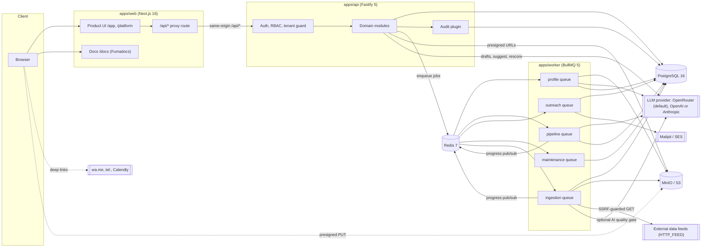
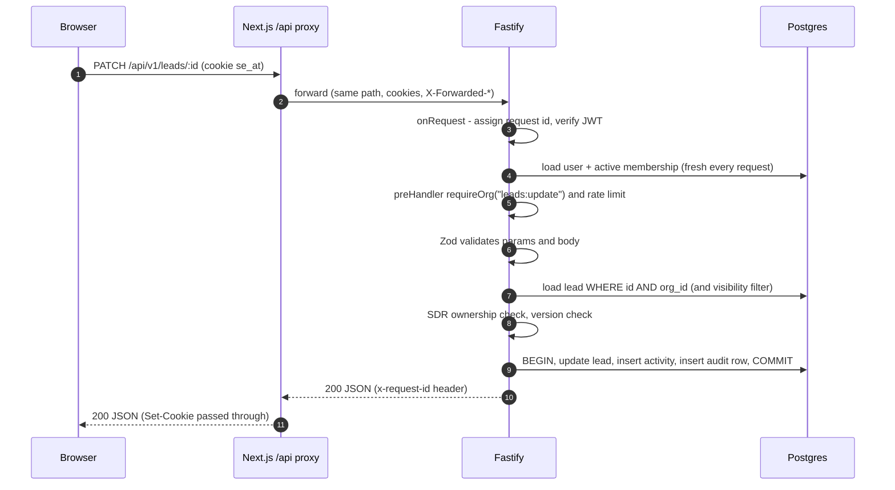
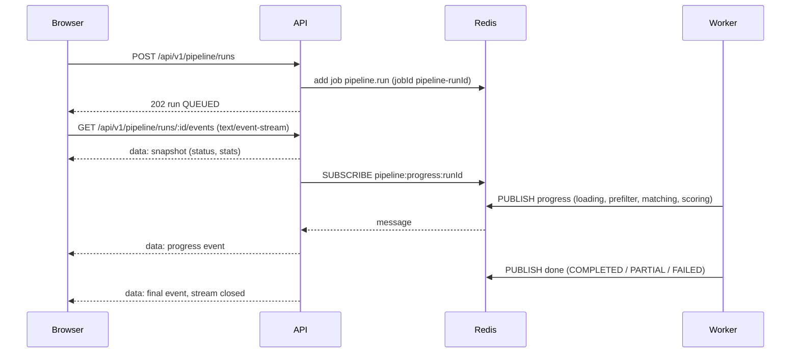

SelloEasy is a **modular monolith** split into three deployable processes that share the same TypeScript
packages:

| Process    | Package       | Role                                                                                                                                                                                                                                             |
| ---------- | ------------- | ------------------------------------------------------------------------------------------------------------------------------------------------------------------------------------------------------------------------------------------------ |
| **web**    | `apps/web`    | Next.js 16 App Router: the product UI (`/app/*`, `/platform/*`, auth pages), the documentation site (`/docs`), and a same-origin proxy for `/api/*`.                                                                                             |
| **api**    | `apps/api`    | Fastify 5 HTTP API under `/api/v1`: auth, RBAC and tenant guards, validation, audit, domain modules, OpenAPI. Short, user-initiated LLM calls (outreach drafts, ICP suggestions, re-score) run synchronously. Everything long-running is queued. |
| **worker** | `apps/worker` | BullMQ processors: knowledge-source processing, profile generation, pipeline runs, email delivery, platform-data imports and connector ingestion, schedulers, audit retention and staging purge.                                                 |

A one-shot **migrate** job (the API image running `pnpm db:migrate` and optionally `pnpm db:seed`) prepares the
database before the API and worker start.

## Component diagram

## Shared packages

| Package               | Responsibility                                                                                                                                                                                                                    |
| --------------------- | --------------------------------------------------------------------------------------------------------------------------------------------------------------------------------------------------------------------------------- |
| `@selloeasy/shared`   | Zod DTOs and enums, the RBAC matrix, pagination helpers, scoring weights and bands, and the environment schema. No I/O.                                                                                                           |
| `@selloeasy/core`     | Config loading (including AWS Secrets Manager), pino logger options with redaction, Redis and BullMQ connections and queue definitions, storage driver (MinIO/S3), mail driver (SMTP/SES), token and password crypto.             |
| `@selloeasy/db`       | Drizzle schema, client (pool, TLS), migrations and reset.                                                                                                                                                                         |
| `@selloeasy/llm`      | The only code that talks to an LLM: a provider-agnostic client over `fetch` with adapters for OpenRouter, OpenAI and Anthropic (`LLM_PROVIDER`), versioned prompts with Zod output schemas, deterministic mocks, cache interface. |
| `@selloeasy/pipeline` | Pure stages and scoring math: prefilter, batching, dedupe keys, authority, ICP fit, signal strength, score combination. No DB or HTTP.                                                                                            |
| `@selloeasy/engine`   | Domain services with I/O shared by API, worker and seed: LLM factory and telemetry, audit writer, knowledge ingestion (crawler, parsers, chunking, retrieval), profile generation, pipeline orchestration, lead scoring.          |
| `@selloeasy/dataset`  | The synthetic dataset and its schema, loader and validator.                                                                                                                                                                       |
| `@selloeasy/seed`     | The idempotent demo seed.                                                                                                                                                                                                         |

See [Monorepo](/docs/architecture/monorepo) for the dependency rules.

## Request flow

A typical authenticated call, such as moving a lead to `QUALIFIED`:

Key properties:

- **Tenant from membership, never from input.** `request.auth.orgId` is resolved from the caller's active
  membership. There is no header or body parameter that selects an org.
- **Default-deny.** Every tenant route declares `requireOrg(permission)` and every platform route
  `requirePermission(permission)`. Unauthenticated routes are limited to login, refresh, logout, invite preview
  and accept, password reset, health and readiness, and the OpenAPI UI.
- **Errors** are RFC 7807 `application/problem+json` with `code`, `requestId` and, for validation, per-field
  `errors`. See [API reference](/docs/api/reference#errors-rfc-7807).
- **Audit in the same transaction** as the change it describes, plus an `onResponse` safety net for any
  successful mutation that recorded nothing explicitly. See [Audit trail](/docs/modules/audit-trail).

## Same-origin API proxy

The browser only ever talks to the web origin. `apps/web/app/api/[...path]/route.ts` forwards `GET`, `POST`,
`PUT`, `PATCH` and `DELETE` on `/api/*` to `API_INTERNAL_URL` (Compose: `http://api:4000`) at runtime:

- request bodies and response bodies are **streamed**, so SSE works through the proxy unchanged;
- hop-by-hop headers are dropped, `X-Forwarded-For`, `X-Forwarded-Proto` and `X-Forwarded-Host` are set;
- every `Set-Cookie` from the API is passed through individually;
- if the API is unreachable, the proxy answers `502` with a problem+json body.

Because the API and UI share an origin, the session cookies are first-party `HttpOnly; SameSite=Lax`, and no
CORS preflights are needed in normal use. A separate Next.js `proxy.ts` (the Next 16 successor to middleware)
redirects `/app/*` and `/platform/*` to `/login` when no session cookie is present. That is a UX shortcut only:
the API enforces real authentication on every call.

In the planned AWS topology, the load balancer routes `/api/*` directly to the API service, so the proxy hop
disappears ([AWS deployment](/docs/operations/aws-deployment)).

## Asynchronous work

| Queue         | Job kinds                                                                 | Producer                                                              | Concurrency                    | Retries                                                                                      |
| ------------- | ------------------------------------------------------------------------- | --------------------------------------------------------------------- | ------------------------------ | -------------------------------------------------------------------------------------------- |
| `profile`     | `source.process`, `profile.generate`                                      | Knowledge endpoints                                                   | 2                              | `source.process` 3 attempts (exponential from 2 s); `profile.generate` 2 attempts            |
| `pipeline`    | `pipeline.run`, `pipeline.schedule-tick`                                  | `POST /pipeline/runs`, `POST /org/activate`, the scheduler            | 2 (different orgs), lock 120 s | `pipeline.run`: 1 attempt (a failed run is marked `FAILED`)                                  |
| `outreach`    | `outreach.send-email`, `mail.invite`, `mail.password-reset`               | Outreach, invites, forgot-password                                    | 5                              | 3 attempts, exponential from 2 s; the message is marked `FAILED` after the last one          |
| `maintenance` | `maintenance.audit-retention`, `maintenance.staging-purge`                | Scheduler (daily 03:30 and 03:45)                                     | 1                              | default                                                                                      |
| `ingestion`   | `import.validate`, `import.commit`, `ingestion.run`, `ingestion.schedule` | `/platform/data` imports and connector runs, per-connector schedulers | 2, lock 300 s                  | 1 attempt; a failed commit returns the batch to `VALIDATED`, a failed run is marked `FAILED` |

Completed jobs are kept 7 days (at most 1000), failed jobs 30 days. On startup, the worker marks any pipeline
run (and any ingestion run) still `QUEUED` or `RUNNING` after 30 minutes as `FAILED`, and registers repeatable
schedules with `upsertJobScheduler`: `pipeline-schedule` (`PIPELINE_SCHEDULE_CRON`, default every 6 hours),
`audit-retention` (`30 3 * * *`), `staging-purge` (`45 3 * * *`, deletes staged import rows older than
`STAGING_RETENTION_DAYS`) and one `connector-<id>` scheduler per enabled, scheduled data connector. See
[ADR-0003](/docs/decisions/0003-bullmq-for-pipeline) and
[Connectors & ingestion](/docs/platform-data/connectors-and-ingestion).

## Live pipeline progress (SSE)

The worker publishes a `PipelineProgressEvent` (`runId`, `status`, `stage`, `progress` 0–100, running
`stats`, `message`) to the Redis channel `pipeline:progress:<runId>` and also updates the BullMQ job progress.
The API's SSE endpoint sends an initial snapshot from the database, relays channel messages, sends a `: ping`
heartbeat every 15 s, and closes the stream on a terminal status or when the client disconnects. A finished
run returns only the snapshot and closes.

## Where LLM calls happen

| Call                                                          | Where                                                                   | Sync or async                                      |
| ------------------------------------------------------------- | ----------------------------------------------------------------------- | -------------------------------------------------- |
| `org-profile.generate`                                        | worker, `profile.generate` job                                          | async                                              |
| `icp.suggest`                                                 | API, `POST /icps/suggest`                                               | sync                                               |
| `signal.match`                                                | worker, pipeline run                                                    | async                                              |
| `lead.score-bant`                                             | worker (pipeline run); API (`POST /leads/:id/rescore`)                  | async / sync                                       |
| `outreach.email`, `outreach.whatsapp`, `outreach.call-script` | API, `POST /leads/:id/outreach/draft`                                   | sync (30 s timeout, rate-limited to 20 per minute) |
| `data.quality-gate`                                           | worker, `import.validate` job (only with `IMPORT_AI_GATE_ENABLED=true`) | async                                              |

All of them go through one `LlmClient` per process, which gives them the same cache, concurrency limit, retries,
validation and `llm_calls` telemetry. The provider (OpenRouter by default, or OpenAI / Anthropic) is chosen by
`LLM_PROVIDER`. See [LLM layer & providers](/docs/pipeline/llm-providers).

## Health and shutdown

- `GET /api/health` returns liveness. `GET /api/ready` checks Postgres (`select 1`) and Redis (`PING`), returns
  503 when either fails, and reports the LLM mode, model and whether mock mode was auto-selected.
- The API and worker handle `SIGTERM` and `SIGINT`: the API closes Fastify, queues and the DB pool. The worker
  closes its BullMQ workers (letting active jobs finish), queues, Redis connections and the pool.
