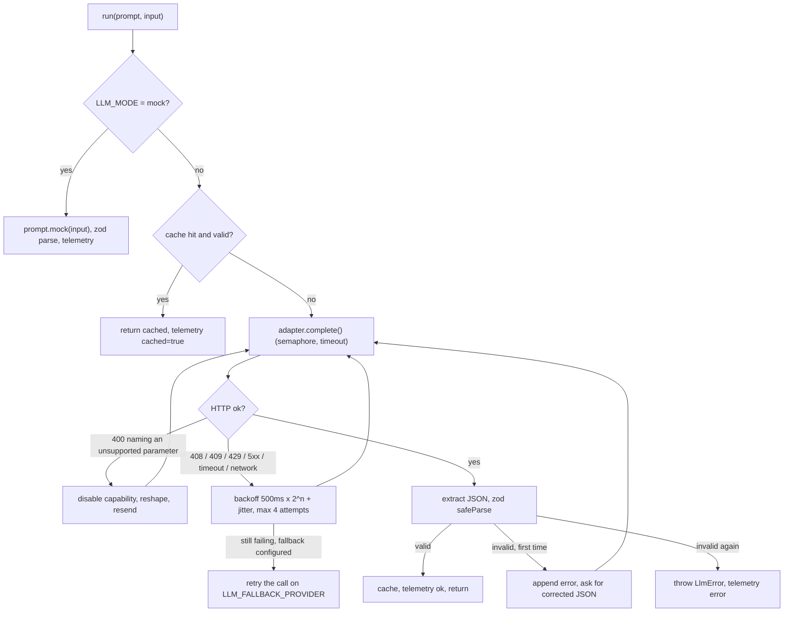

All LLM traffic goes through one class, `LlmClient` in `packages/llm/src/client.ts`. It is created once per process
by `createLlm()` in `packages/engine/src/llm.ts` (API, worker) and wired to the Redis cache and the `llm_calls`
telemetry table. No other code talks to a model.

`LlmClient` owns everything provider-agnostic: prompts, zod validation, the repair retry, the response cache, the
concurrency limit, retries with backoff, failover, telemetry and mock mode. It delegates **only the HTTP call** to a
provider adapter in `packages/llm/src/providers/`
([ADR-0017](/docs/decisions/0017-provider-adapter-layer)).

## Choosing a provider

| `LLM_PROVIDER`         | Adapter                    | Key / model env                          | Endpoint                                                                   |
| ---------------------- | -------------------------- | ---------------------------------------- | -------------------------------------------------------------------------- |
| `openrouter` (default) | `OpenAICompatibleProvider` | `OPENROUTER_API_KEY`, `OPENROUTER_MODEL` | `POST {OPENROUTER_BASE_URL}/chat/completions`                              |
| `openai`               | `OpenAICompatibleProvider` | `OPENAI_API_KEY`, `OPENAI_MODEL`         | `POST {OPENAI_BASE_URL}/chat/completions` (also Azure-compatible gateways) |
| `anthropic`            | `AnthropicProvider`        | `ANTHROPIC_API_KEY`, `ANTHROPIC_MODEL`   | `POST {ANTHROPIC_BASE_URL}/v1/messages`                                    |

<Callout type="info">
  The model is **exactly** the selected provider's `*_MODEL` value: `$OPENROUTER_MODEL`, `$OPENAI_MODEL` or
  `$ANTHROPIC_MODEL`. There is no model name in source code and no default in code
  ([ADR-0009](/docs/decisions/0009-openrouter-model-from-env), extended by
  [ADR-0017](/docs/decisions/0017-provider-adapter-layer)). `.env.example` keeps **OpenRouter as the
  documented default**. Switching provider or model is an environment change plus a restart; no rebuild.
</Callout>

To use OpenAI directly, set these in your own `.env` (never commit keys):

```dotenv
LLM_PROVIDER=openai
OPENAI_API_KEY=<your key>
OPENAI_MODEL=<the model id you want>
# optional: minimal | low | medium | high (reasoning models only)
OPENAI_REASONING_EFFORT=low
```

Anthropic works the same way with `LLM_PROVIDER=anthropic`, `ANTHROPIC_API_KEY` and `ANTHROPIC_MODEL`. OpenRouter can
also route to OpenAI or Anthropic models if you prefer a single key.

- **Validation.** With `LLM_MODE=live`, the env schema requires the selected provider's key **and** model; the other
  providers' keys are ignored. `LLM_FALLBACK_PROVIDER`, when set, must differ from `LLM_PROVIDER` and needs its own key
  and model too. The `LlmClient` constructor refuses to start in live mode without a key and model.
- **Visibility.** The provider and model are logged at startup (`LLM configured { mode, provider, model }`),
  returned by `/api/ready` (`llm.mode`, `llm.provider`, `llm.model`, `llm.autoMocked`), stored on every `llm_calls`
  row (`provider`, `model`), shown on the platform dashboard as `provider · model`, returned with every outreach draft
  and stored as `org_profiles.generated_by_model`.
- Prompts are model-agnostic: an explicit JSON shape in the prompt, structured output when supported, zod validation
  and a repair retry. Quality varies by model, which is why [Evaluation](/docs/pipeline/evaluation) exists.

## Capabilities per model

Providers and model families differ in which request parameters they accept. `capabilitiesFor()` in
`providers/capabilities.ts` resolves them from the provider id and the model string, then applies env overrides:

| Provider     | Model pattern                                                                  | Temperature | Structured output                                | Token parameter         |    `reasoning_effort`     | Output budget             |
| ------------ | ------------------------------------------------------------------------------ | :---------: | ------------------------------------------------ | ----------------------- | :-----------------------: | ------------------------- |
| `openai`     | starts with `gpt-5` or `o` + digit (reasoning)                                 |   omitted   | `response_format: json_schema` (`strict: false`) | `max_completion_tokens` | `OPENAI_REASONING_EFFORT` | max(4000, 3 × prompt max) |
| `openai`     | anything else                                                                  |      ✓      | `json_schema`                                    | `max_completion_tokens` |             —             | prompt max                |
| `openrouter` | contains `gpt-5` or `o` + digit after a `/` (e.g. an upstream reasoning model) |   omitted   | `json_schema`                                    | `max_tokens`            |             —             | max(4000, 3 × prompt max) |
| `openrouter` | anything else                                                                  |      ✓      | `json_schema`                                    | `max_tokens`            |             —             | prompt max                |
| `anthropic`  | any                                                                            |      ✓      | forced tool call (see below)                     | `max_tokens` (required) |             —             | prompt max                |

- **Overrides.** `LLM_SUPPORTS_TEMPERATURE` and `LLM_SUPPORTS_JSON_SCHEMA` (`true`, `false` or empty for auto) force
  the capability for models newer than the table.
- **Reasoning headroom.** Reasoning models spend output tokens on hidden reasoning, so their output cap is raised to
  at least 4000 tokens (three times the prompt's `maxTokens`).

### Self-healing on 400

If a provider answers **400** and the message names a parameter the model rejects, the adapter disables that
capability **for the rest of the process** and retries at once (at most 3 shaping attempts per call):

| Adapter             | Message mentions                                 | Change                                                                            |
| ------------------- | ------------------------------------------------ | --------------------------------------------------------------------------------- |
| OpenAI / OpenRouter | `response_format`, `json_schema` or `structured` | Stop sending structured output; the JSON shape in the prompt carries the contract |
| OpenAI / OpenRouter | `temperature`                                    | Stop sending `temperature`                                                        |
| OpenAI / OpenRouter | `reasoning`                                      | Stop sending `reasoning_effort`                                                   |
| OpenAI / OpenRouter | `max_tokens` (while using it)                    | Switch to `max_completion_tokens`                                                 |
| Anthropic           | `temperature`                                    | Stop sending `temperature`                                                        |
| Anthropic           | `tool`                                           | Stop forcing the tool; ask for JSON text                                          |

### Anthropic structured output

The Anthropic adapter sends `system` as its own field and obtains JSON by **forcing a single tool call**: one tool
whose `input_schema` is the prompt's JSON Schema, with `tool_choice: { type: "tool", name }`. The tool input _is_ the
JSON result, which is more reliable than asking for JSON text. Usage maps from `usage.input_tokens` and
`usage.output_tokens`. Status 529 (overloaded) is retryable. The `anthropic-version` header is `2023-06-01`.

## Request anatomy (OpenAI-compatible)

```http
POST {BASE_URL}/chat/completions
Authorization: Bearer $OPENROUTER_API_KEY   (or $OPENAI_API_KEY)
Content-Type: application/json
HTTP-Referer: $WEB_URL                      (OpenRouter only)
X-Title: SelloEasy                          (OpenRouter only)

{
  "model": "$OPENROUTER_MODEL",             (or $OPENAI_MODEL)
  "messages": [ { "role": "system", … }, { "role": "user", … } ],
  "temperature": 0–0.5 (per prompt, default 0.2; omitted when unsupported),
  "max_tokens" | "max_completion_tokens": per prompt (default 2000),
  "reasoning_effort": "$OPENAI_REASONING_EFFORT" (OpenAI reasoning models only),
  "usage": { "include": true }              (OpenRouter only: returns the real cost),
  "response_format": { "type": "json_schema", "json_schema": { "name": "<prompt id>", "strict": false, "schema": <from zod> } }
}
```

Both adapters use plain `fetch`, not vendor SDKs ([ADR-0014](/docs/decisions/0014-fetch-over-openai-sdk)). The JSON
Schema is generated from the prompt's zod schema (`z.toJSONSchema`, input side) with `$schema` removed.

## Mock mode

`LLM_MODE=mock` replaces every call with the prompt's deterministic `mock(input)`. The output is still validated
against the prompt's zod schema, and a telemetry row is still recorded with `provider = "mock"`, `model = "mock"` and
zero tokens and cost.

| When mock mode is used                                           | How                                                                                                                                                                                                                       |
| ---------------------------------------------------------------- | ------------------------------------------------------------------------------------------------------------------------------------------------------------------------------------------------------------------------- |
| `LLM_MODE=mock` explicitly                                       | Configured                                                                                                                                                                                                                |
| `LLM_MODE=live` but the **selected provider's** API key is empty | **Automatic:** `core/config.ts` switches to mock before validation. The API and worker log "No API key for the selected LLM provider — … LLM_MODE=mock" with the provider, and `/api/ready` reports `"autoMocked": true`. |
| The demo seed                                                    | **Always.** The seed builds its own mock `LlmClient`, so seeding is fast, free and reproducible ([ADR-0008](/docs/decisions/0008-synthetic-dataset)).                                                                     |
| `pnpm eval:pipeline --mode mock`                                 | Evaluation baseline                                                                                                                                                                                                       |

Mocks are rules, not canned text. See [Prompts](/docs/pipeline/prompts).

## Call flow



### Tolerant JSON extraction

`extractJson()` accepts a bare JSON object or array, a fenced `json` block, or JSON surrounded by prose (it slices from
the first `{` or `[` to the last `}` or `]`). For Anthropic tool calls, the tool input is serialized directly.

### Repair retry

If the extracted JSON fails the zod schema (or no JSON is found), the client appends the model's answer and a user
message: _"Your previous answer did not match the required JSON schema: `<prettified zod error>` Return ONLY
corrected JSON, no prose."_, then asks once more. A second failure throws
`Model output failed schema validation for <prompt id>`. Tokens and cost of both attempts are summed.

### Retries, backoff and timeouts

- Each HTTP attempt is aborted after `LLM_TIMEOUT_MS` (30 s).
- Retryable failures: **408**, **409**, **429**, **5xx** (and Anthropic **529**), empty completions (except content
  filtering), timeouts (`AbortError`) and network errors (`TypeError`). Non-retryable: other 4xx (bad key, unknown
  model, insufficient credits).
- Up to **4 attempts**, with delay `min(8000, 500 × 2^attempt) ms + random(0–300) ms`.
- A final timeout surfaces as `LlmError("<provider> request timed out after 30000ms", 408)`.

### Failover (`LLM_FALLBACK_PROVIDER`)

When set (and that provider has its own key and model), a call whose primary attempts all failed with a **retryable
or 5xx** error is re-run once on the fallback provider, with its own retries. Schema-repair turns after a failover
stay on the fallback. Non-retryable errors (for example 401 or 400) never fail over. Telemetry records the provider
and model that actually answered.

### Concurrency

An in-process semaphore caps simultaneous requests at `LLM_MAX_CONCURRENCY` (4) **per process**. With one API and one
worker, at most 8 requests can be in flight. Scale-out multiplies this, so size the setting with your provider's rate
limits in mind.

## Response cache

| Aspect    | Value                                                                                             |
| --------- | ------------------------------------------------------------------------------------------------- |
| Store     | Redis (`createLlm({ redis })`)                                                                    |
| Key       | `llm:` + `sha256(provider + ":" + model + "\n" + promptId@version + "\n" + system + "\n" + user)` |
| Value     | The **validated** JSON output                                                                     |
| TTL       | `LLM_CACHE_TTL_SECONDS` (7 days)                                                                  |
| Bypass    | `RunContext.noCache`, used when a user clicks **Regenerate** on an outreach draft                 |
| Mock mode | Not cached (mocks are free and deterministic)                                                     |

Because the key includes the primary provider, the model and the prompt version, switching any of them naturally
invalidates cached answers. A cached value that no longer passes the schema is ignored and re-fetched. Cache hits are
recorded with `cached = true` and do not count against the pipeline budget.

## Cost

| Provider   | Cost source                                                                                                |
| ---------- | ---------------------------------------------------------------------------------------------------------- |
| OpenRouter | `usage.cost` from the response (`usage: { include: true }`)                                                |
| OpenAI     | Computed from token usage and `LLM_PRICE_INPUT_PER_MTOK` / `LLM_PRICE_OUTPUT_PER_MTOK` (USD per 1M tokens) |
| Anthropic  | Same price table                                                                                           |

When a provider does not report cost and the price table is empty, the call's cost is recorded as **0**, so cost
dashboards under-report for OpenAI and Anthropic until you set the price keys to your model's pricing. The price keys
apply to whichever provider answered, so set them for the provider in use.

## Telemetry: `llm_calls`

Every call (live, cached, mock, success or error) invokes the `onCall` hook, which inserts a row. Telemetry failures
never break business flows.

| Column                          | Meaning                                                                          |
| ------------------------------- | -------------------------------------------------------------------------------- |
| `org_id`                        | Org the call was made for (null outside an org context, e.g. the import AI gate) |
| `purpose`                       | Prompt id (`signal.match`, `outreach.email`, `data.quality-gate`, …)             |
| `provider`                      | `openrouter`, `openai`, `anthropic` or `mock` (the one that answered)            |
| `model`                         | The configured model string, or `mock`                                           |
| `prompt_version`                | e.g. `v1`                                                                        |
| `prompt_hash`                   | Same hash as the cache key                                                       |
| `input_tokens`, `output_tokens` | From the provider's usage (summed over a repair retry)                           |
| `cost_usd`                      | See [Cost](#cost) (0 for mock and cache hits)                                    |
| `latency_ms`                    | Wall time including retries                                                      |
| `status`, `error`               | `ok` / `error`, and the first 500 chars of the error                             |
| `cached`                        | Served from Redis                                                                |

Rows written before migration `0002` default to `provider = 'openrouter'`.

Useful queries:

```sql
-- Cost and calls per org and purpose, last 30 days
select o.slug, c.purpose, count(*) filter (where not c.cached) as calls,
       count(*) filter (where c.cached) as cache_hits, round(sum(c.cost_usd)::numeric, 4) as usd
from llm_calls c left join organizations o on o.id = c.org_id
where c.created_at > now() - interval '30 days'
group by 1, 2 order by usd desc;

-- Error rate and latency by provider and model
select provider, model, status, count(*), avg(latency_ms)::int as avg_ms
from llm_calls where created_at > now() - interval '1 day' group by 1, 2, 3;
```

The platform dashboard shows **LLM cost (30 days)** and **LLM calls (30 days, non-cached)** per org and in total.
Pipeline runs record `llmCalls`, `cacheHits` and `costUsd` in their stats.

## Cost expectations

Cost depends on the configured model's pricing and on how many events pass the prefilter. The controls that bound it
are the prefilter, batching (8 events per match call), the per-run budget (`PIPELINE_MAX_LLM_CALLS_PER_RUN`, 60), the
7-day cache, idempotent re-runs and, for imports, `IMPORT_AI_GATE_MAX_CALLS`. Use the queries above instead of
estimates.

## Errors users may see

| Situation                              | Result                                                                                                          |
| -------------------------------------- | --------------------------------------------------------------------------------------------------------------- |
| Draft generation fails (after retries) | `503 service_unavailable` "Could not generate a draft right now: …"                                             |
| ICP suggestion fails                   | `400` with the error message                                                                                    |
| Profile generation fails               | The BullMQ job fails (2 attempts). `GET /org/profile/jobs/:jobId` returns `state: "failed"` and `failedReason`. |
| Pipeline matching call fails           | The run becomes `FAILED` with the error                                                                         |
| Import AI quality gate fails           | Ignored: the gate is advisory and the import continues                                                          |

See [Runbooks → LLM errors and quotas](/docs/operations/runbooks#llm-errors-and-quotas).

## Adding a provider

1. Add an adapter implementing `ChatProvider` (`complete(req)` returning `content` and `usage`) in
   `packages/llm/src/providers/`, and register it in `createProvider()`.
2. Add its id to `ProviderId`, its capabilities to `capabilitiesFor()`, and its key/model/base-URL env keys to
   `packages/shared/src/env.ts`, `packages/llm/src/config.ts`, `.env.example` and
   [Environment variables](/docs/getting-started/environment-variables).
3. Add request-shaping unit tests with a fake `fetch` (see `packages/llm/test/`).
