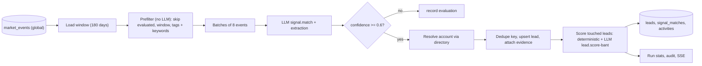
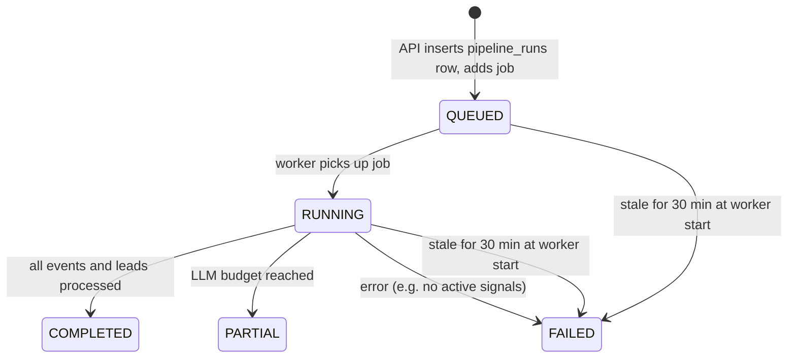

The **intelligence pipeline** is the core of SelloEasy. For one organization, it reads the market-events corpus,
keeps the events that could plausibly matter, asks an LLM which of the org's signals each event satisfies,
resolves the buying company, creates or updates a lead, and scores it on BANT+. Runs execute in the worker
(`pipeline` queue) and are implemented in `packages/engine/src/pipeline.ts` on top of pure stages from
`packages/pipeline`.

## At a glance

| Stage                 |         LLM?          | Where                      | Detail                                                                                                                                                    |
| --------------------- | :-------------------: | -------------------------- | --------------------------------------------------------------------------------------------------------------------------------------------------------- |
| Load org context      |           —           | engine                     | Org, profile, active signals, active ICPs, products. Fails if there are no active signals.                                                                |
| Load events in window |           —           | engine                     | `published_at` within `PIPELINE_EVENT_WINDOW_DAYS` (180); **retracted** events (rolled-back batches) are never loaded                                     |
| Prefilter             |           —           | `pipeline.prefilter()`     | Skip already-evaluated events, keep in-window events that contain at least one keyword of an active signal, newest first                                  |
| Match + extract       |           ✓           | `signal.match` prompt      | Batches of `PIPELINE_BATCH_SIZE` (8). One call returns matches, the buyer account, personas and deal hints per event.                                     |
| Accept                |           —           | `pipeline.acceptMatches()` | Confidence at or above `PIPELINE_MATCH_THRESHOLD` (0.6) and a known signal id                                                                             |
| Resolve account       |           —           | engine                     | Directory lookup by domain, then name. Reuse or create the tenant account and copy directory contacts.                                                    |
| Dedupe & upsert       |           —           | `pipeline.dedupeKey()`     | One lead per account per org. Attach evidence and a `SIGNAL` activity.                                                                                    |
| Score                 | ✓ (budget permitting) | `scoreLead()`              | Authority, ICP fit and signal strength deterministically; budget, need and timeline via `lead.score-bant` (or the heuristic when the budget is exhausted) |
| Finish                |           —           | engine                     | Status `COMPLETED` or `PARTIAL`, stats, audit `pipeline.run_completed`, final SSE event                                                                   |

The detailed rules for each stage are on [Pipeline stages](/docs/pipeline/stages).

## Triggers

| Trigger        | Source                                                                                                                                                                                                                                                                                                                                                                                | Who                                       |
| -------------- | ------------------------------------------------------------------------------------------------------------------------------------------------------------------------------------------------------------------------------------------------------------------------------------------------------------------------------------------------------------------------------------- | ----------------------------------------- |
| `ONBOARDING`   | `POST /api/v1/org/activate` queues the first run                                                                                                                                                                                                                                                                                                                                      | Org Admin                                 |
| `MANUAL`       | `POST /api/v1/pipeline/runs` ("Run pipeline" button)                                                                                                                                                                                                                                                                                                                                  | Org Admin, Sales Manager (`pipeline:run`) |
| `SCHEDULED`    | Repeatable BullMQ job `pipeline.schedule-tick` on `PIPELINE_SCHEDULE_CRON` (default `0 */6 * * *`) queues a run for every `ACTIVE` org that has no run in progress                                                                                                                                                                                                                    | System                                    |
| `DATA_REFRESH` | **Fan-out** after new platform data: an import commit or connector run that inserted events queues a run for every `ACTIVE` org whose target industries (profile + active ICPs) overlap the new events' tags, skipping orgs with a run in progress. On by default, per batch / connector ([Platform data](/docs/platform-data/connectors-and-ingestion#fan-out-and-the-org-pipeline)) | System (Super Admin action)               |

The seed also executes `runPipeline()` directly (without the queue) with a mock LLM to pre-score the demo data. See
[Seed data](/docs/getting-started/seed-data-and-accounts).

## Run lifecycle

- **One run per org at a time.** `enqueuePipelineRun()` refuses with **409** "A pipeline run is already in
  progress" (with `details.runId`) if the org has a `QUEUED` or `RUNNING` run. The scheduler skips busy orgs.
  The BullMQ job id is `pipeline-<runId>`.
- **Different orgs run in parallel.** The pipeline worker runs up to 2 jobs concurrently, with a 120 s lock
  that BullMQ renews while the job is alive.
- **No automatic retry.** Run jobs have `attempts: 1`. A failure marks the run `FAILED` with the error message,
  writes an audit entry (`pipeline.run_failed`) and publishes a final SSE event. Because matching is idempotent,
  starting another run is always safe.
- **Stale runs.** When the worker starts, it marks runs still `QUEUED` or `RUNNING` after 30 minutes as `FAILED`
  ("Run timed out or worker restarted"), so a crashed worker cannot block an org forever.

## Cost controls

| Control        | Default                               | Effect                                                                                                                                                                                                                                          |
| -------------- | ------------------------------------- | ----------------------------------------------------------------------------------------------------------------------------------------------------------------------------------------------------------------------------------------------- |
| Prefilter      | always on                             | Only events containing at least one active-signal keyword reach the LLM. On the demo corpus, most events are cut before any paid call.                                                                                                          |
| Batching       | 8 events per call                     | One `signal.match` call covers 8 events × all active signals                                                                                                                                                                                    |
| Budget guard   | `PIPELINE_MAX_LLM_CALLS_PER_RUN = 60` | Matching stops once non-cached calls reach `ceil(0.6 × budget)` (36 by default). The rest is reserved for scoring. When scoring runs out, the remaining leads are scored by the deterministic heuristic. Either case ends the run as `PARTIAL`. |
| Newest first   | always                                | Kept events are sorted by `published_at` descending, so when the budget ends a run early, the freshest signals have been processed. The rest are picked up by the next run.                                                                     |
| Response cache | 7 days                                | Identical model + prompt version + rendered prompt returns the cached JSON. Cache hits do not count against the budget (`stats.cacheHits`).                                                                                                     |
| Idempotency    | always                                | Events already evaluated under the same signal set are skipped entirely.                                                                                                                                                                        |

## Idempotency in one paragraph

Each evaluated event is recorded in `org_event_evaluations` with a 16-hex-char hash of the org's **active signal
set** (id, match instructions, keywords and negative keywords of every active signal). Re-runs skip events already
evaluated under the same hash. Editing, adding or toggling signals changes the hash, so the corpus is re-evaluated
against the new definitions. Matches are unique per `(org, event, signal)`, so re-evaluation never duplicates
evidence, and leads are unique per `(org, dedupe_key)`. Details: [Stages → Idempotency](/docs/pipeline/stages#idempotency).

## Observability

- `pipeline_runs.stats`: `eventsScanned`, `prefiltered`, `matched`, `leadsCreated`, `leadsUpdated`,
  `llmCalls` (non-cached), `cacheHits`, `costUsd`, `budgetExhausted`. Persisted after the prefilter, after every
  batch and every 5 scored leads.
- **Live progress** over SSE: `GET /api/v1/pipeline/runs/:id/events`, with stages `loading` (2%), `prefilter`
  (10%), `matching` (10–70%), `scoring` (70–98%) and `done`/`failed` (100%). See
  [Architecture → SSE](/docs/architecture/overview#live-pipeline-progress-sse).
- Every LLM call is recorded in `llm_calls` (purpose, provider, model, prompt version, tokens, cost, latency, status,
  cache hit).
- Worker log line `Pipeline run finished` with all stats and the status. Audit entries
  `pipeline.run_requested`, `pipeline.run_completed` and `pipeline.run_failed`.
- Run history: `GET /api/v1/pipeline/runs` (paginated) and `GET /api/v1/pipeline/runs/:id`.

## Where to go next

- [Stages](/docs/pipeline/stages): the exact rules for prefiltering, matching, account resolution, dedupe and
  scoring.
- [Prompts](/docs/pipeline/prompts): every prompt, its version and its output schema.
- [LLM layer & providers](/docs/pipeline/llm-providers): provider switch (OpenRouter, OpenAI, Anthropic), model
  selection, mock mode, cache, retries, failover and cost.
- [Platform data source](/docs/platform-data): where `market_events` come from (imports, connectors) and how new
  data triggers `DATA_REFRESH` runs.
- [Evaluation](/docs/pipeline/evaluation): measuring matching precision and recall on the gold set.
- [Runbooks](/docs/operations/runbooks#pipeline-run-stuck): what to do when a run is stuck or failing.
