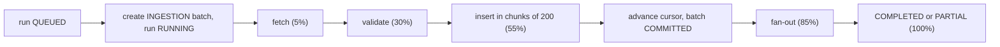

A **connector** is a configured source of template-v1 records (`data_connectors`). An **ingestion run**
(`ingestion_runs`) pulls the next records from a connector, validates them with the same rules as imports, inserts the
valid ones and optionally notifies relevant orgs. Code: `packages/engine/src/data/connectors.ts`; jobs run on the
worker's `ingestion` queue.

## Connector types

### `DEMO_FEED`

A bundled reserve of **60 synthetic events** (12 per demo industry) in `packages/dataset/data/feed/*.jsonl`, not
loaded by the seed. Each run releases the next `config.batchSize` records (10 by default) in `published_at` order, so
clicking "Run ingestion" visibly brings in new data that org pipelines then pick up.

- The cursor is `{ offset, total }`. When the reserve is exhausted, runs fetch nothing ("No new data — the source is
  up to date").
- Dates are shifted at fetch time so the newest reserve item lands about one day before "now", keeping relative
  spacing. The demo always looks like fresh news.
- The seed registers one enabled DEMO_FEED connector named **"Demo news feed"** (`batchSize: 10`, fan-out on, no
  schedule).

### `HTTP_FEED`

GETs an `https://` URL that returns template-v1 records as **CSV, JSONL or JSON** (`config.format`, default `json`).
This is the "data sitting anywhere in the same format" source.

| Config key      | Meaning                                                                                                                     |
| --------------- | --------------------------------------------------------------------------------------------------------------------------- |
| `url`           | Feed URL. Must start with `https://`                                                                                        |
| `format`        | `csv`, `jsonl` or `json` (array, or `{"items": [...], "next": "..."}`)                                                      |
| `sinceParam`    | Optional query parameter for incremental pulls, e.g. `since`. Sent as `?since=<cursor>` when a cursor exists                |
| `authHeader`    | Optional header name, e.g. `Authorization` or `X-Api-Key`                                                                   |
| `authEnvVar`    | The **name** of the env var holding the header value. Must match `CONNECTOR_[A-Z0-9_]{1,60}`. Set both auth keys or neither |
| `maxRowsPerRun` | Optional per-connector cap (1–5 000), never above `INGESTION_MAX_ROWS_PER_RUN` (500)                                        |

- **Incremental pulls.** After a successful run the cursor becomes `{ since: <max published_at of the rows taken> }`.
  Without a `sinceParam` the feed is fetched in full each time and already-known rows are skipped as duplicates.
- **Pagination.** JSON responses may include a `next` URL. It is followed only if it stays on the same host, for up
  to 20 pages or until the row cap is reached. CSV and JSONL feeds are a single response and go through the same
  [file layer](/docs/platform-data/validation-rules#file-layer) as uploads (unknown or missing columns fail the run).
- **Response limits.** 60-second timeout and a 10 MB streamed size cap per response. User agent `SelloEasyIngest/1.0`.

<Callout type="warn">
  **SSRF guard.** Every request (including each `next` page) first passes `assertPublicUrl()`, the same check
  the website crawler uses: the host must resolve to public IP addresses only. Redirects are refused
  (`redirect: "error"`), so a feed cannot bounce the worker to an internal address. See
  [Security](/docs/architecture/security).
</Callout>

### Connector secrets (`CONNECTOR_*`)

Connectors store only the **name** of an env var, never a secret. At run time `readConnectorSecret()` in
`packages/core/src/config.ts` reads the value from the process environment, and only names matching
`CONNECTOR_[A-Z0-9_]{1,60}` are readable. A connector therefore cannot be pointed at `JWT_ACCESS_SECRET`,
`OPENAI_API_KEY` or any other platform secret and exfiltrate it to an external URL.

Put the value in your local `.env` (for example `CONNECTOR_ACME_FEED_TOKEN=...`) or in the AWS Secrets Manager JSON
secret, which is merged into the environment at boot. Restart the worker (and the API, for "Test connection") after
adding one. These keys are free-form and deliberately not part of the env schema; see
[Environment variables](/docs/getting-started/environment-variables#connector-secrets).

## Managing connectors

| Endpoint                                  | Permission             | Notes                                                                                                                                                           |
| ----------------------------------------- | ---------------------- | --------------------------------------------------------------------------------------------------------------------------------------------------------------- |
| `GET /platform/data/connectors`           | `platform:data:read`   | All connectors with cursor, last run, last status and `runningRunId`                                                                                            |
| `POST /platform/data/connectors`          | `platform:data:manage` | Create (201). Name must be unique (409). HTTP feeds need an `https://` URL                                                                                      |
| `PATCH /platform/data/connectors/:id`     | `platform:data:manage` | Partial update; `config` is merged into the existing config. Omitting `schedule` keeps it; `""` or `null` clears it                                             |
| `DELETE /platform/data/connectors/:id`    | `platform:data:manage` | 409 while a run is in progress. Its batches and inserted data stay                                                                                              |
| `POST /platform/data/connectors/:id/test` | `platform:data:manage` | Fetch up to **5** rows and validate them **without inserting** (10 calls per minute). Returns counts and per-row issues. 400 with the reason if the fetch fails |
| `POST /platform/data/connectors/:id/run`  | `platform:data:manage` | Start a run (202). 409 if the connector is disabled or already running (`details.runId`)                                                                        |

Body of create (`connectorSchema`): `name`, `type`, `config`, `schedule` (5-field cron or empty), `enabled` (default
true) and `fanOut` (default true).

## Schedules

A connector with `enabled = true` and a `schedule` gets a BullMQ job scheduler `connector-<id>` on the `ingestion`
queue (the same pattern as the org pipeline schedule). Creating, updating or deleting a connector upserts or removes
it, and the worker re-syncs all connector schedules at startup. Each tick (`ingestion.schedule`) queues a `SCHEDULED`
run unless the connector is disabled or already has a `QUEUED`/`RUNNING` run.

## An ingestion run, step by step

1. Create a `data_batches` row (`kind = INGESTION`, label `<connector> · <timestamp>`) and mark the run `RUNNING`.
   Audit `data.ingestion_started`.
2. **Fetch** up to `min(config.maxRowsPerRun, INGESTION_MAX_ROWS_PER_RUN)` rows (500 by default).
3. **Validate** every row with the [same rules as imports](/docs/platform-data/validation-rules), including
   duplicates in the batch and against the data source. The AI quality gate does not run here. All rows are stored as
   staging rows of the batch, so the report is available like an import's.
4. **Insert** `VALID` and `WARNING` rows in transactions of 200 (`source_type = CONNECTOR`). There is no review step
   and no invalid-ratio guard: invalid and duplicate rows are counted and reported, never inserted.
5. **Advance the cursor** only after the inserts succeeded, so a failed run can be re-run safely. Mark the batch
   `COMMITTED`.
6. **Fan-out** (when the connector's `fanOut` is on and rows were inserted): queue `DATA_REFRESH` pipeline runs for
   relevant `ACTIVE` orgs, exactly as after an import commit. `stats.orgsNotified` holds the count.
7. Finish: `PARTIAL` when the source reported more data ("run again to continue"), otherwise `COMPLETED`. Audit
   `data.ingestion_completed` with the stats.

On error the run and batch become `FAILED`, the connector's `last_status` is `FAILED`, and `data.ingestion_failed` is
audited. At worker startup, runs still `QUEUED` or `RUNNING` after 30 minutes are failed ("Worker restarted during the
run") so the connector can run again. The ingestion worker runs at most 2 jobs at a time (imports and runs share it),
with a 5-minute lock.

Run stats (`ingestion_runs.stats`): `fetched`, `valid`, `warnings`, `invalid`, `duplicates`, `inserted`,
`orgsNotified`.

## Live progress (SSE)

`GET /platform/data/ingestion-runs/:id/events` streams `IngestionProgressEvent`s (`runId`, `status`, `stage`,
`progress` 0–100, `stats`, `message`) as `text/event-stream`, using the same mechanism as
[pipeline runs](/docs/architecture/overview#live-pipeline-progress-sse):

- the first event is a `snapshot` from the database; a finished run returns only the snapshot and closes;
- the worker publishes to the Redis channel `ingestion:progress:<runId>`, with stages `fetching`, `validating`,
  `inserting`, `fanout`, `done` or `failed`;
- a `: ping` heartbeat is sent every 15 s, and the stream closes on `COMPLETED`, `PARTIAL` or `FAILED`.

Run history: `GET /platform/data/ingestion-runs?connectorId=&page=&pageSize=` and
`GET /platform/data/ingestion-runs/:id`.

## Fan-out and the org pipeline

Fan-out queues a normal pipeline run with trigger `DATA_REFRESH` for each `ACTIVE` org whose profile target industries
or active ICP industries overlap the new events' tags (case-insensitive), respecting the one-run-per-org rule. The
org's run then prefilters and matches the new events like any other. Nothing is pushed into tenant tables directly.
See [Pipeline overview → Triggers](/docs/pipeline/overview#triggers).
