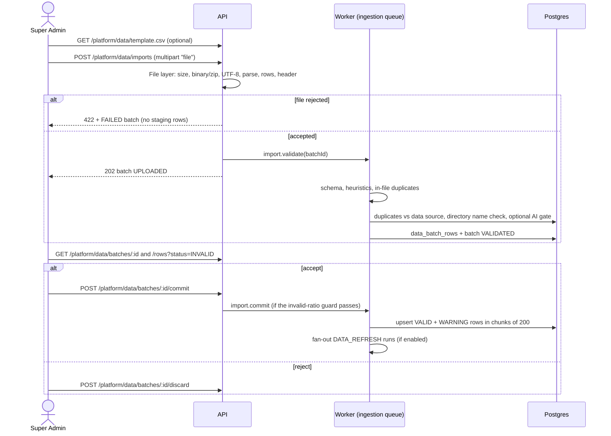

Super Admins import market data as files. Imports are **two-phase**: the file is validated into a staging area
first, the admin reviews the report, and only a commit writes anything to the data source
([ADR-0015](/docs/decisions/0015-canonical-data-template-and-two-phase-import)).



<Callout type="info">
  **Nothing reaches `market_events` before commit.** Validated rows live only in `data_batch_rows`, which orgs
  never read.
</Callout>

## Limits

| Limit                           | Default  | Env key                    | Enforced where                                                               |
| ------------------------------- | -------- | -------------------------- | ---------------------------------------------------------------------------- |
| File size                       | 10 MB    | `IMPORT_MAX_MB`            | Multipart parser (`fileSize`), file layer in the API and again in the worker |
| Data rows per file              | 5 000    | `IMPORT_MAX_ROWS`          | File layer                                                                   |
| Invalid share allowed to commit | 20 %     | `IMPORT_MAX_INVALID_RATIO` | Commit endpoint and the worker commit job                                    |
| Oldest `published_at`           | 730 days | `DATA_MAX_AGE_DAYS`        | Row validation                                                               |
| AI quality-gate calls per file  | 10       | `IMPORT_AI_GATE_MAX_CALLS` | Worker validation (only when `IMPORT_AI_GATE_ENABLED=true`)                  |
| Staging rows retention          | 30 days  | `STAGING_RETENTION_DAYS`   | Daily `maintenance.staging-purge` job                                        |

Larger loads should go through a [connector](/docs/platform-data/connectors-and-ingestion). The current limits are
returned by `GET /platform/data/template` (`limits.maxMb`, `maxRows`, `maxInvalidRatio`, `maxAgeDays`).

## 1. Upload

```bash
curl -b jar.txt -F 'file=@sampleData.csv' \
  http://localhost:4000/api/v1/platform/data/imports
```

- Multipart field **`file`**, exactly one file, with extension `.csv`, `.jsonl`, `.ndjson` or `.json`. The file name is
  sanitized and becomes the batch label.
- Optional form field **`fanOut=false`** (send it before the file part) disables the post-commit fan-out for this
  batch. It is on by default and can also be set at commit time.
- The raw file is stored in object storage (MinIO/S3) under `platform/imports/<batchId>/<fileName>`.
- The API runs the [file layer](/docs/platform-data/validation-rules#file-layer) synchronously as a fast fail:
  - **Rejected:** the batch is recorded as `FAILED` with `fileIssues`, audited as `data.import_rejected`, and the call
    returns **422** (problem+json) with the batch in `details.batch`. No staging rows are created.
  - **Accepted:** the batch stays `UPLOADED` with `format` and the row count, `data.import_uploaded` is audited, the
    `import.validate` job is queued, and the call returns **202** with the batch.

## 2. Validate (worker)

The `import.validate` job (queue `ingestion`) re-reads the file, repeats the file layer, and then validates every
row: zod schema, content heuristics, date window, in-file duplicates, duplicates against the data source, the
directory name check and, when enabled, the AI quality gate. All rules are listed on
[Validation rules](/docs/platform-data/validation-rules).

Each row is stored in `data_batch_rows` with its `raw` input, its `normalized` record (valid rows only), a status and
its issues. The batch becomes `VALIDATED` with `stats` (`rows`, `valid`, `warnings`, `invalid`, `duplicates`), and
`data.import_validated` is audited.

| Row status  | Meaning                                                                            | Committed? |
| ----------- | ---------------------------------------------------------------------------------- | :--------: |
| `VALID`     | Passed every check                                                                 |     ✓      |
| `WARNING`   | Passed, but has soft issues (for example a contact email on another domain)        |     ✓      |
| `INVALID`   | At least one error                                                                 |            |
| `DUPLICATE` | Same key as an earlier row in the file or an existing event (`duplicateOfEventId`) |            |

### The optional AI quality gate

With `IMPORT_AI_GATE_ENABLED=true`, valid and warning rows are sent to the
[`data.quality-gate`](/docs/pipeline/prompts#dataquality-gate-v1) prompt in chunks of **20 rows per call**, up to
`IMPORT_AI_GATE_MAX_CALLS` calls (10) per file. Rows scoring below **0.5** get an `ai_low_quality` **warning**. The
gate is advisory: it never makes a row invalid, and an LLM failure never blocks the import. It is off by default and
runs only for file imports, not for connector runs.

## 3. Review

| Endpoint                                             | Returns                                                                                                       |
| ---------------------------------------------------- | ------------------------------------------------------------------------------------------------------------- |
| `GET /platform/data/batches/:id`                     | Status, stats, `fileIssues`, `committable`, `maxInvalidRatio`, `error`, and (once committed) the distribution |
| `GET /platform/data/batches/:id/rows?status=INVALID` | Paginated staging rows (25 per page, max 100) with `raw`, `issues`, `duplicateOfEventId`, `insertedEventId`   |
| `GET /platform/data/batches/:id/errors.csv`          | Every `INVALID`, `DUPLICATE` and `WARNING` row as CSV                                                         |

`errors.csv` has the columns `row_number`, `status`, `issues` and then every template column with the original values.
Issues are joined as `[error] field: message | [warning] field: message`. Cells are CSV-injection safe: values starting
with `=`, `+`, `-`, `@`, tab or carriage return are prefixed with `'`.

## 4. Commit or discard

### Commit

```bash
curl -b jar.txt -H 'content-type: application/json' -d '{"fanOut": true}' \
  http://localhost:4000/api/v1/platform/data/batches/<batchId>/commit
```

- Needs `platform:data:import`. Only a `VALIDATED` batch can be committed (otherwise **409**).
- **Invalid-ratio guard.** The commit is refused with **422** when `invalid / rows > IMPORT_MAX_INVALID_RATIO`
  (20 %): "N of M rows are invalid — above the 20% limit. Fix the file and upload it again." A batch with no valid or
  warning rows is refused with "Nothing to commit — no valid rows". `DUPLICATE` rows do not count as invalid. The
  batch DTO's `committable` flag tells the UI in advance.
- On success the batch becomes `COMMITTING`, `data.import_commit_requested` is audited, `import.commit` is queued and
  the call returns **202**. The body's optional `fanOut` overrides the batch setting.
- The worker re-checks the guard, then upserts `VALID` and `WARNING` rows in row order, in transactions of **200
  rows**: directory company, then contact, then event. Events get `source_type` `CSV_IMPORT` (for `.csv`) or
  `JSONL_IMPORT` (for JSONL and JSON), the `batch_id`, `schema_version = 1` and `ingested_by`. Each staging row gets
  its `insertedEventId`.
- Unique indexes are the last guard against races: an event that already exists by then is skipped and counted in
  `duplicates`.
- The batch becomes `COMMITTED` with `inserted`, `companiesCreated`, `companiesUpdated` and `contactsCreated`, and
  `data.import_committed` is audited.
- If the commit job throws, the batch goes back to `VALIDATED` with `error` set, so it can be reviewed and committed
  again. Chunks already written stay written; a re-commit skips them as duplicates.

Partial commit is deliberate: valid rows go in, bad rows are skipped and reported, but a file that is mostly garbage is
refused as a whole so it gets fixed at the source.

### Discard

`POST /platform/data/batches/:id/discard` (`platform:data:import`) marks an `UPLOADED`, `VALIDATED` or `FAILED` batch
`DISCARDED` and audits `data.import_discarded`. Any other status returns **409**.

## Fan-out to orgs

When the batch has `fanOut` enabled (the default) and at least one event was inserted, the worker queues a pipeline
run with trigger **`DATA_REFRESH`** for every `ACTIVE` org whose target industries (profile `targetIndustries` plus
active ICPs' `criteria.industries`) overlap the inserted events' tags. Orgs with a run already `QUEUED` or `RUNNING`
are skipped; their next manual or scheduled run picks the events up. The number of orgs is audited as
`data.fanout_enqueued`. See [Pipeline overview → Triggers](/docs/pipeline/overview#triggers).

## Rollback

`POST /platform/data/batches/:id/rollback` needs `platform:data:manage` and a `COMMITTED` batch (otherwise **409**). In
one transaction it:

1. sets `retracted_at` on every live event of the batch;
2. retracts directory companies **created** by the batch that no live event still references by domain;
3. retracts directory contacts created by the batch;
4. marks the batch `ROLLED_BACK` and audits `data.batch_rolled_back` with the counts.

The response is the batch plus `retracted: { events, companies, contacts }`.

<Callout type="warn">
  Rollback **does not delete leads** that orgs already created from these events. Those leads are tenant data
  and remain valid evidence. Retracted events are simply skipped by every future pipeline run
  ([ADR-0016](/docs/decisions/0016-retract-instead-of-delete-for-rollback)). Any `COMMITTED` batch can be
  rolled back, including ingestion batches and the seed's "Initial synthetic dataset" batch, so check the
  batch before you confirm.
</Callout>

There is no in-place edit of stored records. To correct data, roll back the batch and import a fixed file. Because
duplicate detection also considers retracted events, corrected records need a new `external_id`, `source_url` and
content hash to be accepted (see [Known limitations](/docs/limitations#platform-data)).

## Try it with `sampleData.csv`

1. Sign in as the Super Admin (`superadmin@selloeasy.local`) and keep the cookie jar (see
   [API reference → Authentication](/docs/api/reference#authentication)).
2. `POST /platform/data/imports` with `file=@sampleData.csv` returns 202.
3. `GET /platform/data/batches/<id>` shows `VALIDATED` with **10 valid** rows.
4. Commit it: **10 events**, **10 directory companies** and **7 contacts** are inserted, and relevant orgs get a
   `DATA_REFRESH` run.
5. Upload the same file again: all 10 rows are `DUPLICATE` (`duplicate_existing`), so there is nothing to commit.
6. Upload `sampleData.invalid.csv`: 12 of its 13 rows are `INVALID` (one per rule: missing title, a `TEST` title, lorem
   ipsum, all caps, unknown tag, bad date, future date, amount without currency, non-https URL, free-mail domain, size
   band mismatch, incomplete contact), so the commit is refused by the 20 % guard. Its last row is a copy of
   `sampleData.csv` row 1 and is `DUPLICATE` after step 4.
