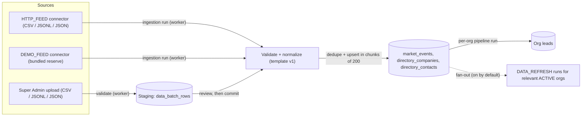
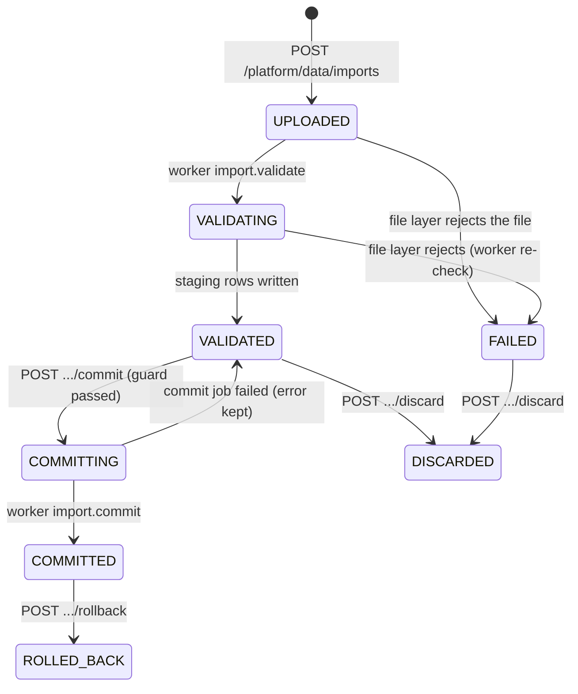

The **platform data source** is the global, tenant-free raw data that the intelligence pipeline matches against each
org's signals:

- `market_events`: business-news events (one record = one event about a subject company),
- `directory_companies`: the company directory (the stand-in for an enrichment provider),
- `directory_contacts`: people at those companies.

It holds **no tenant data**, so the Super Admin may browse all of it without crossing the
[ADR-0010](/docs/decisions/0010-superadmin-public-data-boundary) boundary. Every record carries its provenance:
a `source_type` (`SEED`, `CSV_IMPORT`, `JSONL_IMPORT` or `CONNECTOR`) and the `batch_id` of the import or ingestion
run that created it.

## How data gets in

| Path          | Trigger                                                          | Review step                                   | Page                                                                   |
| ------------- | ---------------------------------------------------------------- | --------------------------------------------- | ---------------------------------------------------------------------- |
| File import   | `POST /platform/data/imports` (multipart)                        | Yes: validate, review the report, then commit | [Importing data](/docs/platform-data/importing)                        |
| Connector run | `POST /platform/data/connectors/:id/run` or the connector's cron | No: valid rows are inserted directly          | [Connectors & ingestion](/docs/platform-data/connectors-and-ingestion) |
| Seed          | `pnpm db:seed`                                                   | —                                             | [Seed data](/docs/getting-started/seed-data-and-accounts)              |

Both import and ingestion use **the same validator** (`packages/shared/src/data-template.ts` for the zod schema,
`packages/pipeline/src/data-quality.ts` for heuristics and dedupe keys), so nothing reaches `market_events` without
passing [template v1](/docs/platform-data/data-template) and the [validation rules](/docs/platform-data/validation-rules).

## Key concepts

| Concept          | Meaning                                                                                                                                                                                                                                                    |
| ---------------- | ---------------------------------------------------------------------------------------------------------------------------------------------------------------------------------------------------------------------------------------------------------- |
| **Template v1**  | The canonical "Market Event Record": one event, its subject (buyer) company and optionally one contact. See [Data template](/docs/platform-data/data-template).                                                                                            |
| **Batch**        | One unit of ingested data (`data_batches`): an import file (`IMPORT`), an ingestion run (`INGESTION`) or the seed (`SEED`, one "Initial synthetic dataset" batch). Every record keeps its batch id.                                                        |
| **Staging row**  | One parsed row of an import file (`data_batch_rows`) with its status (`VALID`, `WARNING`, `INVALID`, `DUPLICATE`) and issues. Nothing in staging is visible to orgs.                                                                                       |
| **Retraction**   | Rolling back a batch sets `retracted_at` on its events and on directory rows only it created. Retracted events are skipped by every future org pipeline run. Nothing is deleted ([ADR-0016](/docs/decisions/0016-retract-instead-of-delete-for-rollback)). |
| **Fan-out**      | After new events are inserted, `DATA_REFRESH` pipeline runs are queued for `ACTIVE` orgs whose target industries overlap the new events' tags.                                                                                                             |
| **Distribution** | Aggregate link from raw data to org results: for an event or a batch, the org names with their match and lead **counts**. Lead records, contacts and scores are never exposed.                                                                             |

## Lifecycle of a batch

Ingestion batches are created by the run itself in `VALIDATING` and end `COMMITTED` (or `FAILED`). Staging rows of
finished batches (`COMMITTED`, `DISCARDED`, `FAILED`, `ROLLED_BACK`) are purged after `STAGING_RETENTION_DAYS`
(30) by the daily `maintenance.staging-purge` job (03:45). The batch row and its stats remain.

## Who can do what

All endpoints live under `/api/v1/platform/data/*` and are Super Admin only (org roles get 403):

| Permission             | Grants                                                                                                                                  |
| ---------------------- | --------------------------------------------------------------------------------------------------------------------------------------- |
| `platform:data:read`   | Overview, explorer lists and details, template downloads, batches and their rows, `errors.csv`, connectors list, ingestion runs and SSE |
| `platform:data:import` | Upload a file, commit or discard an import                                                                                              |
| `platform:data:manage` | Roll back a batch, create, update, delete, test and run connectors                                                                      |

See [Roles & permissions](/docs/concepts/roles-and-permissions) and the full endpoint list in the
[API reference](/docs/api/reference#platform-data-super-admin-only-modulesplatform-datats).

## Audit

Every mutation writes a `PLATFORM`-scope audit entry:

| Action                                                                                                    | When                                                              |
| --------------------------------------------------------------------------------------------------------- | ----------------------------------------------------------------- |
| `data.import_uploaded`, `data.import_rejected`                                                            | Upload accepted, or rejected at the file layer (API or worker)    |
| `data.import_validated`                                                                                   | Worker finished validation (counts in `after`)                    |
| `data.import_commit_requested`, `data.import_committed`                                                   | Commit queued by the API, commit finished in the worker           |
| `data.import_discarded`, `data.batch_rolled_back`                                                         | Discard; rollback (retracted counts in `after`)                   |
| `data.connector_created`, `data.connector_updated`, `data.connector_deleted`                              | Connector changes (config holds env-var **names**, never secrets) |
| `data.ingestion_requested`, `data.ingestion_started`, `data.ingestion_completed`, `data.ingestion_failed` | Ingestion run lifecycle                                           |
| `data.fanout_enqueued`                                                                                    | An import commit queued `DATA_REFRESH` runs (number of orgs)      |

## Decisions

- [ADR-0015](/docs/decisions/0015-canonical-data-template-and-two-phase-import): one canonical template, two-phase
  import, and the invalid-ratio guard.
- [ADR-0016](/docs/decisions/0016-retract-instead-of-delete-for-rollback): rollback retracts instead of deleting;
  the data source is append/retract only.
- [ADR-0018](/docs/decisions/0018-hybrid-offset-keyset-pagination): offset pagination with keyset for deep pages
  and estimated totals on large tables.
