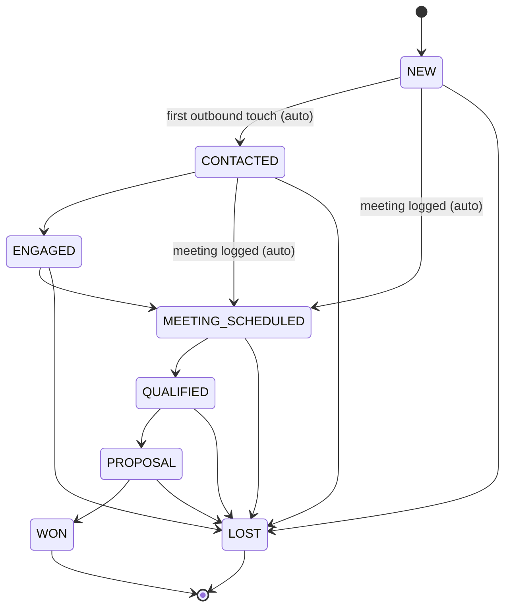

A **lead** is one target account that the pipeline found for an org, together with the evidence (signal matches)
that justified it, a BANT+ score, an owner and a CRM stage. There is **at most one lead per target account per
org**. New evidence about the same company attaches to the existing lead instead of creating a duplicate.

## How a lead is created

1. A market event passes the prefilter and the LLM reports one or more signal matches with confidence of at least 0.6.
2. The buyer account is resolved: the event's _subject_ company is looked up in the company directory, first by
   domain and then by name. An existing tenant account is reused if present. Otherwise one is created and the
   directory contacts are copied in (source `SYNTHETIC`).
3. A **dedupe key** is computed: `d:<normalized domain>` when the account has a domain, otherwise
   `n:<normalized name>` (lower-case, legal suffixes such as Ltd, Pvt, Inc and GmbH removed, punctuation
   collapsed). `leads (org_id, dedupe_key)` is unique.
4. **Existing lead:** the new matches are attached as evidence, `last_signal_at` moves forward if the event is
   newer, and suggested personas are refreshed. **New lead:** created in stage `NEW`, with the account's first
   contact as primary contact.
5. A `SIGNAL` activity (direction `INBOUND`) records the event on the lead's timeline.
6. After matching, every touched lead is **(re)scored**. See [BANT+ scoring](/docs/concepts/bant-scoring).

Leads can also be re-scored on demand with `POST /api/v1/leads/:id/rescore` (uses the LLM).

## Stages

The canonical order (`LEAD_STAGES`) is `NEW → CONTACTED → ENGAGED → MEETING_SCHEDULED → QUALIFIED → PROPOSAL →
WON`, with `LOST` as the exit.

### Automatic transitions

Outreach moves leads forward, never backward, and never out of `WON` or `LOST`:

| Event                                    | Transition                                                                              |
| ---------------------------------------- | --------------------------------------------------------------------------------------- |
| Email sent, WhatsApp logged, call logged | `NEW → CONTACTED`. No change if the lead is already at or beyond `CONTACTED`.           |
| Meeting logged                           | Advances to `MEETING_SCHEDULED` from any earlier stage (`NEW`, `CONTACTED`, `ENGAGED`). |

Each automatic change writes a `STAGE_CHANGE` activity with `metadata.auto = true`. The first outbound touch also
sets `first_touch_at` (used for "average time to first touch").

### Manual transitions

Everything else is a manual `PATCH /api/v1/leads/:id` with `{ stage }`:

- The API does **not** enforce a strict stage order. Any stage can be set directly, so a rep can correct
  mistakes or skip steps. The UI presents stages in canonical order.
- Moving to `LOST` **requires** `lostReason`. Otherwise the response is 400.
- Moving to `WON` can carry `wonValue` (a number, used for "pipeline value won" on the dashboard).
- Every change writes a `STAGE_CHANGE` activity and a `lead.stage_changed` audit entry with before and after.
- Bulk stage changes (`POST /leads/bulk`, up to 100 leads) support every stage except `LOST`, because a reason is
  needed per lead.

### Optimistic locking

Leads carry a `version`. Send the version you read with `PATCH /leads/:id`. If someone changed the lead in the
meantime, the response is **409** "This lead was changed by someone else — refresh and try again" with
`details.currentVersion`. The update itself is conditional on the version, so concurrent writers cannot
overwrite each other even without the field.

## Definitions used in dashboards

<Callout type="info">
  These definitions are **stage-based** and computed in SQL. See [Dashboards](/docs/modules/dashboards) for
  the exact queries.
</Callout>

| Term                | Definition in code                                                                                                                                                                                                     |
| ------------------- | ---------------------------------------------------------------------------------------------------------------------------------------------------------------------------------------------------------------------- |
| **Lead captured**   | Any lead row (in the org or scope and date range).                                                                                                                                                                     |
| **Approached**      | `stage <> 'NEW'`, i.e. any stage past `NEW`, including `LOST` (`APPROACHED_STAGES`). Because the first outbound touch moves `NEW → CONTACTED`, this equals "has at least one outbound touch or was advanced manually". |
| **Engaged**         | Stage in `ENGAGED`, `MEETING_SCHEDULED`, `QUALIFIED`, `PROPOSAL`, `WON`.                                                                                                                                               |
| **Meetings**        | Stage in `MEETING_SCHEDULED`, `QUALIFIED`, `PROPOSAL`, `WON`.                                                                                                                                                          |
| **Converted**       | `stage = 'WON'`.                                                                                                                                                                                                       |
| **Conversion rate** | converted ÷ approached × 100, rounded to one decimal (0 when nothing was approached).                                                                                                                                  |

## Ownership and claiming

- A lead has zero or one owner (`owner_user_id`). The pipeline creates leads **unassigned**.
- **Assign** (`PATCH /leads/:id` with `ownerUserId`, or bulk assign) needs `leads:assign` (Org Admin, Sales
  Manager). The new owner must be an active member of the org. Writes an `ASSIGNMENT` activity and a
  `lead.assigned` audit entry.
- **Claim** (`POST /leads/:id/claim`) needs `leads:claim`. It is a single conditional
  `UPDATE … WHERE owner_user_id IS NULL`, so two SDRs clicking at the same time cannot both win. The loser
  gets **409** "This lead already has an owner".
- **Implicit claim.** An SDR who sends or logs outreach on an unassigned lead claims it in the same
  transaction.
- SDRs can only mutate leads they own. See [Roles & permissions](/docs/concepts/roles-and-permissions#the-sdr-ownership-rule).

## The leads page

`GET /api/v1/leads` powers the grid (UI route `/app/leads`). It uses offset pagination with a default of
**6 per page** and a maximum of 50 ([ADR-0005](/docs/decisions/0005-offset-pagination-for-leads)).

| Query param        | Values                                             | Meaning                                                                                                                      |
| ------------------ | -------------------------------------------------- | ---------------------------------------------------------------------------------------------------------------------------- |
| `page`, `pageSize` | integer; `pageSize` 1–50, default 6                | Offset pagination                                                                                                            |
| `stage`            | a `LEAD_STAGES` value                              | Filter by stage                                                                                                              |
| `band`             | `HOT`, `WARM`, `COLD`                              | Filter by score band                                                                                                         |
| `signalId`         | uuid                                               | Leads with at least one match for this signal                                                                                |
| `icpId`            | uuid                                               | Leads whose best-fit ICP is this one                                                                                         |
| `owner`            | `me`, `unassigned`, `any` (default) or a user uuid | Owner filter                                                                                                                 |
| `q`                | text (max 120)                                     | Case-insensitive search on account name                                                                                      |
| `from`, `to`       | `YYYY-MM-DD`                                       | Range on `last_signal_at`                                                                                                    |
| `sort`             | `score` (default), `recent`, `oldest`, `account`   | `score` sorts by `score_total desc, id desc` (stable). `recent` by last signal, `oldest` by first signal, `account` by name. |

Each item includes the account, the **headline signal** (the most recent matching event, then highest
confidence), the signal count, total score and band, the four BANT sub-scores, stage, owner, primary contact
and timestamps. The response is `{ items, page, pageSize, total, totalPages }`.

The **lead detail** (`GET /leads/:id`, UI route `/app/leads/[id]`) adds the full score breakdown with
rationales ("Why this score?"), all evidence events (signal, confidence, rationale, source link, amount), all
contacts, the best-fit ICP, suggested personas, lost reason, won value and `version`. Sub-resources cover the
activity timeline, tasks, contacts and outreach history (see [CRM](/docs/modules/crm)).

**CSV export** (`GET /leads/export.csv`, needs `leads:export`) applies the same filters, returns at most 5000
rows, neutralizes spreadsheet formulas (cells starting with `=`, `+`, `-`, `@`, tab or CR are prefixed with `'`)
and is audited as `lead.exported`.
