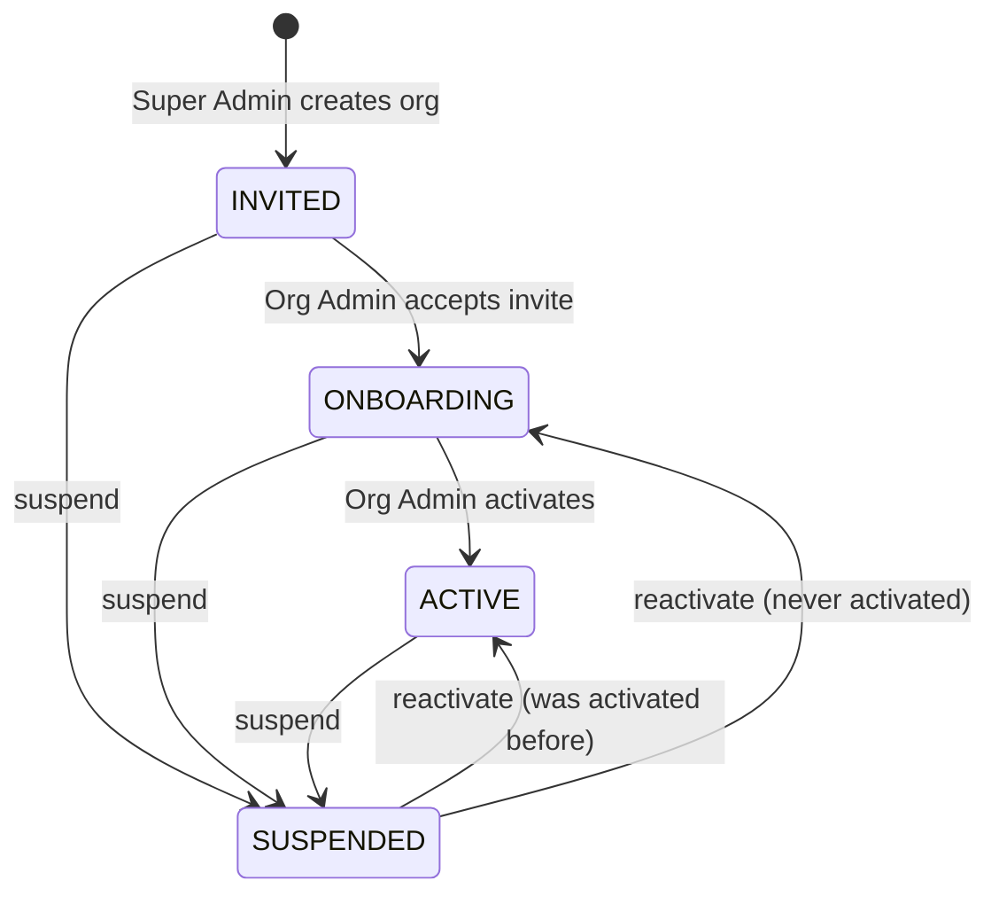

An **organization** (org) is a tenant: a company that uses SelloEasy to find and work its own leads. Every
piece of business data (knowledge, ICPs, signals, leads, accounts, contacts, activities, tasks, outreach
messages, pipeline runs, org audit entries) belongs to exactly one org and is stored with its `org_id`.

## Lifecycle

| Status       | Meaning                                                                 | How it is reached                                                                                                                                          |
| ------------ | ----------------------------------------------------------------------- | ---------------------------------------------------------------------------------------------------------------------------------------------------------- |
| `INVITED`    | The org exists and an `ORG_ADMIN` invite has been sent.                 | `POST /api/v1/platform/orgs`                                                                                                                               |
| `ONBOARDING` | The admin has accepted and is building the knowledge profile.           | `POST /api/v1/auth/accept-invite` by an invite with role `ORG_ADMIN` while the org is `INVITED`                                                            |
| `ACTIVE`     | Onboarding is complete. The org is included in scheduled pipeline runs. | `POST /api/v1/org/activate` (requires a generated profile and at least one active signal). The first pipeline run is queued with trigger `ONBOARDING`.     |
| `SUSPENDED`  | All members lose access immediately.                                    | `POST /api/v1/platform/orgs/:id/suspend`. Login returns 403 "organization has been suspended", and existing sessions stop resolving on their next request. |

Reactivation (`POST /platform/orgs/:id/reactivate`) returns the org to `ACTIVE` if it had been activated
before (`activated_at` set), otherwise to `ONBOARDING`.

<Callout type="info">
  Only `ACTIVE` orgs are picked up by the scheduled pipeline tick (every `PIPELINE_SCHEDULE_CRON`). Manual
  runs are possible in any status for users with `pipeline:run`, as long as the org has active signals.
</Callout>

## Membership model

- A **user** has one global account (`users`, unique lower-cased email).
- A user joins an org through a **membership** (`memberships`: user, org, role, status). The schema allows
  several memberships per user, but v1 enforces **one org per user**. Accepting an invite fails with 409 if the
  email already has a membership or belongs to a Super Admin.
- The **Super Admin** is a flag on the user (`users.is_super_admin`), not a membership. Super Admins belong to
  no org. See [Roles & permissions](/docs/concepts/roles-and-permissions).
- Disabling a membership (`PATCH /org/users/:id` with `status: DISABLED`) revokes access on the next request,
  because the API reloads the user and membership on every request instead of trusting token claims.
- An org can never be left without an active Org Admin. Demoting or disabling the last one returns 400. Admins
  also cannot change their own role or disable themselves.

## What is tenant data and what is platform data

| Scope                 | Tables                                                                                                                                                                                                                                                                                                                                                                                               | Notes                                                                                                                        |
| --------------------- | ---------------------------------------------------------------------------------------------------------------------------------------------------------------------------------------------------------------------------------------------------------------------------------------------------------------------------------------------------------------------------------------------------- | ---------------------------------------------------------------------------------------------------------------------------- |
| **Platform (global)** | `users`, `signal_templates`, `market_events`, `directory_companies`, `directory_contacts`, `audit_logs` rows with scope `PLATFORM`                                                                                                                                                                                                                                                                   | Shared across orgs. Market events are ingested once and matched per org. The directory stands in for an enrichment provider. |
| **Tenant**            | `organizations` (the row itself), `memberships`, `invitations`, `org_sources`, `org_source_chunks`, `products`, `plans`, `policies`, `org_profiles`, `icps`, `signals`, `pipeline_runs`, `signal_matches`, `org_event_evaluations`, `accounts`, `contacts`, `leads`, `lead_signals`, `activities`, `tasks`, `outreach_messages`, `llm_calls` (nullable `org_id`), `audit_logs` rows with scope `ORG` | Always read and written with the caller's `org_id`, which comes from their membership.                                       |

The global events table is a deliberate trade-off: ingest once, match many. Per-org results (`signal_matches`,
`org_event_evaluations`, leads) are tenant-scoped, so one org's matches never leak to another. When the
pipeline creates a lead, it **copies** the directory company and contacts into the org's own `accounts` and
`contacts` tables, and CRM edits never touch the global directory.

## Visibility classifications

Every org-owned knowledge record has a `visibility` of `PUBLIC` or `INTERNAL`. It decides what the **Super
Admin** can see, not what org members can see: members see everything in their org.

| Record                                        | Column                            | Default                                                                |
| --------------------------------------------- | --------------------------------- | ---------------------------------------------------------------------- |
| Knowledge sources (website, PDFs, docs, text) | `org_sources.visibility`          | `INTERNAL` (website sources added through the API default to `PUBLIC`) |
| Products                                      | `products.visibility`             | `PUBLIC`                                                               |
| Plans                                         | `plans.visibility`                | `INTERNAL`                                                             |
| Policies                                      | `policies.visibility`             | `INTERNAL`                                                             |
| Profile summary + value props                 | `org_profiles.summary_visibility` | `PUBLIC`                                                               |

The Super Admin's org view (`GET /platform/orgs/:id`) includes only public products, public documents and the
profile summary and value props when `summary_visibility = PUBLIC`. Everything else is never returned to
platform endpoints. See [ADR-0010](/docs/decisions/0010-superadmin-public-data-boundary).

## Org settings

`organizations.settings` (JSONB) holds per-org preferences, editable by the Org Admin through `PATCH /org`:

| Setting          | Purpose                                                                                                                                                            |
| ---------------- | ------------------------------------------------------------------------------------------------------------------------------------------------------------------ |
| `calendlyUrl`    | Org-wide default booking link, used when a user has no personal Calendly URL                                                                                       |
| `senderName`     | Display name used in outreach drafts and as part of the email "From" name                                                                                          |
| `timezone`       | Informational (seed: `Asia/Kolkata`)                                                                                                                               |
| `leadVisibility` | `ALL` (default) or `ASSIGNED_ONLY`. Changing it is blocked unless `FEATURE_LEAD_VISIBILITY_TOGGLE=true` ([ADR-0011](/docs/decisions/0011-lead-visibility-setting)) |

## Related

- [Multi-tenancy architecture](/docs/architecture/multi-tenancy): how isolation is enforced in code.
- [Onboarding module](/docs/modules/onboarding): invites, knowledge sources, profile generation and activation.
