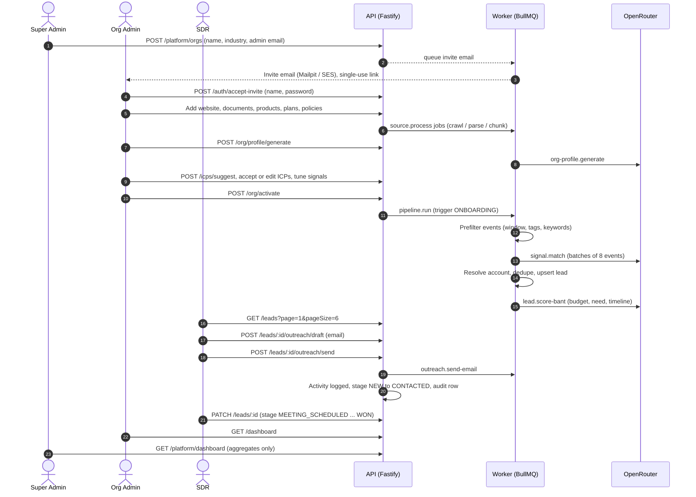

SelloEasy helps B2B sellers find **who is likely to buy now**. Each tenant organization builds a knowledge
profile of itself (website, documents, products, plans, policies). From that profile the platform derives
**Ideal Customer Profiles (ICPs)** and **buying signals**. An AI pipeline scans a corpus of market events
(news-style announcements), detects companies exhibiting those signals, and turns them into **leads scored on
BANT+** with the evidence attached. Sales teams then approach, track and convert those leads by email,
WhatsApp, phone or a booked meeting.

> **Example.** A tyre maker defines the signal _"OEM announces a new vehicle launch"_. When the pipeline reads
> _"Automaker X to launch a new compact SUV in Q1 from its Pune plant"_, it creates a lead for Automaker X,
> attaches the article as evidence, suggests a buyer persona (Head of Procurement), scores the lead and shows it
> on the org's Leads page.

<Callout type="info">
  Version **0.1.0** (2026-09-24). This documentation describes the code as it is in the repository. Features
  that are planned but not built are labelled **Planned**. The honest list lives on [Known
  limitations](/docs/limitations).
</Callout>

## What you get

| Capability                                                                                                 | Who uses it                                       | Where to read more                                          |
| ---------------------------------------------------------------------------------------------------------- | ------------------------------------------------- | ----------------------------------------------------------- |
| Create organizations and invite their admins by single-use link                                            | Super Admin                                       | [Onboarding](/docs/modules/onboarding)                      |
| Build an org knowledge profile from website, documents, products, plans and policies                       | Org Admin                                         | [Onboarding](/docs/modules/onboarding)                      |
| Invite teammates with roles (RBAC)                                                                         | Org Admin                                         | [Roles & permissions](/docs/concepts/roles-and-permissions) |
| AI-suggested and custom ICPs                                                                               | Org Admin, Sales Manager                          | [ICPs](/docs/concepts/icps)                                 |
| Predefined (industry template) and custom signals                                                          | Org Admin, Sales Manager                          | [Signals](/docs/concepts/signals)                           |
| Pipeline: events → prefilter → LLM match → lead → BANT+ score                                              | Worker (system)                                   | [Pipeline overview](/docs/pipeline/overview)                |
| Leads grid (6 per page), filters, detail page with evidence and "Why this score?"                          | All org users                                     | [Leads & stages](/docs/concepts/leads-and-stages)           |
| Outreach: AI-drafted email (really sent), WhatsApp / call / meeting (deep link + manual log)               | SDR, Sales Manager, Org Admin                     | [Outreach](/docs/modules/outreach)                          |
| CRM: stages, owner, claim, notes, tasks, activity timeline                                                 | SDR, Sales Manager, Org Admin                     | [CRM](/docs/modules/crm)                                    |
| Dashboards: org level and cross-org aggregates                                                             | Org roles, Super Admin                            | [Dashboards](/docs/modules/dashboards)                      |
| Append-only audit trail of every mutating action                                                           | Org Admin (own org), Super Admin (platform scope) | [Audit trail](/docs/modules/audit-trail)                    |
| Platform data source: browse raw events and directory, validated CSV / JSONL imports, connectors, rollback | Super Admin                                       | [Platform data](/docs/platform-data)                        |

## The happy flow

The sequence below is the end-to-end flow the platform is built around. Every step exists in the API today.

## Start here

<Cards>
  <Card title="Quickstart" href="/docs/getting-started/quickstart">
    One command (`docker compose up --build`), the URLs, demo accounts and the first things to try.
  </Card>
  <Card title="Environment variables" href="/docs/getting-started/environment-variables">
    Every configuration key, its default and when it is required.
  </Card>
  <Card title="Architecture overview" href="/docs/architecture/overview">
    Web, API, worker, Postgres, Redis, object storage, mail and the LLM provider, and how a request flows.
  </Card>
  <Card title="Intelligence pipeline" href="/docs/pipeline/overview">
    How market events become scored leads, with the cost and idempotency controls.
  </Card>
  <Card title="Roles & permissions" href="/docs/concepts/roles-and-permissions">
    The full permission matrix, SDR ownership rules and the Super Admin data boundary.
  </Card>
  <Card title="API reference" href="/docs/api/reference">
    OpenAPI at `/api/docs`, the error format, pagination and every endpoint by module.
  </Card>
  <Card title="Decisions (ADRs)" href="/docs/decisions">
    Eighteen architecture decision records: what was chosen, why, and what it costs.
  </Card>
  <Card title="Known limitations" href="/docs/limitations">
    What v0.1 deliberately does not do yet.
  </Card>
</Cards>

## Technology at a glance

| Layer              | Choice                                                                                                                                                                                                                                                                                                                                                 |
| ------------------ | ------------------------------------------------------------------------------------------------------------------------------------------------------------------------------------------------------------------------------------------------------------------------------------------------------------------------------------------------------ |
| Language / runtime | TypeScript on Node.js 22; API and worker run TypeScript directly through `tsx` ([ADR-0013](/docs/decisions/0013-tsx-runtime-no-bundling))                                                                                                                                                                                                              |
| Monorepo           | pnpm workspaces + Turborepo                                                                                                                                                                                                                                                                                                                            |
| Web                | Next.js 16 (App Router) with Fumadocs 16 for `/docs` ([ADR-0001](/docs/decisions/0001-nextjs-over-vite))                                                                                                                                                                                                                                               |
| API                | Fastify 5 with `fastify-type-provider-zod`, OpenAPI via `@fastify/swagger`                                                                                                                                                                                                                                                                             |
| Validation         | Zod 4, shared between web, API and worker (`packages/shared`)                                                                                                                                                                                                                                                                                          |
| Database           | PostgreSQL 16 with Drizzle ORM ([ADR-0002](/docs/decisions/0002-drizzle-orm))                                                                                                                                                                                                                                                                          |
| Jobs               | BullMQ 5 on Redis 7 ([ADR-0003](/docs/decisions/0003-bullmq-for-pipeline))                                                                                                                                                                                                                                                                             |
| Object storage     | MinIO locally, S3 on AWS (same driver interface)                                                                                                                                                                                                                                                                                                       |
| Email              | SMTP (Mailpit locally) or AWS SES                                                                                                                                                                                                                                                                                                                      |
| LLM                | Provider adapters over plain `fetch`: OpenRouter (default), OpenAI or Anthropic, selected by `LLM_PROVIDER`; the model comes only from that provider's `*_MODEL` env var ([ADR-0009](/docs/decisions/0009-openrouter-model-from-env), [ADR-0014](/docs/decisions/0014-fetch-over-openai-sdk), [ADR-0017](/docs/decisions/0017-provider-adapter-layer)) |

## Data policy

All demo data is **synthetic and fictional**: organizations, target companies, people, e-mail addresses
(`*.example` domains) and phone numbers are made up, and every event and directory record carries
`synthetic = true`. No real person's contact data is scraped or stored. See
[Seed data & accounts](/docs/getting-started/seed-data-and-accounts) and
[ADR-0008](/docs/decisions/0008-synthetic-dataset).
