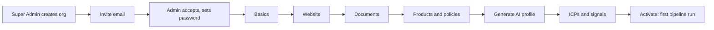

Onboarding takes an organization from `INVITED` to `ACTIVE`. The Super Admin starts it. The Org Admin completes
it with a guided wizard (UI route `/app/onboarding`, shown while the org is not active) backed by the endpoints
below. Each step saves independently, so the wizard is resumable.

## 1. Create the organization (Super Admin)

`POST /api/v1/platform/orgs` with `{ name, industry, websiteUrl?, adminEmail }`:

- creates the org with status `INVITED` and a unique slug (a random suffix is added on collision);
- **clones the industry signal templates** into the org;
- creates an `ORG_ADMIN` invitation (see below) and queues the invite email;
- audits `org.created` and `invite.sent` (scope `PLATFORM`);
- returns **201** with the org list item and, **only when `APP_ENV=local`**, the `inviteLink`, so evaluators can
  proceed without opening Mailpit.

The admin email must not already belong to a user (409). The Super Admin can resend
(`POST /platform/orgs/:id/invites`), list (`GET /platform/orgs/:id/invites`) and revoke
(`DELETE /platform/invites/:id`) invites. All of these are audited.

## 2. Invitations

| Property         | Value                                                                                             |
| ---------------- | ------------------------------------------------------------------------------------------------- |
| Token            | 32 random bytes (base64url), stored only as SHA-256                                               |
| Expiry           | `INVITE_TTL_HOURS` (72 h)                                                                         |
| Use              | Single use (`accepted_at`). Revocable (`revoked_at`).                                             |
| Resend semantics | Creating a new invite for the same email and org revokes any pending one                          |
| Delivery         | Queued on the `outreach` queue (`mail.invite`) and sent by the worker through SMTP/Mailpit or SES |
| Link             | `${WEB_URL}/accept-invite?token=…`                                                                |

The same mechanism is used by Org Admins to invite teammates with any org role (`POST /api/v1/org/invites`,
`GET /org/invites`, `DELETE /org/invites/:id`). An email that already belongs to a member returns 409.

**Accepting.** `GET /api/v1/auth/invite?token=…` previews the invite (email, role, org name, expiry).
`POST /api/v1/auth/accept-invite` with `{ token, name, password }` creates the user (or activates an existing
user without a membership), creates the membership, marks the invite accepted and, for an `ORG_ADMIN` invite
on an `INVITED` org, moves the org to **`ONBOARDING`** (audited `org.onboarding_started`). It signs the user in
immediately. Expired invites return 400. Used, revoked or unknown tokens return 404.

## 3. Basics

`PATCH /api/v1/org` (Org Admin): `name`, `websiteUrl`, `hq`, `regions`, `companySize`, `description` and
`settings` (Calendly default, sender name, timezone). The **basics** step counts as done when both `description`
and `hq` are set.

## 4. Knowledge sources

All sources live in `org_sources` and move through `PENDING → PROCESSING → READY | FAILED`. The UI polls
`GET /api/v1/org/sources`, which returns each source with its status, error, size and chunk count. Processing
runs in the worker (`profile` queue, `source.process` job): fetch or parse the content, then chunk it (~800 tokens with
~100 overlap) into `org_source_chunks` with a full-text index.

### Website

`POST /api/v1/org/sources/website` with `{ url, visibility }` (visibility defaults to `PUBLIC`). The URL is
checked for SSRF safety **before** queuing (400 on private or internal targets). The worker crawls up to
`CRAWL_MAX_PAGES` (25) same-host pages to depth `CRAWL_MAX_DEPTH` (2), respecting `robots.txt`, and strips
navigation, header, footer, script and style elements. Pages with 200 characters of text or fewer are ignored. If
nothing readable is found, the source fails with "No readable pages found (site unreachable, blocked by robots.txt,
or not HTML)". Security details: [Security → SSRF](/docs/architecture/security#website-crawler-ssrf-protection).

### Documents (PDF, DOCX, Markdown, text)

#### Request an upload URL

`POST /api/v1/org/sources/upload-url` with `{ filename, contentType, size, visibility }` (visibility defaults to
`INTERNAL`). Allowed types: `application/pdf`, DOCX, `text/markdown`, `text/plain`. Rejected if `size` exceeds
`UPLOAD_MAX_MB` (20 MB) or the org already has 20 documents. Returns `{ sourceId, uploadUrl, headers }`.

#### Upload directly to storage

The browser `PUT`s the file to the presigned URL (valid 10 minutes), using the `Content-Type` header returned.
Locally that is MinIO at `S3_PUBLIC_ENDPOINT`.

#### Complete

`POST /api/v1/org/sources/:id/complete` queues processing and audits `source.created`. The worker downloads the
object, checks the size, **sniffs magic bytes** against the declared type and extracts text with `unpdf` (PDF) or
`mammoth` (DOCX), or reads it as UTF-8.

### Pasted text

`POST /api/v1/org/sources/text` with `{ title, content (20–100000 chars), visibility }` stores the text in object
storage and processes it like a document.

### Managing sources

`PATCH /org/sources/:id` changes visibility, `POST /org/sources/:id/reprocess` re-runs processing,
`GET /org/sources/:id/download` returns a 5-minute presigned download URL, and `DELETE /org/sources/:id` removes the
source, its chunks and its stored object.

<Callout type="info">
  **Visibility matters for the Super Admin only.** `PUBLIC` sources (e.g. a brochure) appear in the platform's
  public view of the org. `INTERNAL` sources (e.g. pricing) never leave the tenant. Org members see all
  sources.
</Callout>

## 5. Products, plans and policies

Plain CRUD under `/api/v1/org/products`, `/org/plans` and `/org/policies` (list, create, patch, delete), each
audited (`product.created`, `plan.updated`, …). Default visibility: products `PUBLIC`, plans and policies
`INTERNAL`. Products and policies feed profile generation, the matching and scoring context, and outreach drafts
("Relevant commitments" come from policy titles).

## 6. Generate the AI profile

`POST /api/v1/org/profile/generate` queues `profile.generate` (2 attempts) and returns `{ jobId }` (202). Poll
`GET /api/v1/org/profile/jobs/:jobId` for `state` (`waiting`, `active`, `completed`, `failed`) and `failedReason`.

The worker gathers the org basics, all products and policies, and up to 14 chunks from ready sources, then runs the
[`org-profile.generate`](/docs/pipeline/prompts#org-profilegenerate-v1) prompt. The result is **upserted** into
`org_profiles` (the version is incremented on regeneration), with `generated_by_model` recorded and
`profile.generated` audited.

The profile is **editable**: `PATCH /api/v1/org/profile` (summary, value props, differentiators, target
industries, geographies, personas, `summaryVisibility`). Each edit bumps the version and is audited.
`targetIndustries` should stay within the platform's market-tag vocabulary, because it drives the pipeline
prefilter.

## 7. ICPs and signals

- **ICPs:** `POST /api/v1/icps/suggest` proposes ICPs from the profile. Accept with `POST /icps/accept` or create
  your own with `POST /icps`. See [ICPs](/docs/concepts/icps).
- **Signals:** predefined templates are already cloned. Review, edit or disable them, and add custom signals. If
  templates are missing (for example, the seeded Voltedge org), use `POST /api/v1/signals/restore-templates`. See
  [Signals](/docs/concepts/signals).

## 8. Activate

`POST /api/v1/org/activate` requires the **profile** to exist and at least one **active signal**. Otherwise it
returns 400 "Complete these onboarding steps first: …" with `details.missing`. It sets the org to `ACTIVE`
(`activated_at`), audits `org.activated` in both org and platform scope, and **queues the first pipeline run**
(trigger `ONBOARDING`). The response includes `pipelineRunId` so the UI can open the live progress stream.

## Onboarding state

`GET /api/v1/org` returns `onboarding`, a checklist the wizard uses to show progress:

| Flag        | True when                                  |
| ----------- | ------------------------------------------ |
| `basics`    | `description` and `hq` are set             |
| `website`   | a `WEBSITE` source exists                  |
| `documents` | at least one non-website source is `READY` |
| `products`  | at least one product exists                |
| `policies`  | at least one policy exists                 |
| `profile`   | an `org_profiles` row exists               |
| `icps`      | at least one active ICP                    |
| `signals`   | at least one active signal                 |

Only `profile` and `signals` are **required** to activate. The others are recommended because they improve
profile quality and match relevance.

## Try it with the demo org

Use the seeded invite for **Voltedge Mobility**:
`http://localhost:3000/accept-invite?token=demo-invite-voltedge-mobility-2026-local-only` (local only). See
[Seed data & accounts](/docs/getting-started/seed-data-and-accounts#the-onboarding-demo-invite).
