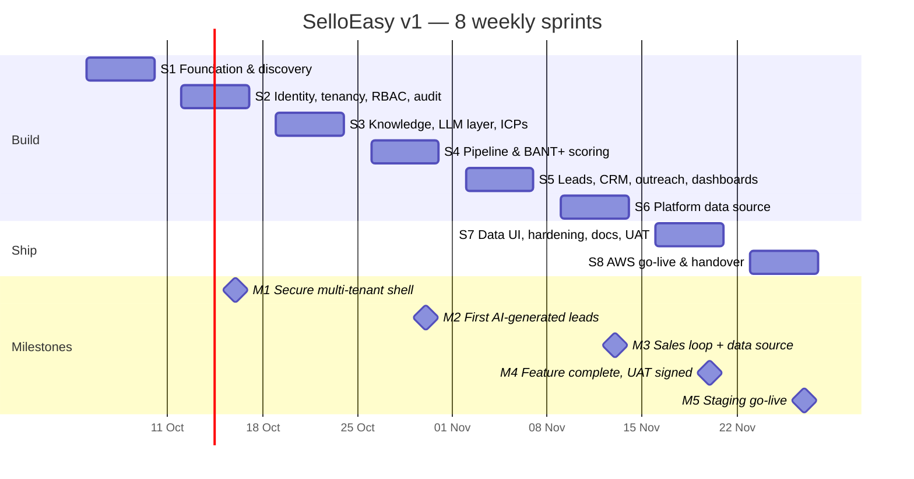

This plan breaks the v1 design (`plan.md` phases P0–P8) and the platform data source / multi-provider work
(`plan2.md` phases A–F) into **eight one-week sprints** for a small team. Each sprint ends with a demo and exit
criteria that can be checked with a command or a click-path. The **Repo** column records what this repository
already contains, so the plan doubles as a progress tracker.

<Callout title="Legend">
  ✅ in the repository and verified (tests, docs, or a smoke run) · ⏳ not done yet: needs people, accounts or
  decisions outside the codebase · Owners use the project roles from [Roles &
  responsibilities](/docs/project/roles-and-responsibilities): **PM** Product Manager, **SD** Senior
  Developer, **DEV** Developer, **SH** Stakeholder, **SME** Subject Matter Expert.
</Callout>

## Team and cadence

| Role                  | Headcount | Allocation | Main focus                                                                  |
| --------------------- | --------: | ---------- | --------------------------------------------------------------------------- |
| Product Manager       |         1 | 100%       | Backlog, acceptance criteria, demos, scope decisions, release notes         |
| Senior Developer      |         1 | 100%       | Architecture, ADRs, reviews, security, pipeline/LLM, infrastructure         |
| Developer             |         2 | 100%       | Features end to end (API, worker, UI), tests, docs entries                  |
| Stakeholder           |       1–2 | ~2 h/week  | Sponsor decisions, sprint demos, UAT sign-off, go/no-go                     |
| Subject Matter Expert |         1 | ~30%       | B2B sales and the five target industries: signals, BANT+, dataset, gold set |

**Capacity.** Three engineers × 5 days = 15 engineer-days per sprint, about 13 after ceremonies, so roughly
**100 engineer-days** over 8 weeks. The design estimates (`plan.md` §27 ≈ 25 days, `plan2.md` §13 ≈ 8 days) assume
one engineer working with Claude Code. The remaining capacity goes to parallel streams, reviews, UAT fixes, live
model evaluation, security and the AWS go-live, which those estimates leave out.

**Calendar.** One-week sprints, Monday to Friday. The example dates below start on **Mon 5 Oct 2026**; shift them
to the real kickoff date.

| Ceremony             | When            | Length | Who                       | Output                                                         |
| -------------------- | --------------- | ------ | ------------------------- | -------------------------------------------------------------- |
| Sprint planning      | Monday 10:00    | 60 min | PM, SD, DEV (SME on call) | Sprint goal, committed backlog with owners                     |
| Daily stand-up       | Every day 10:00 | 15 min | PM, SD, DEV               | Blockers raised, owner and next step for each blocker          |
| Backlog refinement   | Wednesday       | 45 min | PM, SD, SME               | Next sprint's stories meet the Definition of Ready             |
| Sprint review (demo) | Friday 15:00    | 45 min | Everyone, SH required     | Demo on `docker compose up --build`, accepted or rejected work |
| Retrospective        | Friday 16:00    | 30 min | PM, SD, DEV               | One or two concrete improvements for next sprint               |

## Timeline

| Milestone | Date (example) | Meaning                                                                                 | Sign-off |
| --------- | -------------- | --------------------------------------------------------------------------------------- | -------- |
| **M1**    | Fri 16 Oct     | Orgs, invites, roles and audit work; tenant isolation is proven by tests                | SD, PM   |
| **M2**    | Fri 30 Oct     | A pipeline run turns market events into explainable, BANT+-scored leads                 | SH, SME  |
| **M3**    | Fri 13 Nov     | SDRs work leads end to end; the Super Admin can import and ingest platform data         | SH, PM   |
| **M4**    | Fri 20 Nov     | Feature complete, E2E green, docs complete, UAT signed                                  | SH       |
| **M5**    | Fri 27 Nov     | Running on AWS staging with real secrets and a live model; team handed over to run mode | SH, SD   |

## Sprint 1 — Foundation & discovery (5–9 Oct)

**Goal:** an empty clone becomes a running, documented, CI-checked skeleton, and the domain is understood well
enough to write signals and scoring rules.

| Item                                                                                                                                                      | Owner   | Repo |
| --------------------------------------------------------------------------------------------------------------------------------------------------------- | ------- | :--: |
| pnpm + Turborepo monorepo, strict TypeScript, Prettier, `CLAUDE.md`, `.claude/` skills, agents and hooks                                                  | SD      |  ✅  |
| Validated config module, full `.env.example` (local + AWS keys), `pnpm env:check` ([Environment variables](/docs/getting-started/environment-variables))  | SD      |  ✅  |
| Storage and mail driver interfaces (local MinIO/Mailpit, AWS S3/SES) ([ADR-0012](/docs/decisions/0012-env-driven-drivers-for-aws-readiness))              | DEV     |  ✅  |
| Docker Compose infrastructure, Dockerfiles, CI (typecheck, test, docs check, image builds)                                                                | DEV     |  ✅  |
| Fumadocs skeleton (`/docs` in the web app and the standalone [docs site](/docs/getting-started/local-development#docs-site)), first ADRs 0001–0003        | DEV     |  ✅  |
| Product backlog, personas, the happy flow (`plan.md` §3) written as acceptance criteria                                                                   | PM      |  ✅  |
| Discovery workshops for the five industries (Healthcare, Automotive, Semiconductors, Renewable Energy, Logistics); draft signal taxonomy and BANT+ rubric | SME, PM |  ✅  |
| Kickoff: confirm scope, budget, the decisions in `plan.md` §29 (model from env, fictional companies, Super Admin boundary, AWS region)                    | SH, PM  |  ✅  |
| Book SME time for S3–S7; request the AWS account and a production LLM key                                                                                 | PM, SH  |  ⏳  |

**Exit criteria:** `docker compose up --build` serves the web app, `/docs` and API `/health`; CI is green;
`pnpm env:check` passes.

## Sprint 2 — Identity, tenancy, RBAC & audit (12–16 Oct)

**Goal:** the platform is safely multi-tenant before any business data exists.

| Item                                                                                                                                             | Owner | Repo |
| ------------------------------------------------------------------------------------------------------------------------------------------------ | ----- | :--: |
| Identity and audit schema, login / refresh / logout, refresh-token rotation with reuse detection                                                 | SD    |  ✅  |
| Super Admin org CRUD, org-admin invites by email (Mailpit locally), org user management                                                          | DEV   |  ✅  |
| RBAC preHandler on every route, permission matrix in `packages/shared/src/rbac.ts` ([Roles & permissions](/docs/concepts/roles-and-permissions)) | SD    |  ✅  |
| Tenant guard: cross-tenant access returns 404; Super Admin allow-list DTOs ([ADR-0010](/docs/decisions/0010-superadmin-public-data-boundary))    | SD    |  ✅  |
| Append-only audit log (DB trigger), platform and org audit screens ([Audit trail](/docs/modules/audit-trail))                                    | DEV   |  ✅  |
| Lead-visibility setting (all leads now, assigned-only later) ([ADR-0011](/docs/decisions/0011-lead-visibility-setting))                          | DEV   |  ✅  |
| Industry signal-template review; synthetic dataset specification (5 fictional orgs, ~300 events)                                                 | SME   |  ✅  |
| Sign off the Super Admin "public data only" boundary                                                                                             | SH    |  ✅  |

**Exit criteria (M1):** Super Admin creates an org → invite arrives → admin accepts and invites an SDR; the audit log
shows every step; cross-tenant and Super Admin boundary tests pass (`pnpm --filter @selloeasy/api test`).

## Sprint 3 — Knowledge, LLM layer, ICPs & signals (19–23 Oct)

**Goal:** an org can describe itself, and the platform can turn that profile into ICPs and buying signals.

| Item                                                                                                                                 | Owner    | Repo |
| ------------------------------------------------------------------------------------------------------------------------------------ | -------- | :--: |
| Uploads (PDF, magic-byte checks), website crawler with SSRF guard, products, plans and policies, full-text chunks                    | DEV      |  ✅  |
| LLM layer: versioned prompts with zod schemas, deterministic mock mode, cache, telemetry ([LLM layer](/docs/pipeline/llm-providers)) | SD       |  ✅  |
| Provider adapters (OpenRouter, OpenAI, Anthropic), fallback provider ([ADR-0017](/docs/decisions/0017-provider-adapter-layer))       | SD       |  ✅  |
| Onboarding wizard and AI profile generation ([Onboarding](/docs/modules/onboarding))                                                 | DEV      |  ✅  |
| Signal templates, ICP suggestions and custom ICPs, signal CRUD ([ICPs](/docs/concepts/icps), [Signals](/docs/concepts/signals))      | DEV      |  ✅  |
| Synthetic dataset for 5 orgs and the seed script ([ADR-0008](/docs/decisions/0008-synthetic-dataset))                                | DEV, SME |  ✅  |
| Author and review signal templates per industry; check event realism; start the evaluation gold set                                  | SME      |  ✅  |

**Exit criteria:** an org admin completes the wizard and gets a generated profile (mock and live); five orgs are
seeded with ICPs and signals; `pnpm --filter @selloeasy/dataset validate` passes.

## Sprint 4 — Intelligence pipeline & BANT+ scoring (26–30 Oct)

**Goal:** market events become explainable, scored leads.

| Item                                                                                                          | Owner   | Repo |
| ------------------------------------------------------------------------------------------------------------- | ------- | :--: |
| Worker and queues; prefilter → batched LLM match → dedupe → upsert ([Pipeline stages](/docs/pipeline/stages)) | SD      |  ✅  |
| BANT+ scoring with evidence and decay ([BANT scoring](/docs/concepts/bant-scoring))                           | SD, DEV |  ✅  |
| Pipeline runs page with live progress (SSE), schedules, per-run LLM budget guard                              | DEV     |  ✅  |
| Leads delivered 6 per page ([ADR-0005](/docs/decisions/0005-offset-pagination-for-leads))                     | DEV     |  ✅  |
| Evaluation harness `pnpm eval:pipeline` ([Evaluation](/docs/pipeline/evaluation))                             | SD      |  ✅  |
| Label the gold set; calibrate BANT+ weights and bands with real sales judgement                               | SME     |  ✅  |
| Stakeholder demo: "first AI-generated leads"                                                                  | PM, SH  |  ✅  |

**Exit criteria (M2):** a pipeline run produces leads whose evidence and score breakdown make sense to the SME;
mock-mode evaluation numbers are in the docs.

## Sprint 5 — Leads, CRM, outreach & dashboards (2–6 Nov)

**Goal:** an SDR can take a lead from "new" to "won" without leaving SelloEasy.

| Item                                                                                                                                                                                                         | Owner  | Repo |
| ------------------------------------------------------------------------------------------------------------------------------------------------------------------------------------------------------------ | ------ | :--: |
| Leads grid and filters, lead detail, stages, assignment and claim, optimistic locking ([Leads & stages](/docs/concepts/leads-and-stages))                                                                    | DEV    |  ✅  |
| Activities, tasks, AI email draft and send, WhatsApp / call / Calendly deep links with logging ([Outreach](/docs/modules/outreach), [ADR-0006](/docs/decisions/0006-deep-links-for-whatsapp-voice-calendly)) | DEV    |  ✅  |
| Org dashboard, "my stats" for SDRs, platform dashboard with aggregates only ([Dashboards](/docs/modules/dashboards))                                                                                         | DEV    |  ✅  |
| Review stage definitions, email tone and the outreach playbook per industry                                                                                                                                  | SME    |  ✅  |
| Pilot-user walkthrough of the sales loop                                                                                                                                                                     | SH, PM |  ✅  |

**Exit criteria:** an SDR claims a lead, sends an AI email (it arrives in Mailpit), logs a call and marks the lead
WON; dashboards and the audit log reflect it; dashboard KPIs match the seeded data.

## Sprint 6 — Platform data source (9–13 Nov)

**Goal:** the Super Admin can grow the shared market-data source safely, and orgs pick up new data automatically.

| Item                                                                                                                                                                 | Owner | Repo |
| -------------------------------------------------------------------------------------------------------------------------------------------------------------------- | ----- | :--: |
| Data template v1 (24 fields), provenance columns, migration `0002_data_source` ([Data template](/docs/platform-data/data-template))                                  | SD    |  ✅  |
| Two-phase CSV/JSONL import: upload → validate into staging → commit, discard or roll back ([Importing](/docs/platform-data/importing))                               | DEV   |  ✅  |
| Validation rules, 20% invalid-row guard, duplicate detection, error report CSV ([Validation rules](/docs/platform-data/validation-rules))                            | DEV   |  ✅  |
| Connectors (demo feed, HTTPS feed with SSRF guard), ingestion runs, schedules, fan-out to relevant orgs ([Connectors](/docs/platform-data/connectors-and-ingestion)) | SD    |  ✅  |
| Retract-only rollback ([ADR-0016](/docs/decisions/0016-retract-instead-of-delete-for-rollback))                                                                      | DEV   |  ✅  |
| Validate template fields, rules and `sampleData.csv` against how real data providers deliver data                                                                    | SME   |  ✅  |

**Exit criteria (M3):** `sampleData.csv` imports 10/10; `sampleData.invalid.csv` is refused by the 20% guard; a
demo-feed run pulls 10 events and triggers `DATA_REFRESH` runs for relevant orgs; rollback retracts a batch.

## Sprint 7 — Data UI, hardening, docs & UAT (16–20 Nov)

**Goal:** feature complete, tested end to end, documented, and accepted by the business.

| Item                                                                                                                                            | Owner   | Repo |
| ----------------------------------------------------------------------------------------------------------------------------------------------- | ------- | :--: |
| Super Admin data-source UI at `/platform/data` (explorers, import wizard, connectors) ([Explorer](/docs/platform-data/explorer-and-pagination)) | DEV     |  ✅  |
| Playwright E2E: happy flow and the import wizard; Allure report for every layer (`pnpm test:report`)                                            | DEV     |  ✅  |
| Security pass with the `security-auditor` skill ([Security](/docs/architecture/security)); performance pass on leads and dashboards             | SD      |  ✅  |
| Docs complete, ADRs 0001–0018, README verified from a clean clone, `pnpm docs:check`                                                            | DEV, PM |  ✅  |
| User acceptance testing with pilot users, against the happy flow and the data-source scenarios                                                  | SH, SME |  ⏳  |
| Triage UAT findings into must-fix (this sprint) and post-v1 backlog                                                                             | PM      |  ⏳  |

**Exit criteria (M4):** `pnpm typecheck`, `pnpm test`, `pnpm docs:check` and the E2E suite are green; UAT is
signed off by the Stakeholder.

## Sprint 8 — AWS go-live & handover (23–27 Nov)

**Goal:** SelloEasy runs on AWS staging with real secrets and a real model, and the team can operate it.

| Item                                                                                                                             | Owner   | Repo |
| -------------------------------------------------------------------------------------------------------------------------------- | ------- | :--: |
| CDK stacks, `cdk synth` + cdk-nag in CI, disabled-by-default deploy workflow ([AWS deployment](/docs/operations/aws-deployment)) | SD      |  ✅  |
| Runbooks and observability docs ([Runbooks](/docs/operations/runbooks), [Observability](/docs/operations/observability))         | SD      |  ✅  |
| Fill `.env.aws` and Secrets Manager, run `pnpm deploy:aws` to staging, smoke-test the happy flow                                 | SD, DEV |  ⏳  |
| Live model evaluation with the chosen provider: `pnpm eval:pipeline --mode live`; record precision and recall in the docs        | SD, SME |  ⏳  |
| Add an ESLint configuration and a lint step to CI (the web `lint` script still calls the removed `next lint`)                    | DEV     |  ⏳  |
| Release notes from the [changelog](/docs/changelog); go/no-go meeting                                                            | PM, SH  |  ⏳  |
| Handover: on-call rota, runbook walkthrough, post-v1 backlog built from [Known limitations](/docs/limitations)                   | PM, SD  |  ⏳  |

**Exit criteria (M5):** staging is healthy (`/api/ready` green, happy flow passes against it); live evaluation
numbers are documented; go/no-go is recorded.

## Definition of Ready and Done

**Ready** (before a story enters a sprint): a user-visible outcome and acceptance criteria written by the PM; the
permission and tenant scope known; SME input attached for domain stories (signals, scoring, data rules); the size
fits in one sprint; any trade-off is flagged for an ADR.

**Done** follows the definition of done in `CLAUDE.md`: typecheck and tests pass with `LLM_MODE=mock`; the
non-negotiables hold (tenant scoping, RBAC on every route, audit in the same transaction, the Super Admin
boundary, no hard-coded model names, env only through `packages/core`); docs and changelog are updated and
`pnpm docs:check` passes; trade-offs are recorded as ADRs. The Senior Developer approves the review.

## Risks

| Risk                                                         | Likelihood | Impact | Mitigation                                                                                                                                                                     | Owner   |
| ------------------------------------------------------------ | ---------- | ------ | ------------------------------------------------------------------------------------------------------------------------------------------------------------------------------ | ------- |
| LLM quality or cost differs from the mock-mode baseline      | Medium     | High   | SME gold set and `eval:pipeline`; per-run budget guard; provider and model are env-only, so they can be swapped ([ADR-0017](/docs/decisions/0017-provider-adapter-layer))      | SD, SME |
| Tenant data leak                                             | Low        | High   | Non-negotiables 1–4, cross-tenant 404 tests on every endpoint, security pass in S7; RLS on the post-v1 backlog ([ADR-0007](/docs/decisions/0007-app-level-tenancy-before-rls)) | SD      |
| SME time not available when signals and scoring are designed | Medium     | High   | Book SME time in S1; SME work is front-loaded into S1–S4                                                                                                                       | PM      |
| Synthetic data hides real-world messiness                    | Medium     | Medium | SME reviews realism; the data source accepts real CSV/HTTPS feeds with validation and rollback                                                                                 | SME, SD |
| Scope creep from demos                                       | High       | Medium | Every new request goes through the PM's backlog; changes to agreed trade-offs need an ADR                                                                                      | PM      |
| AWS account, domain or keys arrive late                      | Medium     | High   | Requested in S1; the stack is deploy-ready and fully local until then                                                                                                          | SH, PM  |
| Leaked or committed secrets                                  | Low        | High   | `.env*` git-ignored and blocked for agents; keys only in `.env` or Secrets Manager; rotate any key that was shared in chat                                                     | SD      |
