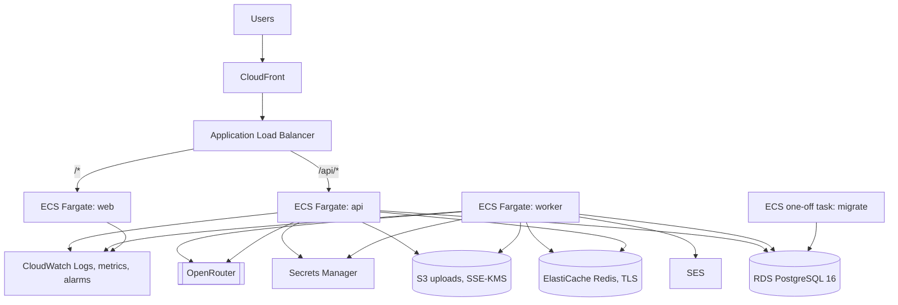

<Callout type="warn">
  **Deploy-ready, not deployed.** No SelloEasy environment is running on AWS. The application code is
  AWS-ready today (env-driven drivers, Secrets Manager loading, RDS TLS, ElastiCache TLS, proxy awareness,
  health endpoints, graceful shutdown). The AWS CDK app in `infra/` and the deploy scripts in `infra/scripts/`
  are being implemented as part of the deploy-readiness phase (plan §23, P8). Treat this page as the target
  design and operating guide, and check the repository for the current state of `infra/`.
</Callout>

## Target architecture



- The **ALB routes `/api/*` straight to the API service**. The Next.js proxy hop used locally disappears, and the
  browser still sees a single origin (CloudFront → ALB).
- The **same images** as local run on Fargate. Only environment values differ.
- The **migrate** task definition uses the API image and runs `pnpm db:migrate` (and optionally the seed) as a
  one-off task.

## Code-level AWS readiness (implemented)

| Concern        | Local                | AWS                               | Code                                                                                                                                                                              |
| -------------- | -------------------- | --------------------------------- | --------------------------------------------------------------------------------------------------------------------------------------------------------------------------------- |
| Object storage | MinIO                | S3 with the task role             | `STORAGE_DRIVER=s3`: same AWS SDK v3 client, no endpoint, no static keys, default credential chain (`packages/core/src/storage.ts`)                                               |
| Email          | Mailpit (SMTP)       | SES v2                            | `MAIL_DRIVER=ses`, `SES_REGION`, optional `SES_CONFIGURATION_SET` (`packages/core/src/mail.ts`)                                                                                   |
| Secrets        | `.env`               | Secrets Manager                   | `SECRETS_SOURCE=aws-secrets-manager` + `AWS_SECRETS_ID` + `AWS_REGION`: the JSON secret is merged over the environment at boot, before validation (`packages/core/src/config.ts`) |
| Database TLS   | off                  | RDS                               | `DATABASE_SSL=true`: verified against `DATABASE_SSL_CA_FILE` (`/app/certs/rds-global-bundle.pem`, downloaded into the API and worker images at build time)                        |
| Redis TLS      | off                  | ElastiCache in-transit encryption | `rediss://` URL or `REDIS_TLS=true` (also applied to BullMQ connections)                                                                                                          |
| Proxy headers  | none                 | ALB / CloudFront                  | `TRUST_PROXY=true` (real client IP for rate limits and audit), `COOKIE_SECURE=true` (enforced outside `local`)                                                                    |
| Health         | Compose healthchecks | ALB target groups                 | `GET /api/health` (liveness), `GET /api/ready` (DB + Redis)                                                                                                                       |
| Migrations     | `migrate` service    | ECS one-off task                  | Same image and entrypoint (`pnpm db:migrate`)                                                                                                                                     |
| Logs           | stdout               | stdout JSON → CloudWatch Logs     | pino with `LOG_LEVEL`                                                                                                                                                             |
| Shutdown       | —                    | ECS `SIGTERM` draining            | Fastify `close()`. BullMQ `worker.close()` lets active jobs finish.                                                                                                               |
| Safety rails   | —                    | —                                 | Outside `local`: invite links are not returned in responses, the demo invite is not seeded, `db:reset` refuses to run, placeholder JWT secrets fail boot                          |

See [ADR-0012](/docs/decisions/0012-env-driven-drivers-for-aws-readiness).

## CDK stacks (`infra/`)

All stack names are prefixed with the environment: `<DEPLOY_ENV>-selloeasy-<name>`. The CDK app validates its
input with `deployEnvSchema` from `packages/shared/src/env.ts` before building any stack, and applies
**cdk-nag** `AwsSolutionsChecks`.

| Stack                | Contents                                                                                                                                                                                                |
| -------------------- | ------------------------------------------------------------------------------------------------------------------------------------------------------------------------------------------------------- |
| `bootstrap`          | ECR repositories (`ECR_REPOSITORY_PREFIX`), GitHub OIDC deploy role                                                                                                                                     |
| `network`            | VPC in 2 AZs with public and private subnets (or `VPC_ID`), `NAT_GATEWAYS`, VPC endpoints for S3, ECR and Secrets Manager                                                                               |
| `secrets`            | The app JSON secret `selloeasy/<env>/app` (OpenRouter key, JWT secrets, Super Admin bootstrap password)                                                                                                 |
| `data`               | RDS PostgreSQL 16 (encrypted; `RDS_*` sizing, Multi-AZ, backups), ElastiCache Redis with TLS and AUTH (`REDIS_NODE_TYPE`), S3 uploads bucket (encrypted, public access blocked, CORS for presigned PUT) |
| `mail`               | SES domain identity, DKIM records in Route 53, configuration set                                                                                                                                        |
| `appbase` / `app`    | ECS cluster, task definitions for api, worker, web and migrate, services with autoscaling, ALB with path routing (`/api/*` → api, `/*` → web), health checks                                            |
| `edge-cert` / `edge` | ACM certificate (DNS-validated in `HOSTED_ZONE_ID`, or `ACM_CERTIFICATE_ARN`), CloudFront in front of the ALB, Route 53 alias for `DOMAIN_NAME`                                                         |
| `observability`      | Log groups, CloudWatch dashboard, alarms (5xx rate, latency, queue depth, RDS CPU and storage, job failures) → SNS → `ALARM_EMAIL`                                                                      |

**Runtime configuration in ECS.** Non-secret values are plain task environment variables. Secrets come from
Secrets Manager through ECS `secrets`. `DATABASE_URL` and `REDIS_URL` are **assembled inside the container** from
CDK-provided parts (host, port, and the generated RDS master and Redis AUTH secrets), so no connection string is
ever typed by hand or stored in a template.

**IAM.** Each task role gets least privilege: access to the uploads bucket, `ses:SendEmail`, and read access to its
own secret. No static AWS keys run in containers.

## Deploy commands

<div className="fd-steps">
<div className="fd-step">

### Prepare an env file

```bash
cp .env.example .env.aws
$EDITOR .env.aws   # fill group 12 (AWS_ACCOUNT_ID, DOMAIN_NAME, HOSTED_ZONE_ID, …), LLM_PROVIDER and its key + model
```

Group 12 keys are documented on [Environment variables](/docs/getting-started/environment-variables#12-aws-deployment).
The deploy schema requires `AWS_ACCOUNT_ID` (12 digits), `DOMAIN_NAME`, `HOSTED_ZONE_ID`, `MAIL_FROM`, and the
**selected provider's** API key and model (`LLM_PROVIDER` defaults to `openrouter`, so `OPENROUTER_API_KEY` and
`OPENROUTER_MODEL`; see [LLM layer & providers](/docs/pipeline/llm-providers)). Provider API keys go into the app
secret; `LLM_PROVIDER` and the `*_MODEL` values are plain task environment variables. Connector feed secrets
(`CONNECTOR_*`) can be added to the same JSON secret.

</div>
<div className="fd-step">

### Validate

```bash
pnpm env:check --file .env.aws --target aws
```

`--target aws` validates the runtime schema with the values ECS will inject (production mode, S3, SES, secure
cookies, trusted proxy, TLS, live LLM) plus the deploy schema, and exits 1 with every missing or invalid key.

</div>
<div className="fd-step">

### Deploy

```bash
pnpm deploy:aws --env-file .env.aws
```

The script runs: `env:check` → `cdk bootstrap` (first time, per region) → bootstrap and secrets stacks → build and
push `linux/amd64` images tagged with the git SHA (`IMAGE_TAG`) → write the app secret values → network, data and
app-base stacks → the **migrate task** with the new image → all remaining stacks → wait for the services → smoke test
`https://$DOMAIN_NAME/api/ready`. Options: `--skip-build`, `--skip-migrate`, `--skip-smoke`.

</div>
<div className="fd-step">

### Optional: demo data

```bash
pnpm deploy:aws:seed-demo --env-file .env.aws
```

Runs the migrate task with `pnpm db:seed` and `SEED_DEMO_DATA=true`. It refuses `DEPLOY_ENV=production` unless
`--allow-production` is passed. Remember that the seed's demo invite token is only created in `APP_ENV=local`.

</div>
</div>

### Verify without an AWS account

```bash
pnpm --filter @selloeasy/infra synth:check
```

This synthesizes every stack for staging and production variants from `infra/test/fixture.env` (dummy values) with
cdk-nag applied, and fails on any synth error or unsuppressed finding. It needs no AWS account and no network
access. This is as close to "deployed" as the project gets without credentials.

## Operating on AWS

| Task             | How                                                                                                                                                                                 |
| ---------------- | ----------------------------------------------------------------------------------------------------------------------------------------------------------------------------------- |
| Roll back        | Redeploy with the previous `IMAGE_TAG` (`pnpm deploy:aws --env-file .env.aws --skip-build` with `IMAGE_TAG=<old sha>`)                                                              |
| Rotate secrets   | Update the JSON secret `selloeasy/<env>/app`, then force a new deployment of api and worker (secrets are read at boot). See [Runbooks](/docs/operations/runbooks#rotating-secrets). |
| Database restore | Restore RDS from a snapshot or a point in time, then update the stack to use it                                                                                                     |
| Scale            | `ECS_*_DESIRED_COUNT` / CPU / memory. Mind `LLM_MAX_CONCURRENCY` per task and the OpenRouter rate limits.                                                                           |
| Region           | Default `ap-south-1` (Mumbai) for `AWS_REGION` and `SES_REGION`                                                                                                                     |

## Cost notes

A minimal staging environment is roughly: RDS `t4g.micro`, ElastiCache `cache.t4g.micro`, three small Fargate tasks,
one NAT gateway, an ALB and CloudFront. NAT is the largest fixed cost, which is why `NAT_GATEWAYS=1` plus VPC endpoints
is the staging default. LLM spend is separate, is bounded per pipeline run by `PIPELINE_MAX_LLM_CALLS_PER_RUN`, and is
visible in `llm_calls`.

## CI/CD

- `.github/workflows/ci.yml` runs on every push/PR: typecheck, unit + API integration tests (Postgres and Redis
  service containers), dataset validation, `docs:check`, `env:check` on the infra fixture, `cdk synth` for staging and
  production with cdk-nag, and Docker builds of the three images.
- `.github/workflows/deploy.yml` runs on `v*` tags / manual dispatch **only when** the repository variable
  `AWS_DEPLOY_ENABLED` is `true`. It assumes the OIDC role (`GITHUB_OIDC_ROLE_ARN`), writes `.env.aws` from repository
  variables/secrets and runs `infra/scripts/deploy.sh`.

Implementation details (stack list, how `DATABASE_URL`/`REDIS_URL` are assembled from the RDS/ElastiCache secrets at
container start, certificate handling, first-deploy caveats) are in `infra/README.md` in the repository.

## Not yet in place

- **Tracing**: OpenTelemetry flags exist but no exporter is wired ([Observability](/docs/operations/observability)).
- **Autoscaling on queue depth** requires the worker to publish a queue-depth metric. Not implemented yet.
