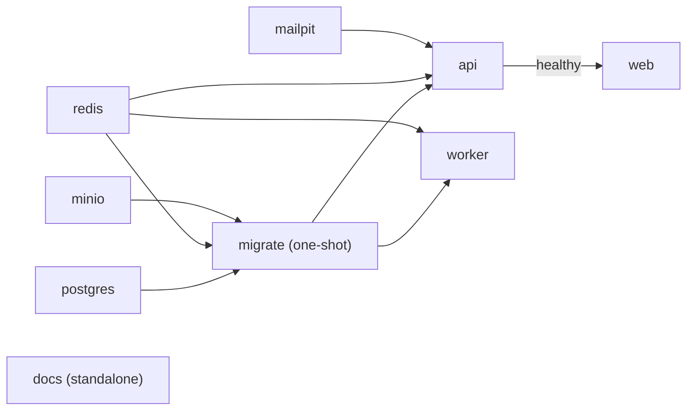

`docker compose up --build` runs the complete platform locally. The same **images** are meant to run on AWS
ECS. Only environment values differ ([ADR-0012](/docs/decisions/0012-env-driven-drivers-for-aws-readiness)).

## Services

| Service    | Image / build                           | Host port(s) (override)                                                | Healthcheck                                          | Notes                                                                                                                                                                 |
| ---------- | --------------------------------------- | ---------------------------------------------------------------------- | ---------------------------------------------------- | --------------------------------------------------------------------------------------------------------------------------------------------------------------------- |
| `postgres` | `postgres:16-alpine`                    | 5432 (`POSTGRES_HOST_PORT`)                                            | `pg_isready` every 3 s                               | Volume `pgdata`. User, password and db from `POSTGRES_*` (default `selloeasy`).                                                                                       |
| `redis`    | `redis:7-alpine`                        | 6379 (`REDIS_HOST_PORT`)                                               | `redis-cli ping`                                     | AOF persistence (`--appendonly yes`), volume `redisdata`                                                                                                              |
| `minio`    | `quay.io/minio/minio:latest`            | 9000 API (`MINIO_HOST_PORT`), 9001 console (`MINIO_CONSOLE_HOST_PORT`) | `mc ready local`                                     | Root credentials = `S3_ACCESS_KEY_ID` / `S3_SECRET_ACCESS_KEY` (default `minioadmin`). CORS allows all origins. Volume `miniodata`.                                   |
| `mailpit`  | `axllent/mailpit:latest`                | 1025 SMTP (`SMTP_HOST_PORT`), 8025 UI (`MAILPIT_UI_HOST_PORT`)         | `/mailpit readyz`                                    | Catches every outgoing email                                                                                                                                          |
| `migrate`  | built from `apps/api/Dockerfile`        | —                                                                      | —                                                    | One-shot: `pnpm db:migrate`, then `pnpm db:seed` if `SEED_ON_START` is `true`. `restart: "no"`. Waits for postgres, minio and redis to be healthy.                    |
| `api`      | `apps/api/Dockerfile`                   | 4000 (`API_HOST_PORT`)                                                 | `fetch('http://localhost:4000/api/ready')` every 5 s | Starts after `migrate` **completed successfully**, and redis healthy                                                                                                  |
| `worker`   | `apps/worker/Dockerfile`                | —                                                                      | —                                                    | Starts after `migrate` completed successfully                                                                                                                         |
| `web`      | `apps/web/Dockerfile`                   | 3000 (`WEB_HOST_PORT`)                                                 | —                                                    | Starts after `api` is **healthy**. Proxies `/api/*` to `http://api:4000`.                                                                                             |
| `docs`     | `apps/docs-site/Dockerfile`             | 3001 (`DOCS_HOST_PORT`)                                                | —                                                    | Standalone docs site rendering the whole `docs/` folder. No dependencies; "Open the app" links use `WEB_URL` ([ADR-0019](/docs/decisions/0019-standalone-docs-site)). |
| `allure`   | `nginx:1.29-alpine` (profile `reports`) | 5252 (`ALLURE_HOST_PORT`)                                              | —                                                    | Opt-in. Serves `./allure-report` ([Allure test report](/docs/getting-started/local-development#allure-test-report)).                                                  |



The application services share an `x-app-env` block: they read `.env` if present (`required: false`) and
override the container-network values (`DATABASE_URL` → `postgres`, `REDIS_URL` → `redis`, `S3_ENDPOINT` →
`minio`, `SMTP_HOST` → `mailpit`, `API_INTERNAL_URL` → `api:4000`), set `NODE_ENV=production`, and supply
local fallbacks for the JWT secrets and S3 credentials. That is why a host-oriented `.env` works unchanged.

## Images

All three Dockerfiles are multi-stage builds on `node:22-bookworm-slim` with pnpm 10 and Turbo installed globally:

| Stage                   | What happens                                                                                                                                        |
| ----------------------- | --------------------------------------------------------------------------------------------------------------------------------------------------- |
| `pruner`                | `turbo prune <app> --docker` produces a minimal workspace (lockfile, `package.json` files, sources) for just that app and its internal dependencies |
| `installer` / `builder` | `pnpm install --frozen-lockfile` with a BuildKit cache mount for the pnpm store, then the pruned sources are copied in                              |
| `runner`                | Runs as the non-root `node` user                                                                                                                    |

| Image         | Specifics                                                                                                                                                                                                                                                                 |
| ------------- | ------------------------------------------------------------------------------------------------------------------------------------------------------------------------------------------------------------------------------------------------------------------------- |
| **api**       | Prunes `@selloeasy/api` **and** `@selloeasy/seed`, so it also serves as the migrate/seed image. Downloads the AWS RDS CA bundle to `/app/certs/rds-global-bundle.pem` (skipped gracefully if offline). `CMD pnpm --filter @selloeasy/api start`, i.e. `tsx src/index.ts`. |
| **worker**    | Same pattern for `@selloeasy/worker`, with the RDS CA bundle. `CMD pnpm --filter @selloeasy/worker start`.                                                                                                                                                                |
| **web**       | Also copies the repository-root `docs/` folder (not a workspace package) and runs `next build` with `output: 'standalone'`. The runner stage contains only `.next/standalone` and `.next/static`, and starts `node apps/web/server.js` on port 3000.                      |
| **docs-site** | Same pattern as **web** for `@selloeasy/docs-site`: copies `docs/`, builds the standalone output, starts `node apps/docs-site/server.js` on port 3001.                                                                                                                    |

<Callout type="info">
  The API and worker images run TypeScript **directly with `tsx`**. There is no bundling or compile step. This
  keeps BullMQ's Lua scripts, pino transports and workspace package exports working without bundler
  configuration, at the cost of slightly slower startup and larger images. See
  [ADR-0013](/docs/decisions/0013-tsx-runtime-no-bundling).
</Callout>

`.dockerignore` excludes `node_modules`, `.next`, `.turbo`, `dist`, `coverage`, `cdk.out`, `.git`, logs and **all
`.env*` files except `.env.example`**. Secrets never end up in an image.

## Everyday commands

```bash
docker compose up --build                 # build and start everything (foreground)
docker compose up -d --build              # detached
docker compose ps                         # status and health
docker compose logs -f api worker         # follow application logs (JSON lines)
docker compose logs migrate               # see migration and seed output
docker compose up -d --build api worker   # rebuild and restart only the backend after code changes
docker compose up -d --build web docs     # rebuild the web app and docs site (also needed after docs changes)
docker compose run --rm migrate           # re-run migrations + seed (idempotent)
docker compose restart worker             # restart the worker (marks stale runs FAILED on boot)
docker compose down                       # stop (keep volumes)
docker compose down -v                    # stop and wipe all data volumes
```

Open a database shell with `docker compose exec postgres psql -U selloeasy selloeasy`, or Redis with
`docker compose exec redis redis-cli`.

## Troubleshooting

### Port conflicts

**Symptom:** `Bind for 0.0.0.0:5432 failed: port is already allocated` (or 6379, 3000, 4000…).

Another process (a local Postgres, another project's Redis…) uses the port. Change only the **host** side in `.env`:

```dotenv
POSTGRES_HOST_PORT=5433
REDIS_HOST_PORT=6380
WEB_HOST_PORT=3100
API_HOST_PORT=4100
# keep links and CORS consistent with the new web port
WEB_URL=http://localhost:3100
CORS_ORIGINS=http://localhost:3100
```

<Callout type="warn">
Do **not** change `API_PORT` for Compose. The API container must listen on 4000, because the healthcheck and the
web proxy target `api:4000`. If your `.env` sets `API_PORT` for host development, remove it or set it back to 4000
before `docker compose up`. If you change `MINIO_HOST_PORT`, also set `S3_PUBLIC_ENDPOINT=http://localhost:<port>`
so browser uploads reach MinIO.
</Callout>

### MinIO image pull fails or is rate-limited

MinIO is pulled from **`quay.io/minio/minio`**, not Docker Hub, which avoids Docker Hub pull limits and the
deprecated `minio/minio` Hub tags. If `quay.io` is blocked on your network, pull through your registry mirror
and retag the image as `quay.io/minio/minio:latest`, or override the image in a `docker-compose.override.yml`.
The healthcheck uses `mc ready local`, which is included in the MinIO server image.

### `migrate` exits with an error, so api and worker never start

`api` and `worker` depend on `migrate` completing **successfully**. Check `docker compose logs migrate`:

- `Invalid environment configuration:` lists the offending keys (e.g. a JWT secret shorter than 32 chars).
- `Seed failed`: usually storage (MinIO not reachable or bad credentials) or a partially seeded database.
  `docker compose down -v` gives a clean slate.

### The API container is unhealthy

`/api/ready` returns 503 when Postgres or Redis is unreachable. `docker compose logs api` shows the cause. Common
causes are a wrong `DATABASE_URL` override, or `API_PORT` not being 4000 (the healthcheck then fails even though
the API runs).

### Uploads fail in the browser

The browser uploads straight to MinIO using `S3_PUBLIC_ENDPOINT` (default `http://localhost:9000`). Make sure that
URL is reachable from your browser and matches `MINIO_HOST_PORT`. MinIO's CORS is open in Compose (`MINIO_API_CORS_ALLOW_ORIGIN: "*"`).

### Emails do not show up

Open http://localhost:8025. If Mailpit is empty, check `docker compose logs worker` for `Job failed` on the
`outreach` queue. Emails are sent by the **worker**, not the API. See
[Runbooks](/docs/operations/runbooks#emails-not-arriving).

### Docs changes are not visible in the container

The web and docs images bake `docs/` in at build time. Rebuild with `docker compose up -d --build web docs`, or use
`pnpm dev` (or `pnpm dev:docs`) for live editing.

### Apple Silicon / ARM

All images are multi-arch (`postgres`, `redis`, `minio`, `mailpit`, `node:22-bookworm-slim`). `argon2` builds
native bindings during `pnpm install` inside the image, so no extra steps are needed.
