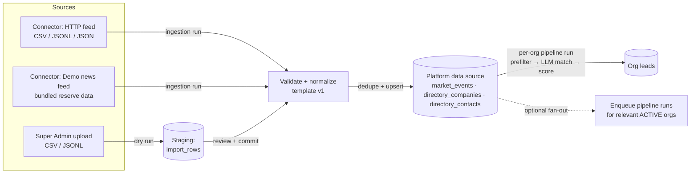
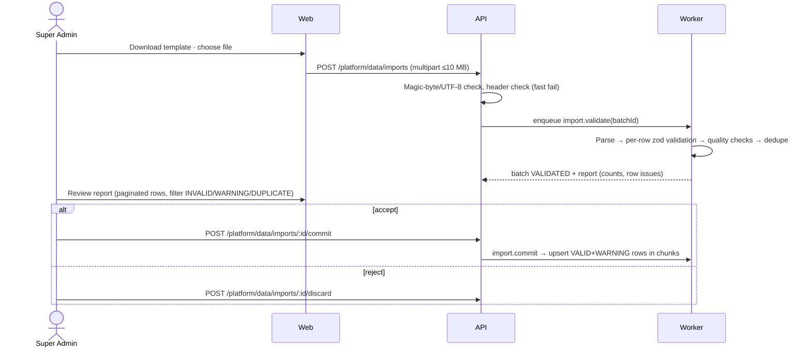

# SelloEasy — Plan 2: Platform Data Source & Multi-Provider AI

> **Status:** Implemented (2026-09-28). Open questions Q1–Q8 were resolved with the recommended option in each case (the "Recommendation" column in §12 is what was built).
> **Owner:** mahalingam@hiresense.ai · **Date:** 2026-09-24
> **Builds on:** `plan.md` v1.1 (implemented). Section references like "plan §11" point there.
>
> **🔶 DECISION** marks a recommended default. **❓ OPEN** marks a question for you (collected in §12).
> Companion file: [`sampleData.csv`](sampleData.csv), with 10 valid rows in the import format defined in §4.

---

## Contents

1. [Goals](#1-goals)
2. [What exists today](#2-what-exists-today)
3. [Concepts & data flow](#3-concepts--data-flow)
4. [The canonical record format (template v1)](#4-the-canonical-record-format-template-v1)
5. [Data model changes](#5-data-model-changes)
6. [Ingestion path A: connectors + "Run ingestion"](#6-ingestion-path-a-connectors--run-ingestion)
7. [Ingestion path B: CSV / JSONL import with validation](#7-ingestion-path-b-csv--jsonl-import-with-validation)
8. [Super Admin "Data Source" UI](#8-super-admin-data-source-ui)
9. [Pagination & performance](#9-pagination--performance)
10. [Multi-provider AI (OpenAI now, Anthropic & others later)](#10-multi-provider-ai-openai-now-anthropic--others-later)
11. [API, permissions, audit, docs, tests](#11-api-permissions-audit-docs-tests)
12. [Open questions](#12-open-questions)
13. [Delivery phases](#13-delivery-phases)
14. [Definition of done](#14-definition-of-done)

---

## 1. Goals

| #   | Goal                                                                                                                                                                                                                              |
| --- | --------------------------------------------------------------------------------------------------------------------------------------------------------------------------------------------------------------------------------- |
| G1  | The Super Admin can **browse the entire raw market data** the platform holds: events, the company directory and contacts. Every field is visible, the data is paginated and filterable, and each record shows where it came from. |
| G2  | The data follows **one explicit template** (a canonical schema with named fields, types and rules), documented and downloadable.                                                                                                  |
| G3  | The Super Admin can **run an ingestion pipeline** that pulls more data from configured sources, assumed to hold data in the same format.                                                                                          |
| G4  | The Super Admin can **import CSV or JSONL files**. **Strict validation** keeps garbage out: the file is validated as a dry run, the admin reviews the report, and only then commits. Committed batches can be rolled back.        |
| G5  | The admin can see how raw data **flows to orgs**: for each event and each batch, how many orgs it matched and how many leads it produced.                                                                                         |
| G6  | AI works now with **OpenAI** (`OPENAI_MODEL`, e.g. `gpt-5.4-mini`). The same code can switch to **OpenRouter, Anthropic or others** by configuration alone.                                                                       |
| G7  | Paginated everywhere, so the UI and database never load unbounded result sets.                                                                                                                                                    |

## 2. What exists today

| Piece                | Today (plan v1.1)                                                                                                                                                                   |
| -------------------- | ----------------------------------------------------------------------------------------------------------------------------------------------------------------------------------- |
| Market events        | The global `market_events` table: about 300 synthetic rows loaded by the seed. It has no provenance columns and no UI.                                                              |
| Company directory    | `directory_companies` (130 rows) and `directory_contacts` (274 rows), global. The pipeline copies them into tenant `accounts`/`contacts` when a lead is created.                    |
| Pushing data to orgs | Each org's pipeline run prefilters global events against that org's signals, matches them with the LLM, and creates leads (plan §11). Results live in `signal_matches` and `leads`. |
| Ingestion            | The seed only. The pipeline has an `EventSource` idea but no connector code.                                                                                                        |
| LLM                  | One OpenRouter client (`packages/llm/src/client.ts`). The model comes from `OPENROUTER_MODEL`.                                                                                      |

## 3. Concepts & data flow



- **Data source**: the platform-wide raw data. It holds **no tenant data**, so the Super Admin may see all of it (this is consistent with ADR-0010).
- **Batch**: one unit of ingested data. Each import file and each ingestion run is one batch. Every record keeps its batch id, which gives provenance and makes rollback possible.
- **Distribution**: the aggregate link from raw data to org results (§8.4). It shows counts per org, never lead records.

## 4. The canonical record format (template v1)

A **Market Event Record** is one row. It describes one business news event plus its **subject company**, and optionally one contact at that company. The same field names are used by:

- CSV import
- JSONL/JSON import and connectors
- the Super Admin data explorer
- the published docs page at `/docs/platform/data-template`

### 4.1 Fields

| Field                       | Type                                                                   | Required                  | Rules                                                                                                                                                 |
| --------------------------- | ---------------------------------------------------------------------- | ------------------------- | ----------------------------------------------------------------------------------------------------------------------------------------------------- |
| `external_id`               | string ≤ 100                                                           | recommended               | Unique per `source`. Used for idempotent re-imports. If empty, a content hash is used instead.                                                        |
| `source`                    | string 2–80                                                            | **yes**                   | Publisher or feed name, e.g. `AutoWire India`.                                                                                                        |
| `source_url`                | URL ≤ 2048                                                             | **yes**                   | `https://` only. Unique per source.                                                                                                                   |
| `title`                     | string 20–300                                                          | **yes**                   | Headline. Must not be all caps and must not be a placeholder such as "lorem ipsum" or "test".                                                         |
| `body`                      | string 200–10 000                                                      | **yes**                   | Article text or summary. At least 30 words. More than 95% of characters must be printable.                                                            |
| `published_at`              | ISO 8601 date or datetime                                              | **yes**                   | Not more than 1 day in the future and not older than 2 years (the age limit is configurable).                                                         |
| `industry_tags`             | list of **MARKET_TAGS**                                                | **yes**                   | Separated by `\|` in CSV and an array in JSON. 1–4 tags from the controlled vocabulary (e.g. `Automotive\|Electric Vehicles`); matching ignores case. |
| `region`                    | string ≤ 120                                                           | no                        | e.g. `Pune, India`.                                                                                                                                   |
| `country`                   | ISO 3166-1 alpha-2                                                     | no                        | e.g. `IN`.                                                                                                                                            |
| `amount`                    | number ≥ 0                                                             | no                        | Deal, investment or order size.                                                                                                                       |
| `currency`                  | `INR` · `USD` · `EUR`                                                  | only when `amount` is set |                                                                                                                                                       |
| `subject_company_name`      | string 2–160                                                           | **yes**                   | The company that would **buy**.                                                                                                                       |
| `subject_company_domain`    | hostname                                                               | **yes**                   | Lowercased. The dedupe key for the directory. Must not be a free-mail domain (gmail.com etc.).                                                        |
| `subject_company_industry`  | one MARKET_TAG                                                         | no                        |                                                                                                                                                       |
| `subject_company_country`   | ISO-2                                                                  | no                        |                                                                                                                                                       |
| `subject_company_size_band` | `1-50` · `51-200` · `201-1000` · `1001-5000` · `5001-10000` · `10000+` | no                        |                                                                                                                                                       |
| `subject_company_employees` | integer 1–5 000 000                                                    | no                        | Must fall inside `size_band` when both are given.                                                                                                     |
| `mentioned_companies`       | list of names                                                          | no                        | Separated by `\|`, at most 5.                                                                                                                         |
| `contact_name`              | string 2–120                                                           | no                        | If any `contact_*` field is set, `contact_name` and at least one of email or phone are required.                                                      |
| `contact_title`             | string ≤ 160                                                           | no                        |                                                                                                                                                       |
| `contact_email`             | email                                                                  | no                        | Its domain should match `subject_company_domain`; a mismatch is a warning, not an error.                                                              |
| `contact_phone`             | E.164 (`+` and 6–15 digits)                                            | no                        | Also used for WhatsApp unless `contact_whatsapp` is given.                                                                                            |
| `contact_whatsapp`          | E.164                                                                  | no                        |                                                                                                                                                       |
| `contact_linkedin_url`      | URL                                                                    | no                        |                                                                                                                                                       |

Unknown columns are **rejected**, not ignored. This catches files exported from a different system. The one exception is a `_comment` column, which is dropped.

### 4.2 File rules (CSV)

- UTF-8 (a BOM is tolerated), comma-separated, RFC 4180 quoting, and a header row exactly as in §4.1 (the column order is free).
- **≤ 10 MB and ≤ 5 000 data rows** per file 🔶. Larger loads go through connectors.
- Cells starting with `= + - @` are stored with a leading `'` to prevent spreadsheet formula injection on export.
- The **template is downloadable** from the UI as a CSV with the header row and one example, and as a JSON Schema (`template-v1.schema.json`).

### 4.3 Versioning

Every stored record carries `schema_version = 1`. A future v2 adds a new parser and keeps v1 accepted. Each version's zod schema lives in `packages/shared/src/data-template.ts` and serves as the single source for the validator, the UI field docs and the JSON Schema export.

## 5. Data model changes

Migration `0002_data_source.sql` is generated by drizzle-kit.

**Existing tables (new columns):**

| Table                                       | New columns                                                                                                                                                                                           |
| ------------------------------------------- | ----------------------------------------------------------------------------------------------------------------------------------------------------------------------------------------------------- |
| `market_events`                             | `source_type` enum (`SEED`, `CSV_IMPORT`, `JSONL_IMPORT`, `CONNECTOR`), `batch_id → data_batches`, `country`, `schema_version`, `retracted_at` (hidden from matching), `ingested_by` (user, nullable) |
| `directory_companies`, `directory_contacts` | `source_type`, `batch_id`, `updated_by_batch_id` (last batch that enriched the row)                                                                                                                   |

**New tables:**

| Table             | Purpose                                                                                                                                                                                                                                                                                                                                                                                |
| ----------------- | -------------------------------------------------------------------------------------------------------------------------------------------------------------------------------------------------------------------------------------------------------------------------------------------------------------------------------------------------------------------------------------- |
| `data_batches`    | One row per import file or ingestion run. Columns: `kind` (IMPORT / INGESTION), `status` (`UPLOADED → VALIDATING → VALIDATED → COMMITTING → COMMITTED` / `DISCARDED` / `FAILED` / `ROLLED_BACK`), `file_name`, `file_s3_key`, `format`, `stats` jsonb (rows, valid, invalid, warnings, duplicates, inserted, updated), `error_report_s3_key`, `created_by`, `committed_by`, timestamps |
| `data_batch_rows` | Staging for imports: `batch_id`, `row_number`, `raw` jsonb, `normalized` jsonb, `status` (`VALID` / `WARNING` / `INVALID` / `DUPLICATE`), `issues` jsonb (`[{field, code, message}]`). Purged 30 days after commit or discard.                                                                                                                                                         |
| `data_connectors` | `name`, `type` (`HTTP_FEED`, `DEMO_FEED`), `config` jsonb (url, format `csv`/`jsonl`/`json`, since-param name, auth header name + **Secrets Manager/env reference**; never the secret itself), `schedule` cron (nullable), `enabled`, `cursor` jsonb, `last_run_at`, `last_status`                                                                                                     |
| `ingestion_runs`  | `connector_id`, `batch_id`, `trigger` (MANUAL / SCHEDULED), `status`, `stats`, `error`, `triggered_by`, timestamps, plus SSE progress like org pipeline runs                                                                                                                                                                                                                           |

**Indexes:** `market_events (source_type, published_at desc)`, `(batch_id)`, a unique index on `(source, external_id)` where `external_id` is not null, a unique index on `(source_url)`, and GIN on `industry_tags` and `tsv` (both already exist). `data_batch_rows (batch_id, status, row_number)`.

The existing seed backfills `source_type = SEED` and puts all seeded rows in one "Initial synthetic dataset" batch.

## 6. Ingestion path A: connectors + "Run ingestion"

### 6.1 Connector interface (`packages/engine/src/ingestion/`)

```ts
interface Connector {
  type: 'HTTP_FEED' | 'DEMO_FEED';
  /** Pull records newer than the cursor. Returns raw rows in template-v1 shape plus the next cursor. */
  fetch(
    config: ConnectorConfig,
    cursor: Cursor | null,
    limit: number,
  ): Promise<{ rows: unknown[]; nextCursor: Cursor | null; hasMore: boolean }>;
}
```

- **`HTTP_FEED`**: GETs an HTTPS URL that returns CSV, JSONL or JSON (an array or `{items: []}`) in the template-v1 format. It supports a `since` query parameter (`?since=<ISO>`) and pagination (`next` link or `page` parameter).
  - The same **SSRF guard** as the website crawler applies: public IPs only, 10 MB and 60-second caps.
  - Optional auth header, whose value is read from the env or Secrets Manager.
  - This is the "data sitting anywhere in the same format" source.
- **`DEMO_FEED`** 🔶: a bundled reserve of about 60 extra synthetic events, 12 per industry (`packages/dataset/data/feed/*.jsonl`), not loaded by the seed. Each run releases the next 10 in `published_at` order. That lets you watch the Super Admin click "Run ingestion" and see new data arrive, and later see orgs pick it up. It is seeded as the default connector.

### 6.2 Ingestion run (worker queue `ingestion`)

1. Create a `data_batches` row (kind INGESTION) and an `ingestion_runs` row.
2. `fetch()` in pages until `limit` (default 500 per run, `INGESTION_MAX_ROWS_PER_RUN`) or until no more rows.
3. Every row goes through the **same validator as imports** (§7.2). Invalid rows are counted and recorded in the batch report, never inserted.
4. Dedupe (§7.3), then upsert in chunks of 200 in transactions: directory company → contact → event.
5. Update the cursor only after a successful commit, so reruns are idempotent. Stream progress over SSE.
6. **Fan-out** 🔶: optionally enqueue org pipeline runs for ACTIVE orgs whose target tags overlap the batch's `industry_tags` (❓ Q4). The existing one-run-per-org rule still applies.
7. Write a `PLATFORM` audit entry: `data.ingestion_completed` with the stats.

Schedules use the connector's cron through a BullMQ job scheduler, the same pattern as the org pipeline schedule.

## 7. Ingestion path B: CSV / JSONL import with validation

### 7.1 Two-phase flow



- **Nothing reaches `market_events` until commit.** Staged rows live only in `data_batch_rows`.
- 🔶 **Commit rule**: only VALID and WARNING rows are committed; INVALID and DUPLICATE rows are skipped. The commit is **refused** if more than 20% of rows are invalid (`IMPORT_MAX_INVALID_RATIO`). That share signals a wrong or garbage file, which should be fixed and re-uploaded rather than partially loaded (❓ Q2).
- The error report can be downloaded as a CSV: the original row, a `row_number` column and an `issues` column.

### 7.2 Validation layers (anti-garbage)

| Layer                                          | Checks                                                                                                                                                                                                        | On failure                                                                                        |
| ---------------------------------------------- | ------------------------------------------------------------------------------------------------------------------------------------------------------------------------------------------------------------- | ------------------------------------------------------------------------------------------------- |
| **File**                                       | Size ≤ 10 MB; UTF-8 (by trial decode); not a binary or zip (magic bytes); parseable CSV/JSONL; ≤ 5 000 rows; header has every required column; no unknown columns; not empty                                  | Rejected up front: **no batch rows** are created and a `FAILED` batch is recorded with the reason |
| **Schema** (zod, template v1)                  | Required fields, types, lengths, URL/email/E.164/ISO formats, enums, controlled tags, date window, `amount` needs `currency`, `employees` falls within `size_band`, contact completeness                      | Row → **INVALID** with field-level issues                                                         |
| **Content quality** (heuristics)               | Body ≥ 30 words; printable ratio ≥ 95%; not all caps; placeholder and "lorem ipsum" detection; title ≠ body; URL host ≠ `localhost`/IP address; free-mail company domains; repeated-character spam (`aaaaaa`) | Hard failures → **INVALID**; soft issues → **WARNING** (committed, but flagged)                   |
| **Consistency**                                | Contact email domain ≠ company domain; subject company already in the directory under a different name for the same domain (reported as rename vs. conflict); tags don't match the company industry           | **WARNING**                                                                                       |
| **Duplicates**                                 | Same `(source, external_id)`, same `source_url`, or same normalized content hash (lowercased title + first 500 characters of body) — checked both within the file and against the data source                 | **DUPLICATE** (skipped; the matching existing event id is shown)                                  |
| **Optional AI quality gate** 🔶 off by default | Asks the LLM whether each row is a real B2B business event, in batches of 20 rows per call, capped by `IMPORT_AI_GATE_MAX_CALLS`                                                                              | Low scores → **WARNING** only (never silently dropped)                                            |

All validation is **pure code** in `packages/shared/src/data-template.ts` (the schema) and `packages/pipeline/src/data-quality.ts` (heuristics and dedupe keys), so the same rules run for imports, connectors and tests.

### 7.3 Upsert semantics

- **Company**: matched on `subject_company_domain`. Missing attributes are filled in, and existing non-empty values are never overwritten unless the row comes from the same source. A name change is recorded as a WARNING.
- **Contact**: matched on (company, email) or (company, phone). It is inserted if new.
- **Event**: always inserted, since duplicates were already excluded. It is linked to the batch and gets `source_type`.

### 7.4 Rollback

- `POST /platform/data/batches/:id/rollback` sets `retracted_at` on the batch's events, so future org pipeline runs skip them.
- It **does not delete leads** that orgs already created from those events. Those belong to tenants and remain valid evidence (❓ Q5).
- Directory rows that exist only because of this batch are also retracted.
- The rollback is audited.

### 7.5 `sampleData.csv`

[`sampleData.csv`](sampleData.csv) has **10 valid rows** covering all five industries. The examples are:

- a new EV launch
- a hospital chain funding round
- a fab incentive approval
- a solar PPA
- a new fulfilment centre
- and more.

Some rows are enriched and some are minimal, and they use every optional field at least once. Importing it should produce 10 VALID rows, 10 new events, 10 directory companies and 7 contacts. The test suite will also ship `sampleData.invalid.csv` (garbage rows, bad tags, duplicates) to prove each validation layer.

## 8. Super Admin "Data Source" UI

A new sidebar entry **Platform → Data source** (`/platform/data`), with tabs synced to the URL.

### 8.1 Overview (header)

- **Stat tiles:** total events, events added in the last 7 and 30 days, companies, contacts, sources, the newest `published_at`, and retracted events.
- **Charts:** events per week by source type (seed / import / connector) and events per industry tag.

### 8.2 Tabs

| Tab            | Content                                                                                                                                                                                                                                                                                                                                                                                                     |
| -------------- | ----------------------------------------------------------------------------------------------------------------------------------------------------------------------------------------------------------------------------------------------------------------------------------------------------------------------------------------------------------------------------------------------------------- |
| **Events**     | Paginated table (25/page, maximum 100). **Columns:** published, title, source, industry tags, subject company, amount, provenance badge (source type + batch), orgs matched (count). **Filters:** full-text search, tag, source, source type, batch, date range, retracted on/off. Clicking a row opens a **drawer** with _every_ template field, the raw JSON, the batch link and the distribution (§8.4). |
| **Companies**  | Directory table: name, domain, industry, country, size, employees, contacts count, events count, provenance. The drawer shows the contacts and events.                                                                                                                                                                                                                                                      |
| **Contacts**   | Name, title, company, email, phone, provenance (PII is fine here, since this is platform-owned synthetic/directory data).                                                                                                                                                                                                                                                                                   |
| **Imports**    | "Import data" button → wizard: **1. Download template** (CSV / JSON Schema / sampleData.csv) → **2. Upload** (drag & drop, format auto-detected) → **3. Validation report** (counts, a paginated issues table filterable by status, a download-errors button) → **4. Commit or discard**. Below it, the batch history with status, counts, who, when, and actions (view, rollback).                         |
| **Connectors** | List of connectors (name, type, URL host, schedule, last run, status, enabled switch). Buttons: **Run ingestion now** (live SSE progress: fetched → validated → inserted → fan-out), create/edit (URL, format, since-param, auth secret reference, cron, max rows), test connection (fetches 5 rows and validates without inserting).                                                                       |
| **Template**   | Human-readable field reference generated from the zod schema (field, type, required, rules, example), plus the downloads.                                                                                                                                                                                                                                                                                   |

### 8.3 UX rules

- Always server-paginated with loading, empty and error states.
- Wide tables scroll horizontally and have a column picker.
- Destructive actions (discard, rollback, disabling a connector) need a confirm dialog.

### 8.4 "Pushing to orgs": the distribution view

- For each event and each batch: **orgs matched** (count), **leads created**, and **per-org counts** showing org name, matches and leads.
- The UI never shows lead records, contacts or scores.
- This is operational, aggregate metadata. I think it fits ADR-0010, but it does reveal _which_ orgs found an event relevant (❓ Q3).

## 9. Pagination & performance

- 🔶 **Offset pagination** with `page` and `pageSize` (default 25, maximum 100), using the same `Page<T>` DTO as the leads list. Sorting is stable (`published_at desc, id desc`) and backed by the indexes in §5.
- **Counts:** an exact `count(*)` when a filter is applied. When no filter is applied and the table has more than 50k rows, the count is an **estimate** from `pg_class.reltuples`, and the UI shows "≈ 1.2M". This keeps the first page fast at scale.
- **Deep pages:** past page 200, the API switches to keyset pagination (`?after=<published_at,id>`). The UI offers "Load next" instead of numbered pages. Plan v1 used offset pagination only; this is an extension of ADR-0005.
- **No list endpoint returns event bodies.** The table gets a 200-character snippet, and the drawer fetches the full record.
- **Imports and ingestion** run in the worker in chunks, off the request path. Staging rows are purged by the retention job.

## 10. Multi-provider AI (OpenAI now, Anthropic & others later)

### 10.1 Requirement conflict (❓ Q1)

The original brief says **"All LLM calls must be made through OpenRouter"**, and the README states `OPENROUTER_MODEL` for the submission.

- 🔶 **Recommendation:** add a provider switch. OpenRouter stays the default in `.env.example`, which keeps the submission compliant. Your local `.env` uses `LLM_PROVIDER=openai` with your key.
- OpenRouter can also route to OpenAI models (e.g. `openai/gpt-5.4-mini`) if you'd rather keep a single path.

### 10.2 Design: provider adapters inside `packages/llm`

```ts
interface ChatProvider {
  id: 'openrouter' | 'openai' | 'anthropic' | string;
  complete(req: {
    model: string;
    system: string;
    messages: ChatMessage[];
    jsonSchema?: { name: string; schema: object }; // structured output when supported
    maxOutputTokens: number;
    temperature?: number;
    signal: AbortSignal;
  }): Promise<{
    content: string;
    usage: { inputTokens: number; outputTokens: number; costUsd: number | null };
  }>;
}
```

`LlmClient` keeps everything that is provider-agnostic: prompts, zod validation, the repair retry, cache, concurrency limits, retries and backoff, telemetry and mock mode. It delegates only the HTTP call to the adapter. Prompts stay model-agnostic.

| Adapter                                                     | Endpoint                                                                                                           | Provider-specific handling                                                                                                                                                                                                                                                                                                                                              |
| ----------------------------------------------------------- | ------------------------------------------------------------------------------------------------------------------ | ----------------------------------------------------------------------------------------------------------------------------------------------------------------------------------------------------------------------------------------------------------------------------------------------------------------------------------------------------------------------- |
| `openrouter` (existing, refactored)                         | `/chat/completions`                                                                                                | `usage.include` gives cost directly; falls back to prompt-only JSON when `json_schema` isn't supported                                                                                                                                                                                                                                                                  |
| **`openai`** (new)                                          | `POST https://api.openai.com/v1/chat/completions` (`OPENAI_BASE_URL`, which also covers Azure-compatible gateways) | Uses `max_completion_tokens` instead of `max_tokens`. **Omits `temperature` for reasoning models (the `gpt-5*` family and `o*` models)**, which only accept the default. Sends `response_format: json_schema` with `strict: false`. Cost comes from a small price table (§10.4). Sets a `reasoning_effort` default of `low` for extraction-type prompts (configurable). |
| `anthropic` (new, same phase, lightly tested without a key) | `POST https://api.anthropic.com/v1/messages` with `anthropic-version`                                              | `system` goes in a separate field. JSON is obtained by forcing a single tool call whose `input_schema` is the prompt's JSON Schema, which is more reliable than text JSON. `max_tokens` is required. Usage is mapped from `usage.input_tokens`/`output_tokens`.                                                                                                         |
| `mock`                                                      | none                                                                                                               | Unchanged.                                                                                                                                                                                                                                                                                                                                                              |

**Capabilities** are resolved per model from a `capabilities.ts` table, with env overrides for new models that ship later:

- `supportsTemperature`
- `supportsJsonSchema`
- `tokenParam`
- `supportsReasoningEffort`

### 10.3 Configuration (env; all in `packages/shared/src/env.ts`, `.env.example` and docs)

```dotenv
# Which provider serves LLM calls: openrouter | openai | anthropic | mock
LLM_PROVIDER=openrouter

# OpenRouter (default for the submission)
OPENROUTER_API_KEY=
OPENROUTER_MODEL=google/gemini-2.5-flash
OPENROUTER_BASE_URL=https://openrouter.ai/api/v1

# OpenAI (direct)
OPENAI_API_KEY=
OPENAI_MODEL=gpt-5.4-mini
# OPENAI_MODEL=gpt-5.6-sol
OPENAI_BASE_URL=https://api.openai.com/v1
OPENAI_REASONING_EFFORT=low

# Anthropic (direct)
ANTHROPIC_API_KEY=
ANTHROPIC_MODEL=
ANTHROPIC_BASE_URL=https://api.anthropic.com

# Optional cost table for providers that don't return cost (USD per 1M tokens)
LLM_PRICE_INPUT_PER_MTOK=
LLM_PRICE_OUTPUT_PER_MTOK=
# Optional failover provider when the primary returns 5xx / timeouts after retries
LLM_FALLBACK_PROVIDER=
```

- **Validation:** the provider's key and model are required only when that provider is selected. With no key for the selected provider, the app auto-falls back to mock with a loud warning, same as today.
- **No model name in code**: this rule (ADR-0009) now applies to all providers.
- 🔶 **Deferred, not in this plan:** per-purpose model routing (e.g. a cheap model for matching and a stronger one for drafts). The design leaves room for `LLM_MODEL_<PURPOSE>` overrides later.
- **Secrets:** real keys go in the gitignored `.env` locally, or AWS Secrets Manager. The deploy script and `SECRETS_SOURCE` already handle arbitrary keys. **The key shared in chat will not be written to any tracked file. Please rotate it after setup.**

### 10.4 Telemetry & cache

- `llm_calls` gets a `provider` column. The model column stores `openai:gpt-5.4-mini` style identifiers.
- Cost is the provider-reported value when available. Otherwise it's computed from token usage and the price table, and left null when the table is empty (the UI shows "n/a").
- The cache key includes the provider and model.
- The platform dashboard's "Model" tile shows provider and model.

### 10.5 Verification with your key (after implementation)

- `pnpm eval:pipeline --mode live` (gold-set precision/recall) with `gpt-5.4-mini`.
- One live org pipeline run, one lead rescore and one AI email draft.
- The results are published in `/docs/pipeline/evaluation`.

## 11. API, permissions, audit, docs, tests

### 11.1 New permissions (Super Admin only)

`platform:data:read`, `platform:data:import`, `platform:data:manage` (connectors, rollback).

### 11.2 Endpoints (`/api/v1/platform/data/*`)

```
GET  /platform/data/overview
GET  /platform/data/events?page&pageSize&q&tag&source&sourceType&batchId&from&to&retracted&after
GET  /platform/data/events/:id                 (full record + distribution)
GET  /platform/data/companies?…  GET /platform/data/companies/:id
GET  /platform/data/contacts?…
GET  /platform/data/template                   (field reference)   GET /platform/data/template.csv  GET /platform/data/template.schema.json
POST /platform/data/imports                    (multipart upload → batch, 202)
GET  /platform/data/batches?…                  GET /platform/data/batches/:id
GET  /platform/data/batches/:id/rows?status&page&pageSize
GET  /platform/data/batches/:id/errors.csv
POST /platform/data/batches/:id/commit | /discard | /rollback
GET/POST /platform/data/connectors             PATCH/DELETE /platform/data/connectors/:id
POST /platform/data/connectors/:id/test        POST /platform/data/connectors/:id/run
GET  /platform/data/ingestion-runs?…           GET /platform/data/ingestion-runs/:id/events (SSE)
```

Uploads use `@fastify/multipart`, with a 10 MB limit enforced by the server. The file is stored in S3/MinIO under `platform/imports/<batchId>/`.

### 11.3 Audit (PLATFORM scope)

`data.import_uploaded`, `data.import_validated`, `data.import_committed`, `data.import_discarded`, `data.batch_rolled_back`, `data.connector_created/updated/deleted`, `data.ingestion_started/completed/failed`, `data.fanout_enqueued`.

### 11.4 Docs (kept in sync)

- New section **Platform data**: `overview`, `data-template` (generated from the zod schema), `importing`, `connectors-and-ingestion`, `validation-rules`.
- Updated pages: env vars, data model and ERD, API reference, `llm-openrouter` renamed to **`llm-providers`**, limitations, changelog.
- New ADRs:
  - 0015: canonical data template and two-phase import
  - 0016: retract instead of delete for batch rollback
  - 0017: provider adapter layer and OpenRouter as the default
  - 0018: hybrid offset/keyset pagination for large tables

### 11.5 Tests

- **Unit:** validator per rule, including every row in `sampleData.invalid.csv`; dedupe keys; heuristics; CSV parser edge cases (BOM, quotes, CRLF); per-adapter request shaping (OpenAI omits temperature and uses `max_completion_tokens`; the Anthropic tool-forcing payload) using fake `fetch`.
- **API integration:**
  - The upload → validate → commit round trip with `sampleData.csv` gives 10 inserted rows.
  - A garbage file fails at the file layer.
  - A file with more than 20% invalid rows has its commit refused.
  - Re-importing gives 10 DUPLICATE rows.
  - Rollback retracts the rows, and org pipelines then skip them.
  - An org user gets 403 on every `/platform/data` route.
  - Pagination limits are enforced.
- **Worker:** a `DEMO_FEED` ingestion run inserts the next 10, and the cursor advances.
- **E2E (Playwright):** the Super Admin imports `sampleData.csv` via the UI, then sees 10 new events in the Events tab and runs ingestion.

## 12. Open questions

| #      | Question                                                                                                                                                                                            | Recommendation                                                              |
| ------ | --------------------------------------------------------------------------------------------------------------------------------------------------------------------------------------------------- | --------------------------------------------------------------------------- |
| **Q1** | The brief mandates OpenRouter. Should `.env.example` keep `LLM_PROVIDER=openrouter` (you use OpenAI in your local `.env`), switch the default to OpenAI, or route OpenAI models through OpenRouter? | Keep OpenRouter as the documented default and use OpenAI in your own `.env` |
| **Q2** | Import commit policy: commit valid rows and skip bad ones (refused above 20% invalid), or all-or-nothing?                                                                                           | Partial commit with the 20% guard                                           |
| **Q3** | May the Super Admin see **which orgs** matched an event (org name + counts), or only a total count?                                                                                                 | Org name + counts (aggregate, no lead data)                                 |
| **Q4** | After an import or ingestion, automatically enqueue pipeline runs for relevant orgs, or leave it to schedules and manual runs?                                                                      | Opt-in checkbox per commit/run, default **on** for the demo                 |
| **Q5** | Rollback: retract events and keep leads already created by orgs, or also remove those leads?                                                                                                        | Retract only; tenant leads stay                                             |
| **Q6** | Import limits: 10 MB / 5 000 rows per file, 500 rows per ingestion run. OK?                                                                                                                         | Yes                                                                         |
| **Q7** | Should the Super Admin also be able to **edit** individual raw records in the UI, or is the data source append/retract only?                                                                        | Append/retract only (edits break provenance); fix by re-importing           |
| **Q8** | JSONL import in addition to CSV?                                                                                                                                                                    | Yes (same validator, costs almost nothing)                                  |

## 13. Delivery phases

| Phase                                     | Scope                                                                                                                       | Exit criteria                                                                                                          |
| ----------------------------------------- | --------------------------------------------------------------------------------------------------------------------------- | ---------------------------------------------------------------------------------------------------------------------- |
| **A: Providers** (≈1 day)                 | `ChatProvider` adapters (OpenRouter refactor, OpenAI, Anthropic), capability table, env + docs, `provider` telemetry column | Unit tests pass; with your key, `pnpm eval:pipeline --mode live` runs on `gpt-5.4-mini` and a live draft/rescore works |
| **B: Template + data model** (≈1 day)     | `data-template.ts` (zod v1), migration 0002, seed backfill + DEMO_FEED reserve dataset, provenance columns                  | `sampleData.csv` validates 10/10 in a unit test; migration applies cleanly on an existing DB                           |
| **C: Import pipeline** (≈2 days)          | Multipart upload, file checks, worker validate/commit, staging rows, error report CSV, rollback, audit                      | Integration tests from §11.5 pass                                                                                      |
| **D: Connectors & ingestion** (≈1.5 days) | Connector interface, HTTP_FEED + DEMO_FEED, runs, cursor, schedule, SSE, fan-out                                            | "Run ingestion" pulls 10 new events; relevant org runs pick them up                                                    |
| **E: Data Source UI** (≈2 days)           | `/platform/data` tabs (overview, events, companies, contacts, imports wizard, connectors, template), drawers, pagination    | Playwright: import `sampleData.csv` through the UI and see it in Events                                                |
| **F: Docs & hardening** (≈0.5 day)        | Docs pages + ADRs 0015–0018, limitations, README section, `docs:check`                                                      | `pnpm test`, `typecheck`, `docs:check` and E2E are green; compose works from clean                                     |

About 8 working days in total. Phase A can start in parallel with B.

## 14. Definition of done

- [ ] Every new route is permission-guarded (`platform:data:*`), audited (PLATFORM scope) and paginated where it lists records.
- [ ] Nothing reaches `market_events` without passing the template-v1 validator, whether it arrives by import or by connector.
- [ ] `sampleData.csv` imports as 10 VALID rows, a second import yields 10 DUPLICATE rows, and a garbage file is rejected with a readable report.
- [ ] The Super Admin can browse all events, companies and contacts with every field, 25 per page, filtered and searchable.
- [ ] "Run ingestion" pulls new data, and org pipelines pick it up.
- [ ] `LLM_PROVIDER` switches between OpenRouter, OpenAI and Anthropic with no code change. No model name appears in code, and keys appear only in env or Secrets Manager.
- [ ] Docs, ADRs, env reference and README are updated in the same change, and `pnpm docs:check` passes.
